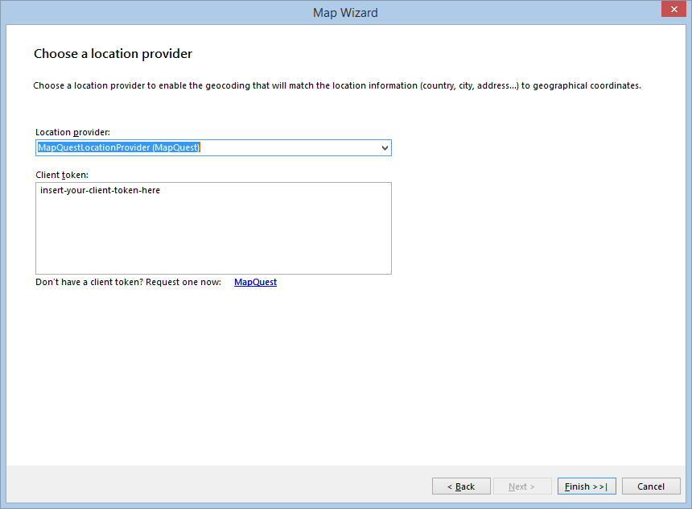

# Getting Started with the Map Report Item

This guide shows how to add the Telerik Reporting Map report item to reports.

The suggested implementation demonstrates how to create a Map which will present the sales distribution by products among several states using the **Adventure Works** sample database and the [Standalone Report Designer](). The steps are valid for the [Visual Studio Report Designer]() as well and can be reproduced with code too.

After the completion of this guide, you will be able to achieve the following result.


## Prerequisites

- Obtain a valid Location Provider key to authenticate your geocoding requests.
- If you don't want to use a location provider, provide the geographical coordinates of your points yourself and set up the `MapSeries` accordingly. For more information, refer to the article on [location providers]().

## Adding the Map

- (For new reports) Select the `Map Wizard` icon from the `Available Templates` page.

  

- (For existing reports) Select the `Map` item from the `Insert` menu. This will start the **Map Wizard** which will guide you through the creation process.

  

## Adding the Data Source

On the `Choose Data Source` page, add a new [SqlDataSource]().

1. Set the connection string to the demo AdventureWorks database.
1. Paste the following query in the **Select Statement** box:

   ```SQL
   SELECT
   PS.Name AS ProductSubCategory,
   SP.Name + ', ' + CR.Name AS State,
   SOD.LineTotal as LineTotal
   FROM

   Production.Product AS P
   INNER JOIN Production.ProductSubcategory AS PS ON P.ProductSubcategoryID = PS.ProductSubcategoryID
   INNER JOIN Production.ProductCategory AS PC ON PS.ProductCategoryID = PC.ProductCategoryID
   INNER JOIN Sales.SalesOrderDetail AS SOD ON P.ProductID = SOD.ProductID
   INNER JOIN Sales.SalesOrderHeader AS SOH ON SOD.SalesOrderID = SOH.SalesOrderID
   INNER JOIN Person.Address AS ADDR ON ADDR.AddressID = SOH.ShipToAddressID
   INNER JOIN Person.StateProvince AS SP ON SP.StateProvinceID = ADDR.StateProvinceID
   INNER JOIN Person.CountryRegion AS CR ON CR.CountryRegionCode = SP.CountryRegionCode

   WHERE
   CR.Name IN ('Australia')
   AND DATEPART(YEAR, SOH.OrderDate) IN (2003, 2004)
   AND PC.Name = 'Bikes'
   ```

1. Click `Execute Query...` to check if everything is OK with the database connection.
1. Click `Finish` when you are ready.

## Building the Map Charts

1. In the **Available data sources** list you will see the data source you've already created. Select it and click **Next**.
1. On the next page, select the fields which will be used to build the Map charts. Since the map will use a location provider, you don't have to provide the **Latitude** and **Longitude** coordinates by yourself and you can leave these boxes empty. Define a location group which will set the geocoding string.
1. From the **Datapoints type** box, select the **Pie Chart** radio button.
1. Select the **ProductSubCategory** field and drag it to the **Series (color)** box.
1. Select the **State** field and drag it to the **Categories (location)** box.
1. Select the **LineTotal** field and drag it to the **Size** box where it will be transformed to **Sum(LineTotal)**.

   Your **Arrange map fields** page will look similar to one in the following image:

   

1. Once the mandatory fields are set up, the **Next** button will get enabled. Click it to go to the next page.

## Defining the Location Provider

1. On the **Choose a location provider** page, select the location provider that will be used to geocode the **State** field that was dragged in the **Categories (location)** box on the previous page. Currently, the supported providers are [`MapQuestOpenAPILocationProvider`](/reporting/api/Telerik.Reporting.MapQuestOpenAPILocationProvider), [`MapQuestLocationProvider`](/reporting/api/Telerik.Reporting.MapQuestLocationProvider), [`BingLocationProvider`](/reporting/api/Telerik.Reporting.BingLocationProvider), and [`AzureLocationProvider`](/reporting/api/Telerik.Reporting.AzureLocationProvider). They all require a valid client token (key) to authenticate the geocoding requests that will be sent from the Map item.

   Once you obtain the key, paste it in the **Client token** box:

   

1. When you click **Finish**, the Wizard will create the definition of the Map item, show it in the designer, and start requesting the geocode and tiles information from the providers asynchronously. Initially, it will take a few seconds to fetch all the data from the geocoding service, but the following requests will be executed faster. The tiles, needed to prepare the Map background, will be displayed as they arrive, but the Map will stay responsive and you can examine and change its definition. When finished, your Map will look similar to the one shown in beginning of this tutorial.

You may download the demo report from our Reporting Samples GitHub repository - [MapWithMapWizard.trdp](https://github.com/telerik/reporting-samples/blob/master/map-samples/MapWithMapWizard.trdp).

## Next Steps

- [(Demo) Product Catalog Report with a Document Map](https://demos.telerik.com/reporting/product-catalog)
- [Map Class API Reference](/api/telerik.reporting.map)
- [Demo Page for Telerik Reporting](https://demos.telerik.com/reporting)
- [Knowledge Base Section](/knowledge-base)

## See Also

- [Adding LocationMapSeries to the Map]()
- [Adding ShapeMapSeries to the Map]()
- [Creating Maps with BarCharts]()
- [Adding a Choropleth Map to the Report with the Map Wizard]()
- [(KB) Adding a Choropleth Map to the Report with the Choropleth Wizard]()
- [(KB) Creating Maps with Custom Polygons]()
- [(KB) Setting Up a Map Manually]()
