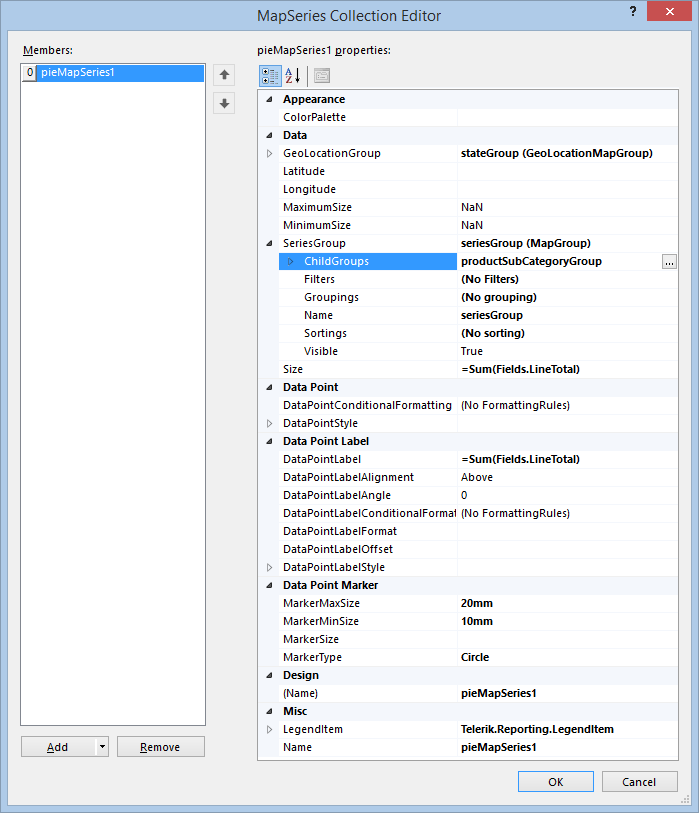

# How to Add LocationMapSeries to the Map Item

The [LocationMapSeries](/reporting/api/Telerik.Reporting.LocationMapSeries) are used when the data points have a single coordinate pair, obtained directly from the data set or by using a [Location provider](). 

## Adding a LocationMapSeries instance to the map

To add new PointMap, PieMap or a ColumnMap series to the map follow these steps: 

1. Open __Series__ collection editor and __Add__ new [PointMapSeries](/reporting/api/Telerik.Reporting.PointMapSeries), [PieMapSeries](/reporting/api/Telerik.Reporting.PieMapSeries) or [ColumnMapSeries](/reporting/api/Telerik.Reporting.ColumnMapSeries) item. 

1. Set the [GeoLocationGroup](/reporting/api/Telerik.Reporting.LocationMapSeries#Telerik_Reporting_LocationMapSeries_GeoLocationGroup) to an existing [GeoLocationMapGroup](/reporting/api/Telerik.Reporting.GeoLocationMapGroup)  instance or create a new one from scratch. 

1. Set the [SeriesGroup](/reporting/api/Telerik.Reporting.MapSeriesBase#Telerik_Reporting_MapSeriesBase_SeriesGroup) to an existing [MapGroup](/reporting/api/Telerik.Reporting.MapGroup) instance or create a new one from scratch. 

1. Grouping the data.

   + If you are creating a [PointMapSeries](/reporting/api/Telerik.Reporting.PointMapSeries), you can define a SeriesGroup by which your data will be grouped. This might come handy if you want to have a different color for every data point in your series. 

   + If you are creating a [PieMapSeries](/reporting/api/Telerik.Reporting.PieMapSeries) or a [ColumnMapSeries](/reporting/api/Telerik.Reporting.ColumnMapSeries), you need to define an additional child group, which will be used to determine how the data will be grouped for every data point. The color and count of the pie sectors (or columns when creating a [ColumnMapSeries](/reporting/api/Telerik.Reporting.ColumnMapSeries)) will be determined by the last child group of defined SeriesGroups. In the most cases you would create one series group without grouping (which will result in a static group) and add one child group, with [Groupings](/reporting/api/Telerik.Reporting.GroupBase#Telerik_Reporting_GroupBase_Groupings) set to the field you would like to group by. 

1. Set __Size__ to an expression that will be used to determine the pie sector or the column size. 

When all the properties are set, the __LocationMapSeries__ instance should look similar to the following one in the __Property Grid__ : 

## See Also

* [Pie Charts]()

* [Column Charts]()

* [Map Overview]()

* [Map Structure]()

* [Add ShapeMapSeries to the Map item]()
