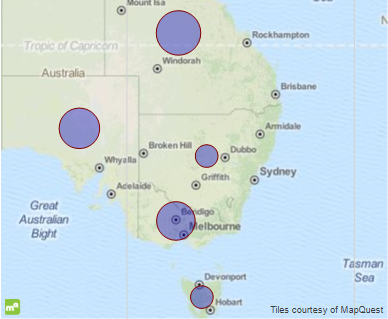
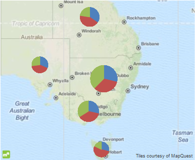
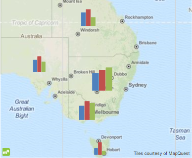

# Map Types

To present the Map data in the most user-friendly way, the Map report item supports a number of map types, which have unique characteristics to help you visualize your dataset. 

The Map provides the following map types: 

* [Point map type](#point)
* [Pie map type](#pie)
* [Column map type](#column)
* [Choropleth map type](#choropleth)
 
## Point 

Similar to the [Scatter chart type]() of the Graph, the Point map type is used to display a correlations between two sets of values. The main difference is that the set of the first values is defined by geographical coordinates which will position every data point onto the Map. The set of he second values is used as a measure and displays a bubble of a variable size depending on the measured value, that is, the differences between the data points are based on the size of the point. The larger the point is, the greater the difference between the two data points becomes. 

## Pie 

Similar to the [Pie chart type]() of the Graph, a Pie map type is a chart for displaying grouped data on every data point. As with the Point map type, the data point coordinates are defined by the `GeoLocation` group. The analytical data for creating the Pie chart is obtained through the child groups of the `GeoLocation` group. For more information about the setup, refer to the article on [setting the Map with the Map Wizard](). 

## Column 

Identical to the Pie chart type of the Graph, the Column map type presents analytical data by using the [Column chart type](). For an advanced example on creating a Column map type, refer to the article about [creating a Map with a BarChart series with a CSV data source](). 

## Choropleth 

The [Choropleth map type](http://en.wikipedia.org/wiki/Choropleth_map) is a thematic map that uses graded color differences to display a measure over predefined regions or areas, and is one of the most popular ways to visualize how a measure varies across a geographic area. 

The Choropleth item is basically a [Map item]() with a special kind of series and groups. To create a Choropleth map, you don't have to configure a [location provider]() or use a [`GeoLocationMapGroup`](/reporting/api/Telerik.Reporting.GeoLocationMapGroup) to obtain the coordinates of the data points. Instead, the Choropleth uses a [`ShapeMapSeries`](/reporting/api/Telerik.Reporting.ShapeMapSeries) instance whose major distinction from the other Map series is that they define the source which will be used to provide the spatial data. This source can be either a string, formatted in compliance with the [Well-known text or Well-known binary](http://en.wikipedia.org/wiki/Well-known_text) standards, or an [ESRI Shapefile](http://en.wikipedia.org/wiki/Shapefile). 

To achieve better appearance, the Map item can define a [tile provider]() which will draw an image of the requested Map extent as a background layer onto the plot area. 

For an example on creating a Choropleth map type, refer to the article about [setting up a Choropleth by using the Map Wizard](). 

 

## See Also

* [Overview of the Map Report Item]()
* [Structure and Elements of the Map]()
