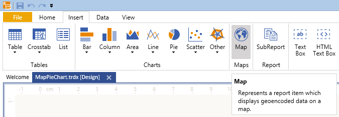
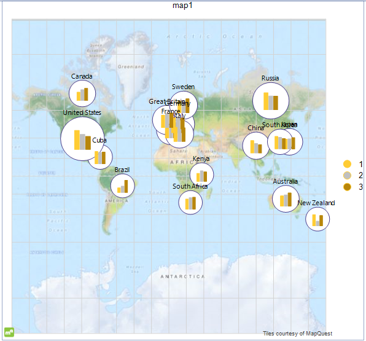

# Creating Advanced Maps with BarChart Series

In this article, you will learn how to create a Map report item with a BarChart series.

The suggested scenario will demonstrate how to create a Map which will present the [countries with the most medals won in Olympic Games](https://en.wikipedia.org/wiki/All-time_Olympic_Games_medal_table) divided by their continental [Association of National Olympic Committees](https://olympics.com/ioc/national-olympic-committees). The example will also add some interactivity to the report, enabling the user to choose which countries will be displayed on the Map, highlighting the currently selected country, and displaying an additional chart with detailed information about it. The suggested implementation uses the [Standalone Report Designer]() and does not require the writing of any code.

The suggested implementation corresponds to the sample `OlympicMedalsByNationalTeams.trdp` report definition that may be found in the installation folder of the Telerik Reporting product. By default, this is `C:\Program Files (x86)\Progress\Telerik Reporting {{site.suiteversion}}\Report Designer\Examples`.

## Prerequisites 

* Obtain a valid Location Provider key that will authenticate your geocoding requests.
* If you don't want to use a location provider, provide the geographical coordinates of your points yourself and configure the `MapSeries` accordingly. For more information, refer to the article on [location providers]().

## 1. Start the Map Wizard

* (For new reports) Select the __Map Wizard__ icon from the __Available Templates__ page.

	

* (For existing reports) Select the __Map__ item from the __Insert__ menu. As a result, the __Map Wizard__ will appear and guide you through the creation process.

	

## 2. Add the Data Source

Now, you'll add a new [CSV data source]() and name it __medalsData__. This data source will hold the information about the countries, the ID of their respective Olympic association, which place and how many times they have occupied it.

1. Copy the data from the __medalsData__ CsvDataSource of the sample `OlympicMedalsByNationalTeams.trdp` report definition, save it locally, and insert its path into the **Select a file to import** textbox. The information in this file is a sample data set that shows how many times a national Olympic team had occupied a first, a second, or a third place in the Olympic Games. It has also a relation with the Association of National Olympic Committees table that you will build later.
1. Click __Next__ until you get to the __CSV Headers__ page. Note that the CSV file has headers and you have to check the **The CSV has headers** checkbox.
1. On the __Map columns to type__ page, set the type of the `AssociationId`, `Place` and `Count` columns to __Integer__.
1. When you click __Parse CSV...__ on the next page, you will see the result of the parsed file, which will look similar to the following image:

	

1. Click __Finish__ when you are ready.

## 3. Build the Map Charts 

In the **Available data sources** list, you will see the data source you've already created. Select it and click __Next__.

1. On the next page, select the fields which will be used to build the Map charts.

	>Since the Map will use a Location Provider, you don't have to provide the __Latitude__ and __Longitude__ coordinates by yourself and can leave these boxes empty. Only define the location group which will set the geocoding string.

1. From the **Datapoints type** box, select the __Column Chart__ radio button.
1. Select the __Place__ field and drag it to the **Series (color)** box.
1. Select the __Team__ field and drag it to the **Categories (location)** box.
1. Select the __Count__ field and drag it to the **Size** box, where it will be transformed to __Sum(Count)__. The __Arrange map fields__ page will look similar to the following:

	

1. Once the mandatory fields are set up, the __Next__ button will be enabled. Click it to go to the next page.

## 4. Set Up the Location Provider

1. On the __Choose a location provider__ page, select the location provider that will be used to geocode the __State__ field that was dragged in the **Categories (location)** box on the previous page.

	Currently, the supported providers are [`MapQuestOpenAPILocationProvider`](/reporting/api/Telerik.Reporting.MapQuestOpenAPILocationProvider), [`MapQuestLocationProvider`](/reporting/api/Telerik.Reporting.MapQuestLocationProvider), [`BingLocationProvider`](/reporting/api/Telerik.Reporting.BingLocationProvider), and [`AzureLocationProvider`](/reporting/api/Telerik.Reporting.AzureLocationProvider). They all require a valid client token (key) to authenticate the geocoding requests that will be sent from the Map item. Once you have obtained the key, paste it in the **Client token** box:

	

1. When you click __Finish__, the Wizard will create the definition of the Map item, show it in the designer, and will start to request the geocode and tiles information from the providers asynchronously. Initially, it will take a few seconds to fetch all the data from the geocoding service, but the following requests will be executed faster. The tiles, needed to prepare the Map background, will be displayed as they arrive, but the Map will stay responsive and you can examine and change its definition. When finished, the Map will look similar to the following:

	

## 5. Add the PointMapSeries

Now you will add a [`PointMapSeries`](/reporting/api/Telerik.Reporting.PointMapSeries) that will display a circle around each column chart. The circle size will be relevant to the whole number of medals each team has won. To add the series, select it and then start the respective Wizard. For the purposes of this example, start the Map Wizard again by clicking the **Map** toolbar icon.

On the __Arrange map fields__ page, perform the following steps:

1. Select the __Point__ radio button from the **Datapoints type** box.
1. Select the __Team__ field and drag it to the **Categories (location)** box.
1. Select the __Count__ field and drag it to the **Size** box, where it will be transformed to __Sum(Count)__. The __Arrange map fields__ page will look similar to one in the following image:

	

1. Click the __Finish__ button. As a result, the Map will display the two series together, rendered in the order they have been created. That's why you will see the column charts being overlapped by the circles.

## 6. Style the Appearance

The Map needs some more configuration and styling to improve its rendering. Select the Map item, click the __Series__ item in the **Property** grid, and perform the following steps in the opened __MapSeries Collection Editor__:

1. In the __Members:__ left pane, select the __pointMapSeries1__ item and move it up by using the arrow buttons. This will display the circles as a background for the column charts.
1. Since the `PointMapSeries` will use the same grouping as the `ColumnMapSeries`, set its `GeoLocationGroup` to __teamGroup__ and its `SeriesGroup` to __seriesGroup__, which were created along with the `ColumnMapSeries`.
1. As you have the __pointMapSeries1__ selected, set its [`DataPointStyle`](/reporting/api/Telerik.Reporting.GraphSeriesBase#Telerik_Reporting_GraphSeriesBase_DataPointStyle) [`BackgroundColor`](/reporting/api/Telerik.Reporting.Drawing.Style#Telerik_Reporting_Drawing_Style_BackgroundColor) to `White` and the [`LineColor`](/reporting/api/Telerik.Reporting.Drawing.Style#Telerik_Reporting_Drawing_Style_LineColor) to a color of your choice. The example report uses the `DarkSlateBlue` color from the __Web__ palette.
1. Set the [`DataPointLabel`](/reporting/api/Telerik.Reporting.GraphSeriesBase#Telerik_Reporting_GraphSeriesBase_DataPointLabel) expression to `=Fields.Team` to display the name of the national team above the point.
1. Set the [`DataPointLabelStyle`](/reporting/api/Telerik.Reporting.GraphSeriesBase#Telerik_Reporting_GraphSeriesBase_DataPointLabelStyle). [Visible](/reporting/api/Telerik.Reporting.Drawing.Style#Telerik_Reporting_Drawing_Style_Visible) property to `True`.
1. Select the __columnMapSeries1__ item from the __Members:__ pane and set its [`MarkerMinSize`](/reporting/api/Telerik.Reporting.PointMapSeries#Telerik_Reporting_PointMapSeries_MarkerMinSize) to `6mm` and [`MarkerMaxSize`](/reporting/api/Telerik.Reporting.PointMapSeries#Telerik_Reporting_PointMapSeries_MarkerMaxSize) to `10mm`.
1. To match the column series colors with the real world medal colors, [define a custom ColorPalette](). The following screenshot illustrates the colors used in this example:

	

1. To change the Map size, adjust the fonts properties and try various styling. Finally, the Map will look similar to the following image:

	

## 7. Configure the Legend

As you may have noticed, the information about the occupied places is present in the CSV data as integer numbers, that's why the legend displays it this way. But the report will look better if the information about the places is displayed with medal names - __Gold__, __Silver__, and __Bronze__.

To achieve the desired scenario, you may use an expression for the [`LegendItem`](/reporting/api/Telerik.Reporting.LegendItem) [`Value`](/reporting/api/Telerik.Reporting.LegendItem#Telerik_Reporting_LegendItem_Value). In our demo though, we will use a [calculated field]() added to the CSV data source. The benefit of this approach is that you can use the calculated field as any other field, without having to use an expression every time you need to address it.

1. Select the __medalsData__ data source, add a calculated field named __Medal__ of type `String` to it and set its expression in the following way:

	`=IIF(Fields.Place = 1, 'Gold', IIF(Fields.Place = 2, 'Silver', IIF(Fields.Place = 3, 'Bronze', 'none')))`


1. Set the [`LegendItem`](/reporting/api/Telerik.Reporting.LegendItem) [`Value`](/reporting/api/Telerik.Reporting.LegendItem#Telerik_Reporting_LegendItem_Value) expression of the `columnMapSeries` to `=Fields.Medal` and style the legend by your choice.

## 8. Reduce the Displayed Information

To reduce the amount of displayed information on the Map, use the [report parameters]() and apply [filtering](). In this case, the filtering criteria will be based on the __AssociationId__ field. To display the meaningful names of the Olympic associations, you will add another CSV data source, which has a relation with the current `AssociationId` field of the data source and will be used only for displaying the report parameters.

1. Add a new CSV data source, select the **Enter CSV as text** tab, and paste the following text in the box:

	````
Id,Name
	1,Pan-American Sports Organization
	2,European Olympic Committees
	3,Olympic Council of Asia
	4,Oceania National Olympic Committees
	5,Association of National Olympic Committees of Africa
````

	The same data source is available also in our sample `OlympicMedalsByNationalTeams.trdp` report definition.

1. On the __CSV Headers__ page, check the **The CSV has headers** box.
1. On the __Map columns to type__ page, set the type of the `Id` column to __Integer__.
1. When you click __Parse CSV...__ on the next page, you will see the result of the parsed file. Click __Finish__ when you are ready and, when the Wizard closes, name the dataSource __associationsData__.
1. Add a new report parameter named __associationParam__ and set its properties as shown at the following screenshot:

	

	By default, the parameter will be set to the association with `Id = 1`, which means that the report will initially show all the teams that are members of __Pan-American Sports Organization__. However, because it is a multi-value parameter, you can add all the Association IDs in its __Value__ property.

1. Select the Map item and add a filter rule that will filter out the teams with an `AssociationId` different than the ones selected in the __associationParam__. Set the __Expression__ to `=Fields.AssociationId`, the __Operator__ to `In`, and the __Value__ to `=Parameters.associationParam.Value`. When you close the **Filter Rules** dialog, the designer gets updated and the Map will show only the teams from the Pan-American Sports Organization. When you preview the report, you will be able to change the Map extent only by selecting different combinations of parameter values.

## 9. Add the CrossTab

Since the column charts on the Map are not suitable to display any labels on them, here you will add an additional _CrossTab_, which will show the number of medals and calculate their amount for each national team.

1. Start the `Crosstab Wizard` and choose the __medalsData__ data source on its __Choose a Data Source__ page.
1. Select the __Medal__ field and drag it to the *Column Groups* box.
1. Select the __Team__ field and drag it to *Row Groups* box.
1. Select the __Count__ field and drag it to *Detail Values* box, where it will be transformed to __Sum(Count)__. Your __Arrange fields__ page should look like the one shown below:

	

1. On the __Choose Layout__ page select *Blocked layout, subtotals below* option and select __Finish__ if you do not need to choose from any predefined stylings. 
1. Once the `Crosstab Wizard` is closed, your crosstab is done, but now it needs to be filtered the same way as the Map item. Apply the same filter rule as you did in the previous step (`=Fields.AssociationId` In `=Parameters.associationParam.Value`).
1. If you want to apply a different color for any of the medals columns, you have to set up three [ConditionalFormatting Rules]() to the textbox with the value `=Fields.Medal`, as shown below:

	

1. To have the information in your crosstab sorted properly, you can set `=Sum(Fields.Count) Desc` as a sorting for the row group and `=Fields.Place Asc` as a sorting for the column group.
1. You can change the table styling by your choice, but finally when you preview the report, the crosstab should look like the one below:

	

## 10. Add Interactivity

In this step, you will add some interactivity to your report, allowing the user to select a national team from the crosstab and changing the Map extent according to its selection. The drill-through action will use an invisible report parameter which will store the selected team name and utilize it in conditional formatting and filtering options.

1. Add new report parameter named __teamParam__. Set its `AllowNull` property to `True` and leave the other properties as set by its default constructor.
1. If you haven't saved your report so far, save it now. Select the crosstab textbox that displays the team name and [add a __Navigate to Report__ action](). Click the __Select a Report Source__ button, select the **URL or File** option. From the **Select a file or enter a valid URL:** drop-down list, click the `< Select a file >` option.
1. From the __Open file__ dialog, select the report you're currently working on. This will cause the report to call itself every time this action is performed.
1. Click the __Edit Parameters...__ button, which will bring up the **Edit Parameters** dialog. When you click the **New** toolbar button, the __associationParam__ and __teamParam__ report parameters will be loaded in the **Parameter Name** drop-down list.
1. From the **Parameter Name** drop-down list, select `associationParam` and choose `=Parameters.associationParam.Value` for the **Parameter Value**. From the **Parameter Name** drop-down list, select `teamParam` and add the `=ReportItem.Text` expression as a **Parameter Value**.

	This setup means that on every report call, the value of the __associationParam__ will be preserved and the __teamParam__ value will be set from the textbox that initiated the action.

1. To make the currently selected crosstab row more distinctive, you can apply a conditional formatting to it. Select the whole row by clicking its header. This action will select its three cells.

	Add a new conditional formatting rule and set its expression to `=Fields.Team` and its value to `=Parameters.teamParam.Value`. Set an appropriate color as a style background to denote the selected state of the row.

1. Apply conditional formatting to the Map series as well, outlining the currently selected national team so it will be easier to find it among the data points on the Map. Select the __PointMapSeries__ and set a new [`DataPointConditionalFormatting`](/reporting/api/Telerik.Reporting.GraphSeriesBase#Telerik_Reporting_GraphSeriesBase_DataPointConditionalFormatting) rule:

	

## 11. Add a Graph

Finally, you will add a small Graph showing a [Column Chart]() that will be used to display the amount of medals won by each team.

1. From the __Insert__ toolbar of the Standalone Report Designer, start the Graph Wizard by selecting __Column__ > __Clustered Column__.
1. Select __medalsData__ as the data source of the Graph.
1. On the next page, select the __Medal__ field and drag it to the **Series** box. Select the __Count__ field and drag it to the **Values** box where it will be transformed to __Sum(Count)__. Click __Finish__ when you are ready.
1. Since the purpose of the Graph is to show the medals of the currently selected team, apply filtering by __Team__ to it by setting `=Fields.Team` `=` `=Parameters.teamParam.Value`.
1. To make it look the same way as the column charts of the Map, set the __Sorting__ of the first member of the Graph series groups to `=Fields.Place ASC` and apply the same `ColorPalette` you have previously defined to the Graph item.

	Additionally, make the Graph axes invisible by setting the __Minumum__ property of the Y axis to `0` and change the styling properties of its data points and data point labels.

1. When you are finished, preview your report which will look similar to the one in the following image:

	

## See Also

* [Adding Choropleth Maps to Reports with the Map Wizard]()
* [Adding ShapeMapSeries Instances to the Map]()
* [Adding LocationMapSeries Instances to the Map]()
* [Demo Page for Telerik Reporting](https://demos.telerik.com/reporting) 
* [Knowledge Base Section](/knowledge-base)
* [Map Class API Reference](/api/telerik.reporting.map)
