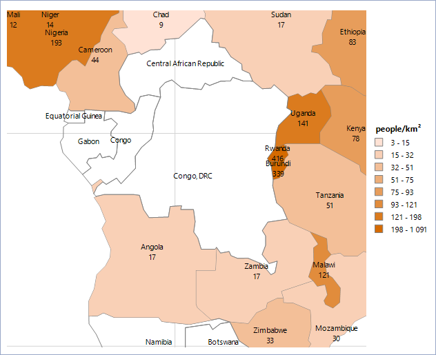

# Adding Choropleth Maps to Reports with the Choropleth Wizard

This article demonstrates how to add a Choropleth map to your report by using the Map Wizard of the Standalone Report Designer.

The suggested approach will create and set up a Choropleth map that will show the world population for each country and coloring its area depending on the population density value.

You will use a [CSV Data Source]() for the analytical data and an [ESRI Shapefile](https://en.wikipedia.org/wiki/Shapefile) for the spatial data.

The analytical data will be obtained from the [List of sovereign states and dependent territories by population density](https://en.wikipedia.org/wiki/List_of_countries_and_dependencies_by_population_density) Wikipedia article.

## 1. Start the Map Wizard

+ (For new reports) From the __Available Templates__ page, select the __Choropleth Wizard__ icon.

	

+ (For existing reports) From the `Insert` menu, select the `Choropleth` item. As a result, the Choropleth Wizard will start and guide you through the creation process.

## 2. Add the Data Source 

Now, you will add a new [CSV Data Source]() and name it __populationData__. This data source will hold the information about the countries, their area, population, and density along with some additional data.

Although you can copy the data directly from the Wikipedia page mentioned above, for your convenience pass the ready-to-use `CSV` file and pass it to the CSV data source.

1. Download the [`PopulationData.zip`](https://github.com/telerik/reporting-docs/raw/master/knowledge-base/resources/PopulationDensity.zip) file, save it locally, and extract its contents in a folder.
1. Navigate to that folder, locate the `PopulationDensity.csv` file, and copy its location path.
1. Back in the Wizard, insert the path to the `CSV` file into the **Select a file to import** textbox or paste its contents in the __Enter CSV as text__ tab.
1. The file uses semicolon (__;__) as a separator and comma (__,__) for the thousands separator. On the __Configure the separators__ page, tick the semicolon checkbox and untick the comma checkbox.
1. Click __Next__ until you get to the __CSV Headers__ page. Note that the `CSV` file has headers and you have to check the **The CSV has headers** checkbox.
1. On the __Map columns to type__ page, set the column types to match the actual data they represent.

	

1. When you click __Parse CSV...__ on the next page, you will see the result of the parsed file. Click __Finish__ when you are ready.
1. In the **Available data sources** list, you can see the datasource you've already created. Select it and click __Next__.

## 3. Provide the Spatial Data

On the next page, you have to select the source that will provide the spatial data to your choropleth. In this example, you will use a **Shapefile** bundle which consists of the `world.shp` and `world.dbf` files. The files are located in the `\Resources` subfolder of the directory where the `PopulationDensity.zip` file is extracted.

1. Select the __Binary file in ESRI Shapefile format__ radio button.
1. Browse to the directory where your Shapefile is placed or paste the path to the file in the textbox.
1. When the path to the Shapefile is set, create the __relations__ between the fields in the analytical (`CSV`) data set and the fields from the `world.dbf` file, which is part of the Shapefile bundle.

	Click the __New__ button on the relations control. A new row will appear. From the __Analytical Field__ column, select **Fields.Country**. Match it with the **Fields.CNTRY_NAME** field from the __Shapefile Field__ column.

	Your __Choose a spatial data source__ page will look like the following:

	

1. When the mandatory fields are set up, the __Next__ button will be activated. Click **Next** and you will be able to go to the next page.

## 4. Set the Specific Fields

On the following page, you will set the fields that are specific to the Choropleth map. Note that in the **Available fields** you will see the fields from both the analytical and spatial data sets.

1. Select the __Density (pop./km2)__ field and drag it to **Color data field:** box, where it will be transformed to __Sum([Density (pop./km2)])__. You can omit the aggregate operator, since every country is on a separate row in the data set, and the __Sum__ operator will aggregate only one row.
1. Select __EqualDistribution__ as a **Range grouping** method, which will distribute the data points evenly in groups or clusters.
1. Set a proper value to the **Colors count** property, which will define the number of clusters in which the color data values will be distributed. For the purposes of this example, choose __8__.
1. Set appropriate colors for the **Start color** and **End color** properties. They will be used to create a [`GradientPalette`](/api/Telerik.Reporting.Drawing.GradientPalette), which will distribute graded colors among the data points.

	The data points that have lower color values will receive colors from the start of the palette and the data points with the higher color values will receive colors from the end of the palette.

1. Check the appearance of the __Choropleth setup__ page which will look similar to the following image:

	

1. When you click the __Finish__ button, the Map will display the Choropleth map. Add some formatting to its title and legend and will look similar to the following image:

	

## Considerations

Some areas (countries) on the Map are transparent. These areas represent shapes that have no match with the analytical data set fields.

The Choropleth displays all the shapes that are available in the spatial data set, but the data points are created only when the field from the analytical data set is matched with a field from the spatial data by using the [`MapRelationPairCollection`](/api/Telerik.Reporting.MapRelationPairCollection).

The suggested approach uses a Shapefile for all the countries in the world, but you have analytical data for the 100 most populated countries. This means that some of the shapes will never be matched with the analytical data set and, therefore, will not be colored, because they don't have a valid population value.

Another reason for having transparent areas is the mismatch of the fields that are used in the __Relation Pairs__. Take a look at the following screenshot showing a part of Africa:

For this screenshot, the data point labels are __visible__ and have the following expression set to them: `= Format('{0} {1}', Fields.CNTRY_NAME, Sum(Fields.[Density (pop./km2)]))`. Note that the expression uses the fields from both the spatial and the analytical data set. As a result, the Choropleth displays __Congo, DRC__ as a country name but does not display a valid population value for it. Since the countries are bound by name, the engine tries to find a country named __Congo, DRC__ in the analytical data set, but fails, because in the CSV data source this country is named __Democratic Republic of the Congo__ (Pos. 79). If you edit the CSV data and rename the country to __Congo, DRC__, you will see that the both records are matched, the country area is now colored, and a valid population value __(29.6)__ is displayed.

This example demonstrated how to create a simple Choropleth map by using data from analytical and spatial data sources without writing a single line of code. You can find the `PopulationDensity.trdx` actual report definition in the contents of the `PopulationDensity.zip` archive that was used earlier.

## See Also

* [Adding ShapeMapSeries Instances to the Map]()
* [Adding LocationMapSeries Instances to the Map]()
* [Creating BarChart Series and CSV Data Source Maps]()
* [Demo Page for Telerik Reporting](https://demos.telerik.com/reporting)
* [Knowledge Base Section](/knowledge-base)
* [Map Class API Reference](/api/telerik.reporting.map)
