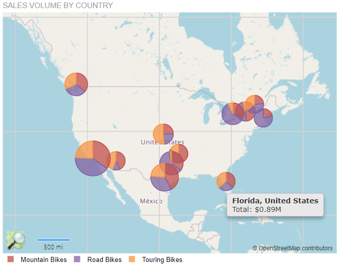

# Map Overview

The Map report item is a native Telerik Reporting item which enables you to visualize an aggregated business data in a geographical manner.

The data may be presented in different formats that is determined by the [chosen Map Type]().

## Key Features

* [Structure and elements]()&mdash;You can utilize all available elements the visual structure of the Map report item supports.
* [Connecting to data]()&mdash;The Map report item allows you to bind it to a single data object where you can control what data and in what way is geographically visualized through the Telerik Reporting Expression engine.
* [Layers and hierarchy]()&mdash;The analytical data from the data source will be presented geographically on the Map based on your settings.
* [Map types]()&mdash;The Map enables you to create different map types.
* [Styling and formatting]()&mdash;The Map delivers extensive settings for configuring the rendering of its parallels and meridians, legend, and other elements.

## Next Steps

* [Getting Started with the Map Report Item]()
* [(Demo) Sales Dashboard Report with a Map](https://demos.telerik.com/reporting/sales-dashboard)
* [(Demo) Product Catalog Report with a Document Map](https://demos.telerik.com/reporting/product-catalog)
* [(Demo) Population Density Report with a Choropleth Map](https://demos.telerik.com/reporting/population-density)
* [(Demo) Crypto Currency Info Report with Choropleth and Point Series](https://demos.telerik.com/reporting/crypto-currency-info)
* [Map Class API Reference](/api/telerik.reporting.map)
* [Demo Page for Telerik Reporting](https://demos.telerik.com/reporting)
* [Knowledge Base Section](/knowledge-base)

## See Also

* [Telerik Reporting Homepage](https://www.telerik.com/products/reporting)
* [Reporting Forums](https://www.telerik.com/forums/reporting)
* [Reporting Blog](https://www.telerik.com/blogs/tag/reporting)
* [Reporting Videos](https://www.telerik.com/videos/reporting)
* [Reporting Roadmap](https://www.telerik.com/support/whats-new/reporting/roadmap)
* [Reporting Pricing](https://www.telerik.com/purchase/individual/reporting)
* [Reporting Training](https://learn.telerik.com/learn/course/external/view/elearning/19/reporting-report-server-training)
