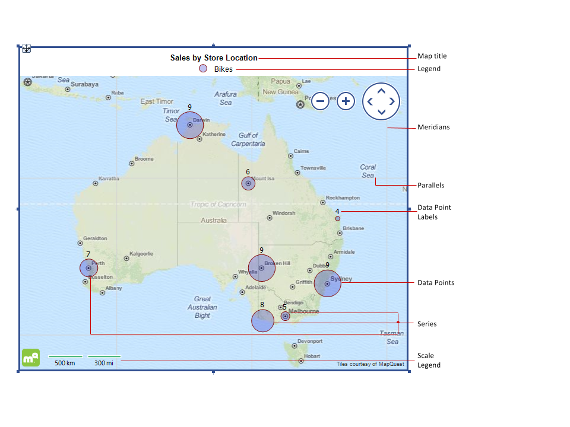

# Overview of the Map Structure and Elements

The Map report item enables you to visualize aggregated business data in a geographical manner.

## Visual Structure

The following image displays a Map report item showing a Point map series.

## Parallels and Meridians

The parallels and meridians, or the latitude and longitude lines, represent an imaginary grid over the Earth's surface thus forming the map coordinate system, called graticule. By combining longitude and latitude measurements, you can determine any location. The units of measurement for geographic coordinates are degrees (°), minutes ('), and seconds ("). For simplicity, the Map report item uses its decimal representation (decimal degrees).

When using the [Mercator projection](#projection), the meridians are distributed equally along the coordinate system. However, when using this projection, the latitude lines are non-linear, and, therefore, the parallels are placed at a non-constant distance from each other. That's why the Map enables the user to change the step at which the parallels or meridians are drawn. When not set, the latitude and longitude lines are drawn based on the given extent and scale factor.

## Data Points

Data points are produced by the defined Map series groups and geolocation groups. Their position is uniquely identified by the latitude and longitude coordinates that are returned either from a [location provider]() or from an expression.

The data point can display one or more measures, for example, when using a [Point map series](), the **Size** property can represent some scalar value.

## Labels

Data point labels are used to display the exact value represented by a data point. However, when the map has lots of data points fit on a small plot area, the data point labels make it more difficult to read. Therefore, by default, they are invisible.

## Series

Series represent a number of data points that show individual measurements. Depending on the groups they use and the data points they display, the series in the Map report item can be divided into two major categories.

- [`LocationMapSeries`](/api/Telerik.Reporting.LocationMapSeries)&mdash; To determine its data points' position on the map, this category uses [`GeoLocationMapGroup`](/api/Telerik.Reporting.GeoLocationMapGroup) to obtain a set of latitude and longitude coordinates, or to query the defined [location provider](). Location map series are the Point, Pie, and Column map types because they present similar data points each one on a single location on the map.
- [`ShapeMapSeries`](/api/Telerik.Reporting.ShapeMapSeries)&mdash; This category uses a set of coordinates to determine the shape of the data point itself. In this case, the engine does not use a `LocationProvider` or a `GeoLocationMapGroup` because the data points are not determined by a single location on the map surface.

The Map series can share existing `GeoLocation`, `ShapeMap`, and `Series` groups.

> tip Although the Map series share common properties, a `ShapeMapSeries` can only use and share `ShapeMap` groups. The `LocationMapSeries` (Point, Pie, and Column) can only use and share a `GeoLocationmap` group.

## Title

The Map title sets a header over the report item. You can move the title to various positions to achieve a better visual effect.

## Legend

The Map legend is a collection of legend items that are used to distinguish the map series and supports numerous [styling and expression capabilities that are resolved in a hierarchical way]().

## Scale

The [`MapScaleLegend`](/api/Telerik.Reporting.MapScaleLegend) shows the scale of the current map extent measured in the middle between its minimum and maximum latitude. The scale is calculated by using the [Haversine formula](https://en.wikipedia.org/wiki/Haversine_formula) which assumes that the Earth is a perfect sphere.

### Formatting the Scale Legend

The `ScaleLegend` allows the user to see the map scale in metric, imperial, or both units, depending on the way the [`ScaleUnits`](/api/Telerik.Reporting.MapScaleLegend#Telerik_Reporting_MapScaleLegend_ScaleUnits) property is set.

The value of the displayed scale depends on the [`Size`](/api/Telerik.Reporting.MapScaleLegend#Telerik_Reporting_MapScaleLegend_Size) property because the processing engine calculates the nearest round value that can be shown on the scale using all available width.

The [`Height`](/api/Telerik.Reporting.Drawing.SizeU#Telerik_Reporting_Drawing_SizeU_Height) in conjunction with [`VerticalAlign`](/api/Telerik.Reporting.Drawing.VerticalAlign) property determines how the scale will be positioned vertically. If the `Size.Height` is set to a very small value, for example, `0.1`, the `ScaleLegend` will grow vertically to display its content.

### Styling the Scale Legend

Similar to the [`LegendItem`](/api/Telerik.Reporting.LegendItem) of the Graph series, the `MapScaleLegend` provides the [`Style`](/api/Telerik.Reporting.MapScaleLegend#Telerik_Reporting_MapScaleLegend_Style) and [`ItemStyle`](/api/Telerik.Reporting.MapScaleLegend#Telerik_Reporting_MapScaleLegend_ItemStyle) properties for more precise styling.

The `ItemStyle` is used to set the styling of the mark line and the label:

- The [`LineStyle`](/api/Telerik.Reporting.Drawing.Style#Telerik_Reporting_Drawing_Style_LineStyle), [`LineWidth`](/api/Telerik.Reporting.Drawing.Style#Telerik_Reporting_Drawing_Style_LineWidth), and the [`LineColor`](/api/Telerik.Reporting.Drawing.Style#Telerik_Reporting_Drawing_Style_LineColor) properties define the rendering style of the scale line.
- The borders around the line are defined by the [`BorderColor`](/api/Telerik.Reporting.Drawing.Style#Telerik_Reporting_Drawing_Style_BorderColor), [`BorderStyle`](/api/Telerik.Reporting.Drawing.Style#Telerik_Reporting_Drawing_Style_BorderStyle), and [`BorderWidth`](/api/Telerik.Reporting.Drawing.Style#Telerik_Reporting_Drawing_Style_BorderWidth) properties.
- The styling of the label is determined by the [`Color`](/api/Telerik.Reporting.Drawing.Style#Telerik_Reporting_Drawing_Style_Color) and [`Font`](/api/Telerik.Reporting.Drawing.Style#Telerik_Reporting_Drawing_Style_Font) properties.

The `Style` property sets the styling of the container item, including the background color, borders, and the vertical alignment of its content.

## Projection

The projection is the representation model used to project the globe or celestial sphere on a surface. The projected coordinate system is defined on a flat two-dimensional surface and it is always based on a geographic coordinate system that represents a sphere or spheroid.

In such a coordinate system, the locations are identified by a X and Y coordinates with the origin at the center of the grid. Each position has two values that reference it to that central location, one for the horizontal and one for the vertical position.

The Map report item supports the [Mercator projection](https://en.wikipedia.org/wiki/Mercator_projection) which is a conformal map projection of which the meridians are drawn parallel to each other, and the parallels of the latitude are straight lines whose distance from each other increases with their distance from the equator.

## Extent

The Map extent is a rectangular map area defined by geographical coordinates and consists of the following fields which define the sides of the extent area:

- **LatitudeMax**&mdash;Usually the top side of the area rectangle.
- **LatitudeMin**&mdash;The bottom side.
- **LongitudeMin**&mdash;The left side.
- **LongitudeMax**&mdash;The right side of the area rectangle.

The extent is displayed in the Map viewport and can be defined in the following ways:

- Automatically&mdash;By the latitude and longitude coordinates of the data points. To retrieve these coordinates, use geocoding or set them from the data source.
- Explicitly&mdash;When the extent fields are set directly through the **Property** grid. If the defined extent is not conformant or has an invalid values, it will be automatically fixed when the map is panned or zoomed.
- From the viewport&mdash;When the map is panned, or zoomed in or out, the extent is recalculated and its new values are populated in the **Property** grid.

To reset the Map extent to its automatically calculated bounds, right-click outside of the plot area and select **Reset Map Extent** from the context menu. This will restore its `Latitude` and `Longitude` values to its default state.

## Tile Provider

The Tile Provider requests and downloads the imagery data for the specified map extent. For more information, refer to the dedicated article on the [tile provider Map element]().

## Location Provider

The Location Provider matches the addresses or locations with geographical coordinates. For more information, refer to the dedicated article on the [location provider Map element]().

## Layers and Hierarchy

The Map report item is a data item and allows you to present aggregated data by two hierarchical dimensions or groups. For more information, refer to the dedicated article on the [layers and hierarchy Map elements]().

## Precision

The Map report item is designed for scenarios which do not require great precision. For performance reasons, the processing engine works with float numbers and limits the data points precision to ~0.00001. Such a difference in decimal degrees, measured as the latitude at the equator, gives a distance of ~1.1 meters. If the coordinates of the data points are closer than that distance, they may overlap.

## Next Steps

- [Demo Page for Telerik Reporting](https://demos.telerik.com/reporting)
- [Knowledge Base Section](/knowledge-base)
- [Map Class API Reference](/api/telerik.reporting.map)

## See Also

- [Telerik Reporting Homepage](https://www.telerik.com/products/reporting)
- [Reporting Forums](https://www.telerik.com/forums/reporting)
- [Reporting Blog](https://www.telerik.com/blogs/tag/reporting)
- [Reporting Videos](https://www.telerik.com/videos/reporting)
- [Reporting Roadmap](https://www.telerik.com/support/whats-new/reporting/roadmap)
- [Reporting Pricing](https://www.telerik.com/purchase/individual/reporting)
- [Reporting Training](https://learn.telerik.com/learn/course/external/view/elearning/19/reporting-report-server-training)
