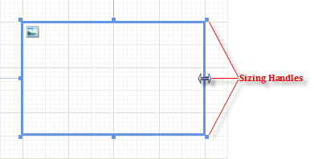

# Report Items Overview

Report items are used in the report depending on the data that will be displayed, for example, a [TextBox]() item for static or data-bound text, a [PictureBox]() for displaying images, a [Barcode]() for showing barcode in a label report, and so on. 

Every report item is an instance of the [`ReportItemBase`](/reporting/api/Telerik.Reporting.ReportItemBase) class. Report items can reside inside report sections or containers such as [Panel]() or [Table, Crosstab, or List]() items. 

## Arranging Report Items

The report content is displayed in the report items. To use report items, select them from the **Toolbox** and place them on your report.

### In Visual Studio

To display and arrange the report items in Visual Studio: 

1. Open the report in design view. 

1. Expand the __Telerik Reporting__ tab of the **Toolbox**. 

1. Select the report item that you want to place. 

1. Drag the report item from the **Toolbox** to the design surface of the report. 

  Alternatively, select the section of the report where you want the report item to appear by clicking the section header. Then, double-click the report item in the **Toolbox**. You can also select the report item in the **Toolbox** and draw a bounding rectangle to indicate the area the report item will occupy. 

### In the Standalone Designer

To display and arrange the report items in the Standalone Designer:

1. Open the report in design view. 

1. Click the __Insert__ tab of the ribbon. 

1. Select the report item that you want to place and click on it. 
  
### Relocating Report Items

To move a report item: 

1. Hover over the report item. 

1. When the cross hair cursor appears, click and drag the report item.

## Changing the Size 

To change the size of a report item: 

1. Click the report item to select it.

1. Click and drag one of the size handles on the edge of the report item to the desired size. 

## Controlling the Height

To remove blank vertical space in a container, such as a report section or panel item, whenever you control the visibility of report items in runtime, set its respective height to a very small value, for exampe, `1mm`. 

A Section or a Panel item can expand to accommodate their children but cannot shrink or take space that is no longer occupied. To make a section or a panel to shrink only at runtime, set its `Height` property in the report constructor and place the `Height` property assignment code right after the `IntializeComponent()` method call. 
