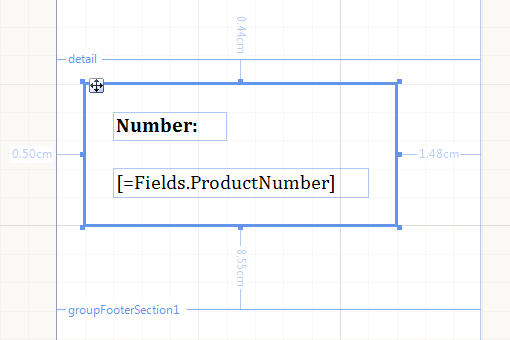

# Panel Report Item Overview 

The Panel report item serves as a container to group or separate multiple report items based on specific criteria, and is not associated with data. 

> The Panel acts as a container for items that you either create inside it or drag into it. For example, if you draw a Panel around an item that already exists in the Report Designer, the Panel will not act as its container. 

You can use the Panel to organize the layout of a report and allow the rendering of items without affecting the content outside the Panel itself. 

The Panel grows to accommodate its content, and as of the R3 2016 release, you can set the report item to shrink by setting its `CanShrink` property to `true`. 

The Panel enables you to set global properties, such as __Visible__, which affect all hosted report items.

When you move the Panel, the items that are contained within it move along with it. 

The following image shows a Panel which contains two [TextBox]() report items. 

## See Also

* [Organizing the Report Layout with the Panel]()
* [Using Styles to Customize Reports]() 
* [(API) Panel](/reporting/api/Telerik.Reporting.Panel)
