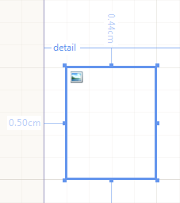

<style>
table th:first-of-type {
	width: 20%;
}
table th:nth-of-type(2) {
	width: 80%;
}
</style>

# PictureBox Report Item Overview

The PictureBox report item displays images in a report, and supports Base64-encoded images, SVG (Scalable Vector Graphics), and GDI+-supported (BMP, GIF, JPEG, EXIF, PNG, and TIFF) image formats.

This document explains how to add an image to a report with the help of the PictureBox item and how to configure its layout.

## Setting the Value

As its value, the PictureBox accepts an [expression]() that can contain any of the following:

* Binary image data.
* A URI (local path or URL) that points to a bitmap or an SVG file.
* A string that represents either a Base64-encoded image or an SVG markup.

The following screenshot shows a PictureBox report item at design-time. Note the image thumbnail in the upper left corner.



When you add values to the PictureBox, note the following:

* When the `Value` property is a string that is not an expression (a string which doesn't start with `=`), the PictureBox assumes the value is a URI, a Base64-encoded image, or an SVG markup.

	The __Relative Path__ will be resolved as follows:

	+ For __declarative report definitions (TRDP and TRDX files)__ - with respect to the report location.
	+ For __type report definitions (CS and VB reports)__ - with respect to the application starting point.

* Clicking the ellipsis for `Value` will open a **Browse** dialog to navigate to a file on your hard drive. The engine will try to determine the type of the selected file and populate the `Value` property with a descriptive text.
* When a raster image file (BMP, GIF, JPEG, PNG, EXIF, or TIFF) is selected, its bytes will be serialized in the report definition. When a Base64-encoded image file is selected, the report definition will persist the string representation of the Base64-encoded image. When an SVG image file is selected, the report definition persist its markup and it will be accessible in Edit Expression dialog.
* You can also paste a path to an image file, a Base64-encoded string, or an SVG markup in the `Value` property editor or in the **Edit Expression** dialog. Note that the maximum length supported by the `Value` editor is 32767 characters, so if the new string value is longer than that, you need to use the **Edit Expression** dialog instead.

To set an expression as a PictureBox value in the Report Designer:

1. Right-click the item. Choose **Expression...**.
1. Enter the expression in the [**Edit Expression** dialog]().

## Binding to Data

To bind an image data to a PictureBox when using a Report Designer is a straight-forward process. You need to connect to a data source and drag the image field from the [**Data Explorer**]() window to your report. As a result, the report designer tool will associate each field based on its data type.

Alternatively, you can drag a PictureBox item to the design surface and use an expression to set its `Value` property to an existing field from the data source. The type of the `PictureBox.Value` property is [`Object`](https://learn.microsoft.com/en-us/dotnet/api/system.object) which allows for versatile data binding and you do not have to directly bind to a database field with an image column.

The `Value` property accepts objects of type [`Image`](https://learn.microsoft.com/en-us/dotnet/api/system.drawing.image), byte array and strings. The string can be either of the following:

* An expression&mdash;The expression must evaluate to an [`Image`](https://learn.microsoft.com/en-us/dotnet/api/system.drawing.image), byte array, relative or absolute [Uri](https://learn.microsoft.com/en-us/dotnet/api/system.uri), or a string representing a Base64-encoded image or an SVG markup.
* A string literal&mdash;The string literal can be a relative or absolute [Uri](https://learn.microsoft.com/en-us/dotnet/api/system.uri), or a string representing a Base64-encoded image or an SVG markup.

### Binding to Binary Images

You can directly assign a reference to an [`Image`](https://learn.microsoft.com/en-us/dotnet/api/system.drawing.image) to the `Value` property of a PictureBox.

````C#
using System.Drawing;
Image image1 = Image.FromFile(@"C:\MyPictures\MyPicture.jpg");
this.pictureBox1.Value = image1;
Image image2 = Image.FromStream(imageStream);
this.pictureBox2.Value = image2;
````
````VB.NET
Imports System.Drawing
Dim image1 As Image = Image.FromFile("C:\MyPictures\MyPicture.jpg")
Me.PictureBox1.Value = image1
Dim image2 As Image = Image.FromStream(imageStream)
Me.PictureBox2.Value = image2
````

While in design-time within the [Visual Studio Report Designer](), if you click the ellipsis of the `Value` property, a dialog appears for you to choose the desired image. After you select the image, the Designer will automatically store it in the resources file for the report (`.resx`) and add a line of code to the `InitializeComponent` method that obtains a reference to the image stored in the resources and assigns it to the `Value` of the PictureBox:

````C#
this.pictureBox1.Value = ((object)(resources.GetObject("pictureBox1.Value")));
````

When the database field contains a relative path, either a file path or a URI, you can utilize the [user functions]() to specify the correct path to the image and then set the `Value` to the correct `=LoadImage(Fields.YourImagePathColumn)` expression.

````C#
public static Image LoadImage(string imageLocation)
{
	string absoluteLocation = "C:\\" + imageLocation;
	return Image.FromFile(absoluteLocation);
}
````
````VB.NET
Public Shared Function LoadImage(imageLocation As String) As Image
	Dim absoluteLocation As String = "C:\" + imageLocation
	Return Image.FromFile(absoluteLocation)
End Function
````


### Binding to Expressions, URIs, Base64, and SVG

Alternatively, you can assign a string value to the `Value` property. This string value can be any of the following:

* An [item binding expression]()&mdash;When binding to a data field with an expression, the Value property will accept both `binary` and `string` data fields.
* A [URI](https://en.wikipedia.org/wiki/Uniform_Resource_Identifier)&mdash;The `Value` property supports both absolute and relative URIs.
* A string representing a Base64-encoded image or a valid SVG markup&mdash;For optimization, the engine initially checks the length of the string value.

	If it is less than 80 characters, the value is considered to be an URI. Otherwise, the string is tested whether it is SVG markup (if its first 256 characters contain `<svg`) or a Base64-encoded string.

	If the string is neither a valid SVG, nor a Base64-encoded string, the engine will still accept the string as a URI and will try to instantiate an image from it.

To sum it up, the data source column of the PictureBox can store the image object, its Base64 string representation, an SVG markup, or a relative or absolute URI pointing to the image:

````C#
this.pictureBox1.Value = "=Fields.MyImageBinary";//a binary data column
this.pictureBox2.Value = "=Fields.MyImageURI";//a data column containing an URI
this.pictureBox3.Value = @"C:\MyPictures\MyPicture.png";//absolute file path to a PNG file
this.pictureBox4.Value = @"C:\MyPictures\MySVGImage.svg";//absolute file path to an SVG file
this.pictureBox5.Value = @".\images\MyPicture.png";//relative path
this.pictureBox6.Value = "https://www.mysite.com/images/img1.gif";//absolute URL
````
````VB.NET
Me.PictureBox1.Value = "=Fields.MyImageBinary" 'a binary data column
Me.PictureBox2.Value = "=Fields.MyImageURI" 'a data column containing an URI
Me.PictureBox3.Value = "C:\MyPictures\MyPicture.png" 'absolute file path to a PNG image
Me.PictureBox4.Value = "C:\MyPictures\MySVGImage.svg" 'absolute file path to an SVG file
Me.PictureBox5.Value = ".\images\MyPicture.png" 'relative path
Me.PictureBox6.Value = "https://www.mysite.com/images/img1.gif" 'absolute URL
````


## Clipping, Rendering, and Positioning

The clipping and positioning of an image in the display area of the PictureBox item is controlled by its `Sizing` and `ImageAlignment` properties.

The following table lists the `Sizing` property modes.

| Name | Description |
| ------ | ------ |
|`AutoSize`|The PictureBox size is adjusted to that of the image it contains.|
|`Center`|The image is displayed in the center of the PictureBox. If the image is larger than the PictureBox, the outside edges are clipped.|
|`Normal`|The image is placed in the upper-left corner of the PictureBox. The image is clipped if it's larger than the PictureBox which contains it.|
|`Stretch`|The image within the PictureBox is stretched or shrunk as appropriate to fit the size of the PictureBox.|
|`ScaleProportional`|The image is sized proportionally (without clipping) so that it's best fitted to the PictureBox.<br/> If the height and width ratio of the PictureBox is the same as the ratio of the image, it will be resized to exactly fit into the PictureBox. Otherwise, the closest fitting side (height or width) of the image will be sized to the item and the other side (height or width) of the image sized proportionally (leaving empty space).|

The `ImageAlignment` property dictates the alignment of the image if it does not conform to the specified PictureBox size. *Not respected when the __Sizing__ property is set to __AutoSize__, __Center__, or __Stretch__.*
The following table lists the `ImageAlignment` property modes.

| Name | Description |
| ------ | ------ |
|`Auto`|Retains the original alignment of the __Normal__ and __ScaleProportional__ sizing modes.<br/>This is the default mode.|
|`Center`|Aligns the image to the **center** of the PictureBox's **X-axis** and to the **center** of the PictureBox's **Y-axis**.|
|`Left`|Aligns the image to the **left** of the PictureBox's **X-axis** and to the **center** of the PictureBox's **Y-axis**.|
|`Top`|Aligns the image to the **center** of the PictureBox's **X-axis** and to the **top** of the PictureBox's **Y-axis**.|
|`Right`|Aligns the image to the **right** of the PictureBox's **X-axis** and to the **center** of the PictureBox's **Y-axis**.|
|`Bottom`|Aligns the image to the **center** of the PictureBox's **X-axis** and to the **bottom** of the PictureBox's **Y-axis**.|
|`TopLeft`|Aligns the image to the **left** of the PictureBox's **X-axis** and to the **top** of the PictureBox's **Y-axis**.|
|`TopRight`|Aligns the image to the **right** of the PictureBox's **X-axis** and to the **top** of the PictureBox's **Y-axis**.|
|`BottomLeft`|Aligns the image to the **left** of the PictureBox's **X-axis** and to the **bottom** of the PictureBox's **Y-axis**.|
|`BottomRight`|Aligns the image to the **right** of the PictureBox's **X-axis** and to the **bottom** of the PictureBox's **Y-axis**.|

The PictureBox renders the image depending on the underlying image DPI settings, so the physical dimensions of the rendered item may vary. For example, if you are using a 120dpi image in your PictureBox with __Sizing__ set to `AutoSize` or `Normal` and the machine settings are set to `96dpi`, the image will look smaller due to the higher amount of pixels per inch. To properly resize the image, set its __Sizing__ to `Stretch` or `ScaleProportional`.

The SVG images are rendered in vector format where the rendering extension supports it.

* On the designer surface and in image formats, the SVG content is rendered as an EMF (Enhanced Metafile) which is also a vector format and preserves the lossless scaling.
* In HTML formats, the SVG markup is rendered as-is, since all modern browsers support SVG contents.
* In OpenXML-based rendering extensions (DOCX, XLSX, PPTX, RTF), the SVG is rendered in a vector format by default, but can be rendered in a raster format if the `deviceInfo` setting `UseMetafile` is set to `false`.
* In the rest of the rendering extensions, the SVG is rendered as a raster image, but the size of the item is always taken into account for quality.

## Next Steps

* [(Demo) Product Catalog Report with a PictureBox](https://demos.telerik.com/reporting/product-catalog)
* [Using Styles to Customize Reports]()
* [Using Expressions]()
* [(API) PictureBox](/api/Telerik.Reporting.PictureBox)
* [(API) Sizing](/api/Telerik.Reporting.PictureBox#Telerik_Reporting_PictureBox_Sizing)
* [Demo Page for Telerik Reporting](https://demos.telerik.com/reporting)
* [Knowledge Base Section](/knowledge-base)

## See Also

* [Telerik Reporting Homepage](https://www.telerik.com/products/reporting)
* [Reporting Forums](https://www.telerik.com/forums/reporting)
* [Reporting Blog](https://www.telerik.com/blogs/tag/reporting)
* [Reporting Videos](https://www.telerik.com/videos/reporting)
* [Reporting Roadmap](https://www.telerik.com/support/whats-new/reporting/roadmap)
* [Reporting Pricing](https://www.telerik.com/purchase/individual/reporting)
* [Reporting Training](https://learn.telerik.com/learn/course/external/view/elearning/19/reporting-report-server-training)
