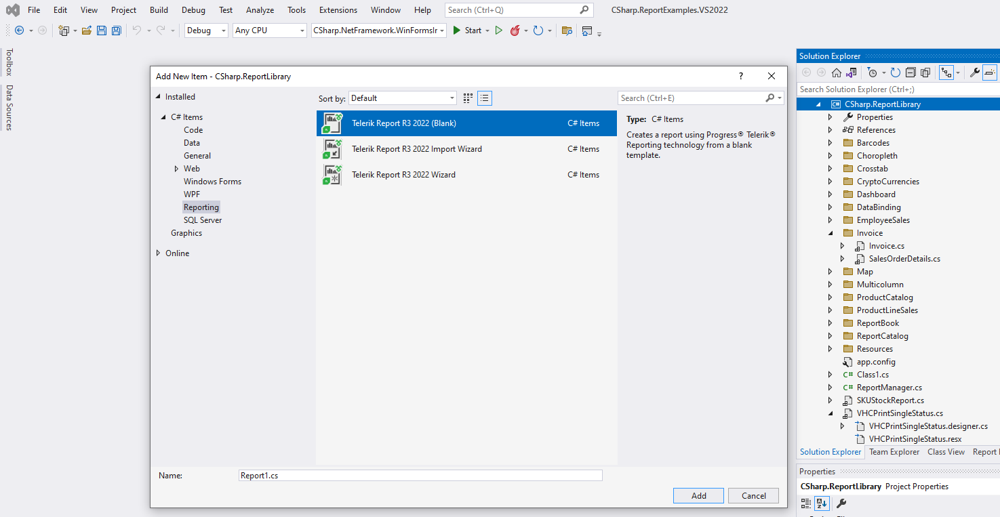
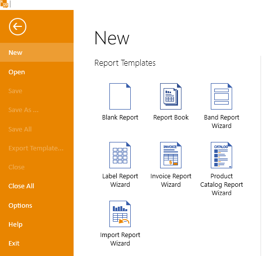

# Getting Started with the Report Item

The `Report` item is a unique report item that is a container for the rest of the report items. It consists of report sections, each one with a different purpose as explained in the article on [Telerik Reporting report sections](#report-sections).

You may add a Report item to the Desktop Report Designers as follows:

* For the Visual Studio Report Designer you may right-click over the .NET Framework ReportLibrary project and select `Add` > `New item...`. You need to choose the corresponding item from the available items under `Reporting` as shown in the image below:

	

* For the Standalone Report Designer you may select `File` from the Menu toolbar and choose the corresonding option from the `New` tab as displayed in the image below:

	

When you create a new report with any of the Telerik Reporting [Report Designer tools](), the report will automatically add the Report item by providing you with the following approaches to do that:

* (For all Report Designers) Select to add a **Blank report**&mdash;The Blank report contains the **Page Header**, **Details**, and **Page Footer** empty sections by default. You can add any of the other available report sections later.

	For the specific steps to proceed further on, refer to the [guide on designing and configuring the Blank report sections](#step-2-create-the-sample-report).

* (For the desktop Report Designers) Add a Report Template&mdash;The Telerik Reporting [report templates]() save time when you create reports with consistent layouts.

	The templates support the following dedicated wizards that enable you to configure the initial settings of the report:

	* [Band Report Wizard (step-by-step guide)]() for creating reports with layouts based on the report sections.

	* [Label Report Wizard (step-by-step guide)]() for creating reports with label layouts.

	* [Invoice Report Wizard (step-by-step guide)]() for preparing one of the most common business documents, the invoice.

	* [Product Catalog Report Wizard (step-by-step guide)]() for creating one of the most useful business presentation documents, the catalog.

* (For the desktop Report Designers) Convert a report from another reporting format&mdash;If you have already used another reporting tool and want to reuse some of your existing reports, check [whether Telerik Reporting provides automatic converters for them]().

	If yes, use the [Import Report Wizard step-by-step guide]() to proceed with the conversion.

## See Also

* [Designing Reports with Telerik Reporting (Step-by-Step Guide)]()
* [Report Designers]()
* [Report Sections]()
* [Report Templates]()
* [Importing Reports]()
