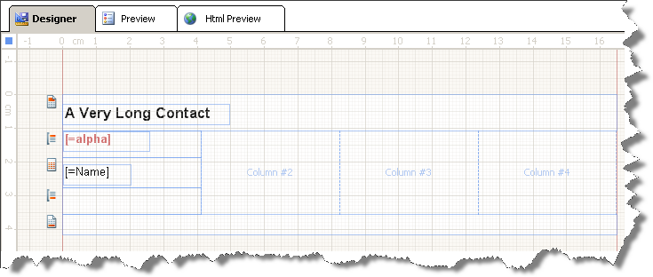
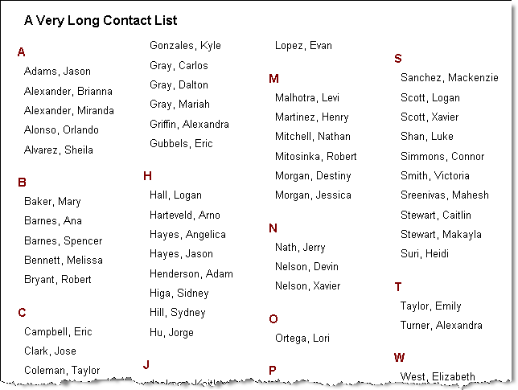

# Creating Multi-Column Reports

A report can be divided into columns, similarly to a newspaper, that are treated as logical pages rendered on the same physical page. The detail section is printed once for every row in the data source similarly to a repeater, which also happens vertically.

The columns represent the separate pages of the report, which are treated as logical pages rendered on the same physical page. They are arranged from left to right and from top to bottom. The columns are separated by white spaces and the data flow in the columns is left to right, top to bottom, that is, down the page and then across.

A column on a physical page is considered a logical page, whenever there are multiple columns on the physical page. If you apply a page break on a report section in multi-column layout, the section affected by the page break will move to the next column (logical page). This means that if there is enough space on the current physical page, the section is moved to a new logical page (column) and not to a new physical page.

Columns are specified through the [`ColumnCount`](/api/Telerik.Reporting.DetailSection#Telerik_Reporting_DetailSection_ColumnCount) property. The column width is determined by the width of the report in the design view. The [`ColumnSpacing`](/api/Telerik.Reporting.DetailSection#Telerik_Reporting_DetailSection_ColumnSpacing) property sets the spacing in between the columns.

The column width can be calculated as the page width minus the sum of the left and right margins minus the `ColumnSpacing` * (`ColumnCount` - 1). The result will be divided to the `ColumnCount`.

>tip Columns are only applied when you view a report in the __Print Preview__, when you print a report or export it to a page-oriented format. A report with a multi-column report layout used as a SubReport will be rendered as a single-column report layout.

## Setting Up the Layout

To set up the multi-column report layout:

1. In the **Properties** window, expand the __PageSettings__ property of the report.
1. Change the __ColumnCount__ property to __4__.
1. Set __ColumnSpacing__ if needed.
1. Resize the report to match the desired width of the columns. You can do this visually or by setting the __Width__ property of the report in the Properties window.
1. Resize any report items so that they are not greater than the width of the report.

> If the report does not render the number of columns set in `ColumnCount`, it is possible that the report width is too large. In such cases, check for report items with greater width than the width of the report and the column width itself.

## Example

The following example shows a report set for a multi-column layout in design time with the following properties:

* `Report.Width=1.5in`
* `Report.PageSettings.ColumnCount=4`
* `Report.PageSettings.ColumnSpacing=0in.`

The following image shows the way this report looks like when previewed in **Print Preview**:

The following specifics are visible from the preview:

* The report header and group header sections span the width of the column.
* The page header and page footer sections span the actual width of the page, not the width of the column.

## See Also

* [Creating Multi-Column Report across and down the Page]()
