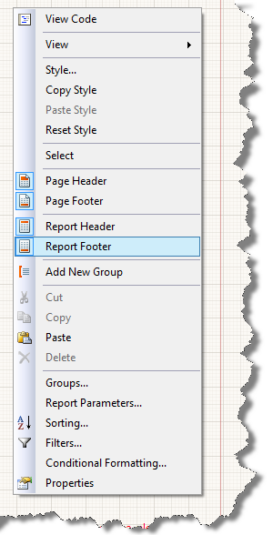

# Page Headers and Footers Overview

By default, every new report is created with a page header section and a page footer section.

## Specifics

In the report output, any control you place in the page header will be rendered at the top of each page, and any control you place in the page footer will be rendered at the bottom of each page.

The size of page sections can be controlled through the [`Bindings`]() setting. However, the inner items won't force the page sections to grow. If a report item inside a page section grows beyond its parent size, the page section would not grow to accommodate it and the part that does not fit would be cut off. Listed below are page section specific properties:

* __PrintOnFirstPage__&mdash;If set to `False`, suppresses the page section on the first page of the report.

* __PrintOnLastPage__&mdash;If set to `False`, suppresses the page section on the last page of the report.

`PrintOnFirstPage` has priority over `PrintOnLastPage` in page headers and visa versa in page footers. Therefore, for single-page reports in the page header the `PrintOnFirstPage` property will be respected, and in the page footer the `PrintOnLastPage` property will take precedence.

>note 
>* Page sections are not related to the report itself, but are relative to the paper or the screen. Thus, page sections of nested or detail reports are ignored and only the page sections of the main report are visible. 
>* You cannot use [data items]() in page sections because page sections are processed after the report data. Currently, the report data source is not available anymore.

## Adding and Removing

To add or remove page headers or footers:

1. Right-click in the empty space around the sections.

1. Select __Page Header__ or __Page Footer__ and follow the prompts.

	

## Adding Calculated Page Totals

For some reports, it is useful to include a page-scoped aggregate in the page header or footer of the report. For example, a per-page sum total may be rendered if the page includes numeric values.

For more information, refer to the `PageExec` description in the article on [functions]().

## See Also

* [(API) PageHeaderSection](/api/Telerik.Reporting.PageHeaderSection)
* [(API) PageFooterSection](/api/Telerik.Reporting.PageFooterSection)
