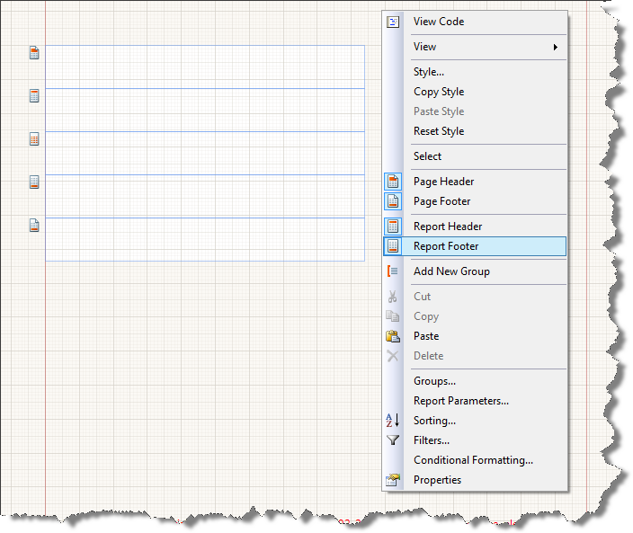

# Report Headers and Footers

Reports can contain report headers and footers. By default, new reports are created without these sections.

## Specifics 

In the report output, any control you place in the report header will be rendered once at the top of the entre report and after the first page header section (if any); any control you place in the report footer will be rendered once at the bottom of the entire report, and before the last page footer section (if any).

## Adding and Removing Report Headers and Footers

1. Right-click on any section header in the report, or in the empty space around the sections.

1. Select __Report Header__ or __Report Footer__.  

  

## See Also

* [`ReportHeaderSection`](/reporting/api/Telerik.Reporting.ReportHeaderSection)  
* [`ReportFooterSection`](/reporting/api/Telerik.Reporting.ReportFooterSection)
