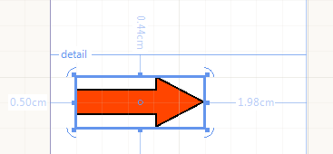

# Shape Report Item Overview

The Shape report item displays a single selection of predefined shapes in a report.

The following screenshot shows a Shape report item with its `ShapeType="Right Arrow"` on the report design surface.

You can use shapes to create visual effects within a report. You can set display and other properties to this item by using the Properties pane.

The following table lists the `ShapeType` property modes supported by the Shape.

|Lines|Stars|Arrows|Other
|:---|:---|:---|:---
|Vertical Line|3-ray star|Top Arrow|Ellipse 
|Horizontal Line|4-ray star|Bottom Arrow|Triangle 
|Slant Line|5-ray star|Left Arrow|Square 
|BackSlant Line|6-ray star|Right Arrow|Pentagon 
||8-ray star||Hexagon 
||||Octagon 
||||Cross 

The Shape enables you to create custom shapes programmatically. The following code snippet shows how to inherit the [`ShapeBase`](/api/telerik.reporting.drawing.shapes.shapeBase) class and provide a custom set of `PointF` arrays that will form the Shape. The coordinates of the points are relative and do not depend on the size or position of the item in the report.

{{source=CodeSnippets\CS\API\Telerik\Reporting\ShapeSnippets.cs region=CustomShapeClassDeclarationSnippet}}
{{source=CodeSnippets\VB\API\Telerik\Reporting\ShapeSnippets.vb region=CustomShapeClassDeclarationSnippet}}

You can create the Shape at runtime and add it to a report item container (Section, Panel, or other). The following snippet shows how to instantiate a Shape of the `CustomShape` type:

{{source=CodeSnippets\CS\API\Telerik\Reporting\ShapeSnippets.cs region=CreateCustomShapeSnippet}}
{{source=CodeSnippets\VB\API\Telerik\Reporting\ShapeSnippets.vb region=CreateCustomShapeSnippet}}

## Next Steps 

* [(Demo) Crypto Dashboard Report with a Shape](https://demos.telerik.com/reporting/crypto-dashboard)
* [Using Styles to Customize Reports]()
* [(API) Shape](/api/Telerik.Reporting.Shape)
* [(API) ShapeType](/api/Telerik.Reporting.Shape#Telerik_Reporting_Shape_ShapeType)
* [(API) Stretch](/api/Telerik.Reporting.Shape#Telerik_Reporting_Shape_Stretch)
* [Demo Page for Telerik Reporting](https://demos.telerik.com/reporting)
* [Knowledge Base Section](/knowledge-base)

## See Also

* [Telerik Reporting Homepage](https://www.telerik.com/products/reporting)
* [Reporting Forums](https://www.telerik.com/forums/reporting)
* [Reporting Blog](https://www.telerik.com/blogs/tag/reporting)
* [Reporting Videos](https://www.telerik.com/videos/reporting)
* [Reporting Roadmap](https://www.telerik.com/support/whats-new/reporting/roadmap)
* [Reporting Pricing](https://www.telerik.com/purchase/individual/reporting)
* [Reporting Training](https://learn.telerik.com/learn/course/external/view/elearning/19/reporting-report-server-training)
