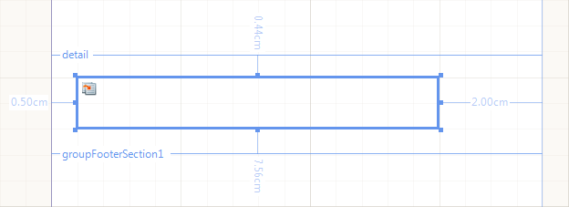
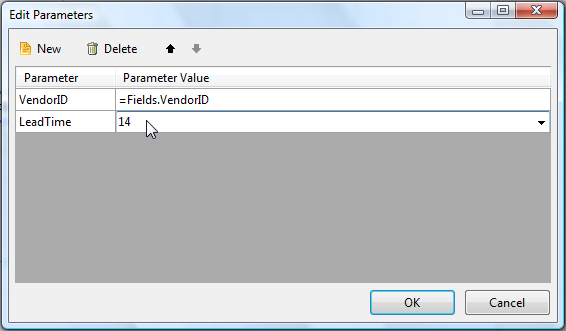

# SubReport Item Overview

The SubReport item enables you to display reports within reports and serves as a container, similar to the report sections, growing in size depending on its children.

The following screenshot shows a SubReport item at design time, allowing you to compose complex reports from various report sources. The data for each SubReport can be completely different, for example, you can combine a product listing, a sales summary, and a list of salespeople each in their own sub-report with each sub-report drawing its data from a different source. You can also pass parameters to the SubReport by using the **Edit Parameters** collection editor.

## Defining the Parameters

To set up the SubReport:

1. Click the report item you want to change. The selected SubReport properties are listed in the **Property Browser**.
1. In the `ReportSource` property, click the **Edit Collection (…)** button. As a result, the **Load a Report From** window opens.
1. Click the **Edit Parameters** button to add a parameter. As a result, the **Edit Parameters** window opens.
1. Click the **New** button to add a new parameter mapping.
1. Assuming you have assigned the `ReportSource` property, the **Parameter Name** drop-down list will contain the names of parameters defined in the sub-report. Select a **Parameter Name** from the combo box to set the target for this parameter.
1. The **Parameter Value** combo-box allows you to directly enter the value, and create an `<Expression>` or a `<New Report Parameter>`.
1. When you are done, click **OK**.

The following image shows the end result.

## Setting the Report Source

To specify a sub-report for a [SubReport item](), you need a [ReportSource]() object.

The SubReport enables you to set up the report source either by using a Telerik Report Designer tool or programmatically.

When using relative path to the report in the **UriReportSource** of the SubReport, it gets resolved by default as follows:

- In the Standalone Report Designer, Reporting REST Services and Report Viewers with respect to the main report that calls the subreport;
- In custom applications rendering reports programmatically with the [ReportProcessor class](/api/telerik.reporting.processing.reportprocessor) with respect to the application starting point.

> When you reference reports stored in the [Telerik Report Server](https://docs.telerik.com/report-server/introduction) ensure using the _[CategoryName]/[ReportName]_ path for the URI as specified in the article [Working with Report Server Reports]().

### Using a Report Designer

To set the report source of the SubReport item by using a Telerik Report Designer:

1. In the **Design** view, right-click a SubReport item to which you want to set a report source and click **Properties**.
1. In the **Properties** of the item, click `ReportSource`. As a result, a **Load a Report from** dialog appears. Select a `ReportSource`.
1. Select the type of report source you will use to specify a report. For this example, click the **Instance Report Source** option and select the report that will serve as the detailed report.
1. To specify the parameters for the report, click the **Edit Parameters** button. As a result, the **Edit Parameters** dialog appears. Click **New**.
1. In the **Parameter Name** column, select the name of a report parameter in the detail report. In the **Parameter Value**, type or select the value to pass to the parameter in the detail report.

### Defining Programmatically

The following snippet demonstrates how to set the report source of the SubReport programmatically.

{{source=CodeSnippets\CS\API\Telerik\Reporting\ReportSourceSnippets.cs region=CreateInstanceReportSourceSnippet}}
{{source=CodeSnippets\VB\API\Telerik\Reporting\ReportSourceSnippets.vb region=CreateInstanceReportSourceSnippet}}

Due to the format of the produced reports, the [Standalone Report Designer]() includes only `XmlReportSource` and `UriReportSource` options.

The [Visual Studio Report Designer]() provides the [report sources]() options.

If you are using the HTML5 Report Viewer to preview the report, the main report will be rendered in HTML and loaded on the client. The sub-report is considered as part of the main report content and its report source will be internally resolved without additional calls to the Reporting REST service.

## The property DataSource of the SubReport item

The property was introduced with `R3 2022 SP1 (16.2.22.1109)`.

It enables direct feeding of the inner report with data from the main report. When the property is set, its data will be used when processing the inner report instead of the data that is set up in the definition of the inner report.

All the [data sources]() supported in the [DataSource](/api/Telerik.Reporting.DataItem.html#Telerik_Reporting_DataItem_DataSource) property are applicable as a value of this property.

A common scenario would be to feed the inner report with data coming from the data context of the `SubReport` item. To do this, define a [Binding]() to bind the `DataSource` property to a data field.

For example, define a `Binding` with `Path` `DataSource` and `Expression` `=Fields.InvoiceRows` to link the inner report DataSource to the collection with the invoice rows from the main report DataSource.

## Considerations and Known Limitations

When working with the SubReport item, mind the following:

- Page sections are not related to the report itself, but are relative to the paper or screen. Therefore, page sections of nested or detail reports are ignored and only the page sections of the main report are visible.
- To render page sections that appear on each page, similar to page sections, consider using an unbound group (no grouping criteria specified) and set the [`PrintOnEveryPage`](/api/Telerik.Reporting.GroupSection#Telerik_Reporting_GroupSection_PrintOnEveryPage) property of its sections to `True`. Note that you cannot use the `PageCount` and `PageNumber` global objects in group sections.
- The [Table of Contents (TOC) section]() is designed to be displayed at the top/bottom of the entire report document. For that reason, the TOC section of the subreport is ignored.
- To remove blank vertical space in the detail section of a SubReport, set the `Height` of the `SubReport.ReportSource` `DetailSection` to the height of the highest item.
- Sections can grow to accommodate their children but cannot shrink to hide empty spaces. To make the detail section shrink only at runtime, set the `Height` property of the `DetailSection` in the report constructor. Place the `Height` property assignment code right after the `IntializeComponent()` method call.
- The default styles used in the subreports may be overridden by inherited styles from their parent reports.

  When Report items and sections use default styles (i.e. their styles are not set explicitly), they will inherit the Styles from their parents. This is valid for the SubReport item and the corresponding subreport specified by its ReportSource. This may lead to inconsistencies when rendering the subreport as a separate report and in a main report. Here is an example for clarity:

  Let's have a report definition (referenced below as _subreport_) that doesn't have a Font specified. It will be rendered with Font size `10pt` which is a default value, which is not explicitly set. If you have a TextBox in this report, with default Font, the text will be rendered with `10pt` when you render the _subreport_ as a separate report.

  Let's consider a main report, with Font size set explicitly to `20pt`. If we use the above _subreport_ in our main report, the _subreport_ text will inherit the Font size from the main report and the same text will appear with size `20pt`.

## Next Steps

- [(Demo) Invoice Report with a SubReport](https://demos.telerik.com/reporting/invoice)
- [Creating Master-Detail Reports with the SubReport]()
- [Binding the SubReport to Parent Report Data]()
- [(API) SubReport](/api/Telerik.Reporting.SubReport)
- [(API) ReportSource](/api/Telerik.Reporting.SubReport#Telerik_Reporting_SubReport_ReportSource)
- [(API) DataItem.DataSource](/api/Telerik.Reporting.DataItem.html#Telerik_Reporting_DataItem_DataSource)
- [Demo Page for Telerik Reporting](https://demos.telerik.com/reporting)
- [Knowledge Base Section](/knowledge-base)

## See Also

- [Telerik Reporting Homepage](https://www.telerik.com/products/reporting)
- [Reporting Forums](https://www.telerik.com/forums/reporting)
- [Reporting Blog](https://www.telerik.com/blogs/tag/reporting)
- [Reporting Videos](https://www.telerik.com/videos/reporting)
- [Reporting Roadmap](https://www.telerik.com/support/whats-new/reporting/roadmap)
- [Reporting Pricing](https://www.telerik.com/purchase/individual/reporting)
- [Reporting Training](https://learn.telerik.com/learn/course/external/view/elearning/19/reporting-report-server-training)
