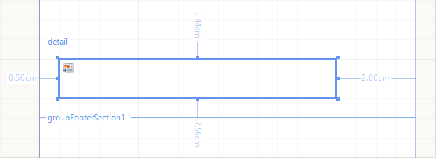
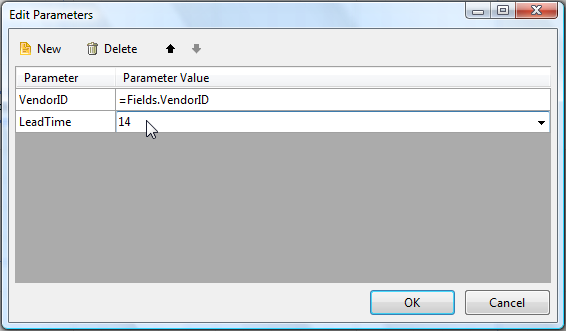

# SubReport Item Overview

The Telerik Reporting SubReport item embeds a separate report definition inside a main report. Use it when the nested content needs its own layout, data source, parameters, or reusable design.

In this article, *main report* means the parent report that contains the SubReport item, and *subreport* means the child report loaded through the `ReportSource` property of that item.

At design time, the SubReport item acts as a placeholder in the main report. Each subreport can use different data and parameters, which lets you combine content such as product lists, sales summaries, and detail records in one document.

## When to Use a SubReport

Use a SubReport when you need to:

- Reuse the same child report in multiple parent reports.
- Show nested content that has its own data source, parameters, or layout.
- Build a master-detail report in which each parent row renders a child report.

If your goal is to create groups dynamically inside a Table or Crosstab, configure row groups or column groups in that data item instead of using a SubReport. A SubReport embeds another report definition; it does not create dynamic grouping inside a table data region.

## How to Identify the Main Report and the Subreport

Use the following terms throughout this article:

| Term | What it means | What you edit |
|---|---|---|
| Main report | The parent report that contains the SubReport item | The report surface where you place and select the SubReport item |
| SubReport item | The report item in the main report that hosts the child report | Its properties, such as `ReportSource`, parameter mappings, and `DataSource` |
| Subreport | The child report definition loaded by the SubReport item | The separate report whose layout, parameters, and data definition you want to display |

This distinction matters in the designer: you select and configure the SubReport item in the main report, while you define fields, sections, and report parameters in the subreport itself.

## How to Pass Parameters to a SubReport

Before you map parameters, create the required report parameters in the subreport definition and assign the `ReportSource` of the SubReport item in the main report.

>note
> In this procedure, edit the **main report** that contains the SubReport item. Edit the subreport itself only when you need to add, remove, or rename the report parameters.

## Defining the Parameters

To set up the SubReport:

1. Open the main report and select the SubReport item that will host the child report. The selected item's properties appear in the __Property Browser__.
1. In the `ReportSource` property, click the __Edit Collection (…)__ button. The __Load a Report From__ window opens.
1. Select the child report that you want to use as the subreport, and then click the __Edit Parameters__ button. The __Edit Parameters__ window opens.
1. Click the __New__ button to add a new parameter mapping.
1. In the __Parameter Name__ drop-down list, select a parameter that is defined in the subreport.
1. In the __Parameter Value__ field, enter the value that the main report should pass to that subreport parameter. You can type a literal value or create an `<Expression>` or a `<New Report Parameter>`.
1. When you are done, click __OK__.

The following image shows the parameter editor after the mapping is configured.

## Setting the Report Source

To specify a subreport for a [SubReport item](slug:telerikreporting/designing-reports/report-structure/subreport), you need a [ReportSource](slug:telerikreporting/designing-reports/report-sources/overview) object.

Edit this property on the SubReport item in the **main report**. The report that you select becomes the child report rendered inside that item.

The SubReport enables you to set up the report source either by using a Telerik Report Designer tool or programmatically.

When you use a relative path to the report in the __UriReportSource__ of the SubReport, it resolves as follows:

- In the Standalone Report Designer, Reporting REST Services, and Report Viewers, relative to the main report that calls the subreport.
- In custom applications that render reports programmatically with the [ReportProcessor class](/api/telerik.reporting.processing.reportprocessor), relative to the application starting point.

>important
> When you reference reports stored in the [Telerik Report Server](https://docs.telerik.com/report-server/introduction), use the `[CategoryName]/[ReportName]` path in the URI, as described in [Working with Report Server Reports](slug:telerikreporting/designing-reports/report-designer-tools/desktop-designers/standalone-report-designer/working-with-report-server-reports).

### Using a Report Designer

To set the report source of the SubReport item by using a Telerik Report Designer:

1. Open the main report in **Design** view, right-click the SubReport item, and then click **Properties**.
1. In the selected SubReport item's **Properties**, click `ReportSource`. The **Load a Report from** dialog opens.
1. Select the report source type that points to the child report. For example, click **Instance Report Source** and then select the report that will serve as the subreport.
1. If the subreport requires parameters, click **Edit Parameters** and then click **New**.
1. In the **Parameter Name** column, select the name of a report parameter that exists in the subreport.
1. In the **Parameter Value** column, type or select the value from the main report that you want to pass to that subreport parameter.

### Defining Programmatically

The following snippet demonstrates how to set the report source of the SubReport programmatically.

{{source=CodeSnippets\CS\API\Telerik\Reporting\ReportSourceSnippets.cs region=CreateInstanceReportSourceSnippet}}
{{source=CodeSnippets\VB\API\Telerik\Reporting\ReportSourceSnippets.vb region=CreateInstanceReportSourceSnippet}}

Due to the format of the produced reports, the [Standalone Report Designer](slug:telerikreporting/designing-reports/report-designer-tools/desktop-designers/standalone-report-designer/overview) includes only `XmlReportSource` and `UriReportSource` options.

The [Visual Studio Report Designer](slug:telerikreporting/designing-reports/report-designer-tools/desktop-designers/visual-studio-report-designer/overview) provides the [report sources](slug:telerikreporting/designing-reports/report-sources/overview) options.

If you are using the HTML5 Report Viewer to preview the report, the main report will be rendered in HTML and loaded on the client. The subreport is considered part of the main report content, and its report source will be internally resolved without additional calls to the Reporting REST service.

## The property DataSource of the SubReport item

Starting with `R3 2022 SP1 (16.2.22.1109)`, the `DataSource` property lets you feed the subreport directly with data from the main report.

When you set this property, processing uses that data instead of the data configured in the subreport definition.

All the [data sources](slug:telerikreporting/designing-reports/connecting-to-data/data-source-components/overview) supported in the [DataSource](/api/Telerik.Reporting.DataItem#Telerik_Reporting_DataItem_DataSource) property are applicable as a value of this property.

A common scenario is to feed the inner report with data that comes from the data context of the `SubReport` item. To do this, define a [Binding](slug:telerikreporting/designing-reports/connecting-to-data/expressions/using-expressions/bindings) to bind the `DataSource` property to a data field.

For example, define a `Binding` with `Path`: `DataSource`, and `Expression`: `= Fields.InvoiceRows` to link the inner report DataSource to the collection with the invoice rows from the main report DataSource.

## Considerations and Known Limitations

When working with the SubReport item, mind the following:

* Page sections are not related to the report itself, but are relative to the paper or screen. Therefore, page sections of nested or detail reports are ignored, and only the page sections of the main report are visible.
* The `PageSettings` are not related to the report itself, but to the paper or screen. For that reason, the subreport ignores them, and properties such as `ColumnCount` do not apply.
* To render page sections that appear on each page, similar to page sections, consider using an unbound group (no grouping criteria specified) and set the [`PrintOnEveryPage`](/api/Telerik.Reporting.GroupSection#Telerik_Reporting_GroupSection_PrintOnEveryPage) property of its sections to `True`. Note that you cannot use the `PageCount` and `PageNumber` global objects in group sections.
* The [Table of Contents (TOC) section](slug:telerikreporting/designing-reports/adding-interactivity-to-reports/table-of-contents/overview) is designed to be displayed at the top/bottom of the entire report document. For that reason, the TOC section of the subreport is ignored.
* To remove blank vertical space in the detail section of a SubReport, set the `Height` of the `SubReport.ReportSource` `DetailSection` to the height of the highest item.
* Sections can grow to accommodate their children, but they cannot shrink to hide empty spaces. To make the detail section shrink only at runtime, set the `Height` property of the `DetailSection` in the report constructor. Place the `Height` property assignment code right after the `InitializeComponent()` method call.
* The default styles used in subreports may be overridden by inherited styles from their parent reports.

	When report items and sections use default styles, meaning their styles are not set explicitly, they inherit styles from their parents. This behavior applies to the SubReport item and to the corresponding subreport specified by its `ReportSource`. As a result, the same subreport may render differently when you render it separately and when you render it inside a main report.

	For example, assume the subreport does not define a font. When you render that subreport separately, text boxes with default font settings use the default `10pt` font size.

	If the main report explicitly sets its font size to `20pt`, the same subreport text inherits the `20pt` font when it is rendered inside the main report.

## Next Steps

Use the following resources to continue working with SubReport items:

- [(Demo) Invoice Report with a SubReport](https://demos.telerik.com/reporting/invoice)
- [Creating Master-Detail Reports with the SubReport](slug:telerikreporting/designing-reports/report-structure/how-to/how-to-create-a-master-detail-report-using-a-subreport-item)
- [Binding the SubReport to Parent Report Data](slug:how-to-bind-sub-report-to-main-report-s-data)
- [(API) SubReport](/api/Telerik.Reporting.SubReport)
- [(API) ReportSource](/api/Telerik.Reporting.SubReport#Telerik_Reporting_SubReport_ReportSource)
- [(API) DataItem.DataSource](/api/Telerik.Reporting.DataItem#Telerik_Reporting_DataItem_DataSource)
- [Demo Page for Telerik Reporting](https://demos.telerik.com/reporting)
- [Knowledge Base Section](/knowledge-base)

## See Also

- [Telerik Reporting Homepage](https://www.telerik.com/products/reporting)
- [Reporting Forums](https://www.telerik.com/forums/reporting)
- [Reporting Blog](https://www.telerik.com/blogs/tag/reporting)
- [Reporting Videos](https://www.telerik.com/videos/reporting)
- [Reporting Roadmap](https://www.telerik.com/support/whats-new/reporting/roadmap)
- [Reporting Pricing](https://www.telerik.com/purchase/individual/reporting)
- [Reporting Training](https://learn.telerik.com/learn/course/external/view/elearning/19/reporting-report-server-training)
