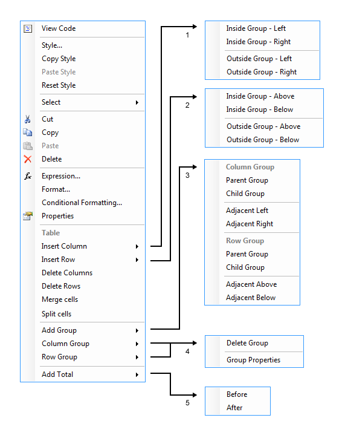

# Using the Table Context Menu

When you click a Table or Crosstab cell, you select a TextBox item. Although this is a standard TextBox report item, when it is in the context of a Table, CrossTab, or List item, its context menu will show settings for the Table, CrossTab, or List item besides the [usual TextBox attributes it displays]().

To see an option, click either an item, or the row or column handlers (the gray rectangles appearing when the whole Table item is selected).

The context menu is functionally dependent on the exact location of your click, and offers possible actions that are allowed as shown in the following image.

According to the hierarchy level, the Groups can be Parent, Child, and Adjacent. However, when it comes to row or column operations, they're referred to as inside and outside groups, that is, a static row or column is added inside or outside the current group.

When you select several cells which belong to a single dynamic or static group, the context menu will display the `Merge Cells` option. Once the cells from a single group are merged, they can be later split by selecting the merged cell and choosing the `Split Cells` option from the menu.

## See Also

* [Table Class API Reference](/api/telerik.reporting.table)
* [Demo Page for Telerik Reporting](https://demos.telerik.com/reporting)
* [Knowledge Base Section](/knowledge-base)
