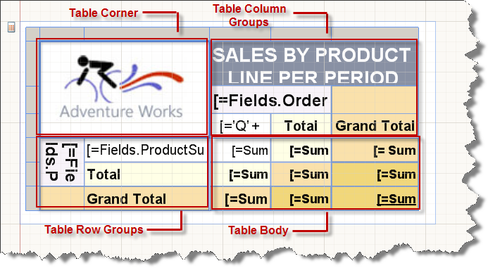
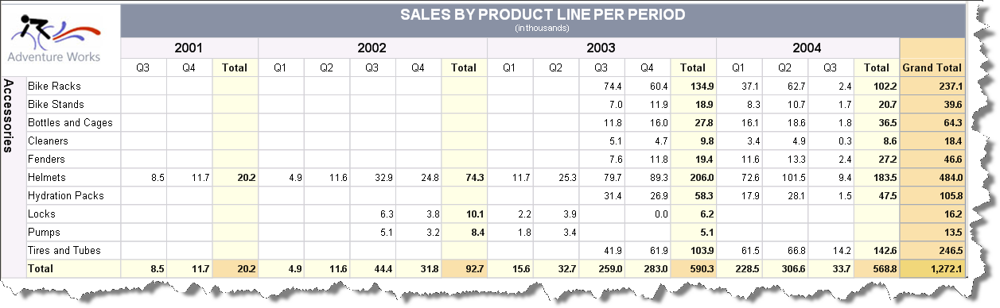

# Overview of the Crosstab Areas

A CrossTab item provides the Corner, Row Group, Column Group, and Body areas that contain table cells.

The cells in each area have a distinct function. For example, when you create a group, the Report Designer adds cells to the Row Group or Column Group area to display group instance values.
 
The following image shows the areas of a CrossTab with nested Row Groups, based on **ProductCategory** and **ProductSubCategory**, and nested Column Groups, based on **OrderDate.Year**.

The following list describes each CrossTab area and its characteristics:

* (Optional) Corner area&mdash;A CrossTab Corner is located in the upper-left corner. This area is automatically created when you add both row groups and column groups to a CrossTab. In this area, you can merge cells, and add a label or embed another report item.

	In the following image, the Corner displays the AdventureWorks logo.

* (Optional) Column Groups area&mdash;The CrossTab Column Groups are located in the upper-right corner. This area is automatically created when you add a column group. The cells represent members of the column groups hierarchy, and display the column group instance values.

	In the following image, the cell that displays **OrderDate.Year** is the column group. The columns **Total** and **Grand Total** display the aggregated totals across each row. These can be repeated on every page across which the table spans vertically by setting the [`ColumnHeadersPrintOnEveryPage`](/api/Telerik.Reporting.Table#Telerik_Reporting_Table_ColumnHeadersPrintOnEveryPage) to `true`. Column headers can also remain visible while scrolling vertically in the Interactive mode of the Telerik Reporting HTML5-based Report Viewers by setting [`FreezeColumnHeaders`](/api/Telerik.Reporting.Table#Telerik_Reporting_Table_FreezeColumnHeaders) to `true`.

* (Optional) Row Groups area&mdash;The CrossTab Row Groups are located on the lower-left corner. This area is automatically created when you add a row group. The cells represent members of the row groups hierarchy, and display row group instance values.

	In the following image, the cells that display **ProductCategory** and **ProductSubCategory** are nested row groups. The **Total** row under **ProductSubCategory** repeats with each category group to show the aggregated subtotals for each column. The **Grand Total** row shows the totals for all categories and can be repeated on every page across which the table spans horizontally by setting [`RowHeadersPrintOnEveryPage`](/api/Telerik.Reporting.Table#Telerik_Reporting_Table_RowHeadersPrintOnEveryPage) to `true`. Row headers can also remain visible while scrolling horizontally in the Interactive mode of the Telerik Reporting HTML5-based Report Viewers by setting [`FreezeRowHeaders`](/api/Telerik.Reporting.Table#Telerik_Reporting_Table_FreezeRowHeaders) to `true`.

* Body area&mdash;The CrossTab Body is located in the lower right corner. The cells of the Body area display detail and grouped data.

	In the following image, only aggregated data is used. The scope for the expression is determined by the innermost groups to which the text box belongs. The cells in the CrossTab Body display detail data when they are members of a detail row and represent aggregate data when they are members of a row or column associated with a group.

	By default, cells in a group row or column that contain simple expressions that do not include an aggregate function evaluate to the first value in the group. In the following image, the cells display the aggregate totals and grand totals for line totals for all sales orders.

When the report runs, column groups expand to the right for as many columns as there are unique values for the grouping expression. Row groups expand down the page. For more information, refer to the article on the [Table cells, rows, and columns]().

The following image shows the CrossTab in Preview:

* The row group area displays group instances for **ProductCategory** (**Accessories** in the image). 
* The column group displays four-year group instances for 2001, 2002, 2003, and 2004.
* The **Total** column row displays the row totals.
* The **Totals** row that repeats with the category group shows **productSubCategory** totals.
* The **Grand Total** row displays the category totals once for the CrossTab.

## See Also

* [(Demo) Product Sales Report with a CrossTab Summary](https://demos.telerik.com/reporting/product-sales)
* [Table Class API Reference](/api/telerik.reporting.table)
* [Demo Page for Telerik Reporting](https://demos.telerik.com/reporting) 
