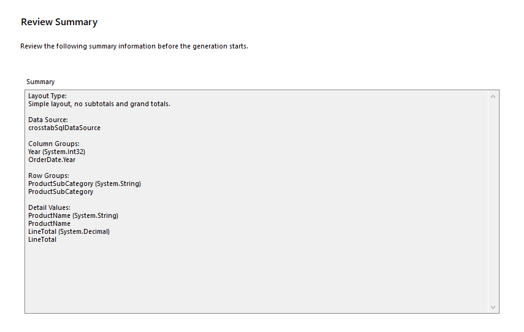

# Getting Started with the Crosstab

The Telerik Reporting Crosstab is a template variation of the Telerik Reporting Table report item, the difference between the two being that the Crosstab uses grouped data. As a result, the Crosstab is more frequently used in real-case scenarios and its Wizard provides more options for manipulating its data than the Table Wizard does.

Therefore, this guide shows how to create and use the Telerik Reporting Crosstab report item in reports with the [Telerik Reporting Standalone Report Designer](). Note that the Crosstab Wizard of the Standalone Report Designer is identical to the Table Wizard, except for the grouping and total aggregates options, and, if required, you can add a Table instead of a Crosstab to your report by following the same steps from this guide.

* First, you will add a Crosstab item in an empty report created with the Standalone Designer. You will use the Crosstab Wizard for this purpose.
* Following the instructions in the wizard, you will create an SqlDataSource to feed the Crosstab with data.
* With the wizard, you will also create one Row and one Column Group without Totals.
* Finally, you will manually add some minor adjustments to the layout of the Crosstab.

After the completion of this guide, you will also be able to configure a Crosstab in the Standalone Designer and achieve the following result:


## Adding the Crosstab

To add the Crosstab report item to your report:

1. Open the Standalone Report Designer.
1. [Add a new **Blank** report item]().
1. Select the **Detail** section of the new report and, from the Standalone Designer Menu, select `Insert`.
1. Use the **Crosstab** button from the toolbar and, then, the **Crosstab Wizard** option from the drop-down to open the CrossTab wizard:

	

1. In the Crosstab wizard, click the **Add New Data Source...** button. As a result, the Create New Data Source wizard will open.

## Configuring the CrossTab SqlDataSource

1. From the list with the available DataSource components, select **SqlDataSource** and name it **crosstabSqlDataSource**.
1. [Populate the report with data](#step-3-populate-the-report-with-data).

	For the purposes of this demo, you will use the following query from the __AdventureWorks__ sample database:

	````SQL
SELECT
		[Production].[Product].[Name] AS 'ProductName', 
		[Production].[ProductCategory].[Name] AS 'ProductCategory', 
		[Production].[ProductSubcategory].[Name] AS 'ProductSubCategory', 
		[Sales].[SalesOrderDetail].[LineTotal], 
		[Sales].[SalesOrderHeader].[OrderDate]
	FROM (((([Sales].[SalesOrderDetail]
		INNER JOIN [Sales].[SalesOrderHeader]
		ON [Sales].[SalesOrderDetail].[SalesOrderID] = [Sales].[SalesOrderHeader].[SalesOrderID])
		INNER JOIN [Production].[Product]
		ON [Sales].[SalesOrderDetail].[ProductID] = [Production].[Product].[ProductID])
		INNER JOIN [Production].[ProductSubcategory]
		ON [Production].[Product].[ProductSubcategoryID] = [Production].[ProductSubcategory].[ProductSubcategoryID])
		INNER JOIN [Production].[ProductCategory]
		ON [Production].[ProductSubcategory].[ProductCategoryID] = [Production].[ProductCategory].[ProductCategoryID])
````


1. Preview the returned data and close the SqlDataSource wizard.

## Configuring the Crosstab

1. Return to the Crosstab Wizard to see the fields of the recently created SqlDataSource. The image below shows how the data source will look like:

	

1. Click **Next** and continue to the __Arrange Fields__ page of the wizard. Drag and drop the fields as follows:

	* `ProductSubCategory` to the **Row Groups**.
	* `OrderDate.Year` to the **Column Groups**.
	* `ProductName` to the **Detail Values**. This will automatically apply the `Count` [aggregate function]() to the value.
	* `LineTotal` to the **Detail Values**. This will automatically apply the `Sum` aggregate function to the value.

	The following screenshot shows this configuration step:

	

1. Go to the next **Choose Layout** page. Let's leave its default layout as shown below:

	

1. On the **Choose Style** page, select a theme for the Crosstab layout. Let's try the **Office** theme:

	

1. Click **Review Summary** to see the result. Then, click **Finish** to close the wizard:

	

After the wizard closes, you will have a fully configured Crosstab in the middle of the Report Detail section:


## Fine-Tuning the Layout

If you are not planning to add other components to your project, drag the Crosstab so that it starts from the top left corner of the report **Detail** section and collapse the detail section of your report.

You can also delete the **PageHeader** and **PageFooter** sections that were added by default. The following image shows the **Design view** of the Crosstab after these changes:


## Next Steps

* [Manually Adjusting the CrossTab]()
* [(Demo) Product Sales Report with a Crosstab Summary](https://demos.telerik.com/reporting/product-sales)
* [(Demo) List-Bound Report](https://demos.telerik.com/reporting/list-bound-report)
* [Basic Concepts of the Table, Crosstab, and List]()
* [Table Class API Reference](/api/telerik.reporting.table)
* [Demo Page for Telerik Reporting](https://demos.telerik.com/reporting)
* [Knowledge Base Section](/knowledge-base)

## See Also

* [Standalone Report Designer]()
* [Report Getting Started]()
* [Group Explorer]()
* [Aggregate Functions]()
