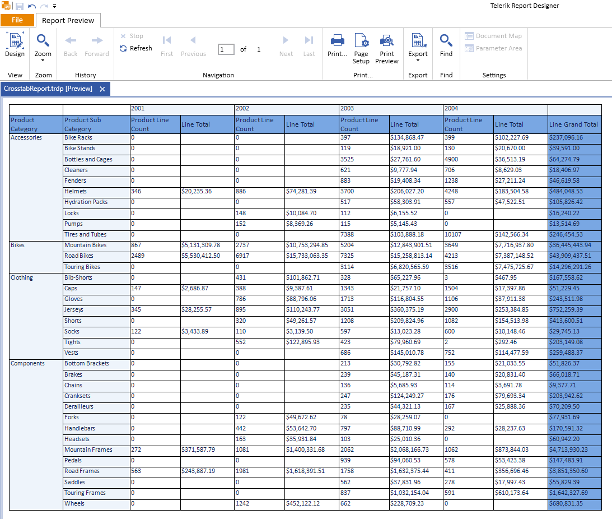
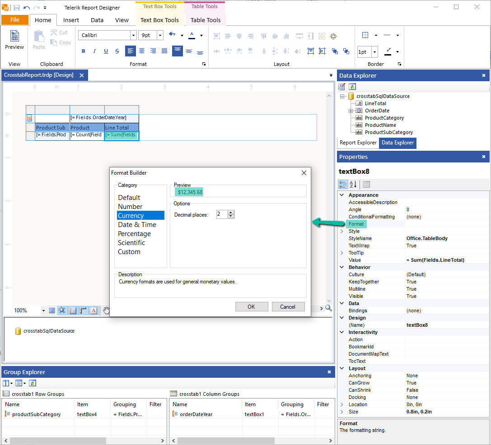
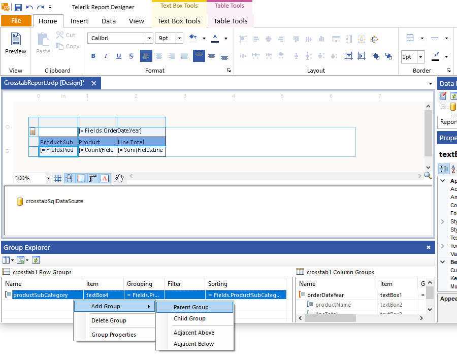
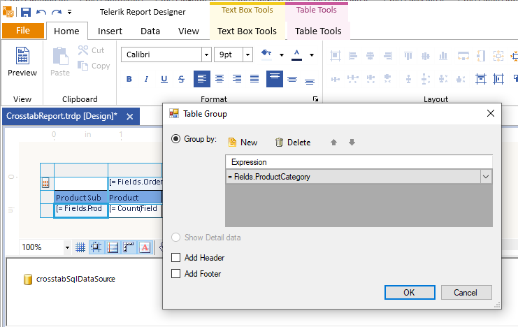
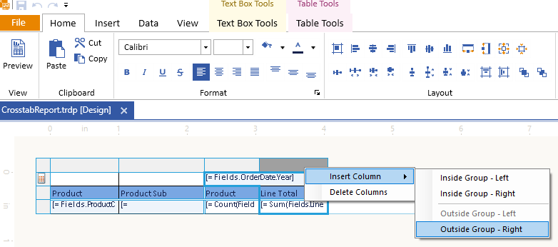

# Manually Adjusting the Crosstab

Once you have [added the CrossTab to your report, designed it in the Standalone Report Designer, and closed the wizard](), you can further adjust the configuration and rendering of the report item by manually setting its required specifics and achieve the following result.

## Formatting Numbers

The CrossTab also enables you to format the numbers for its **LineTotal**:

1. Select the detail cell under the **Line Total** column.
1. Go to its **Properties** pane. By default, the pane is in the bottom-right corner of the Standalone Designer.
1. Choose the **Format** property and click the ellipses (`...`) to open the `Format Builder`. Select **Currency** from the **Categories** and leave its default options as shown below:

	

You can also increase the width of the **LineTotal** column to accommodate larger values by dragging the right border of the Crosstab to the right.

## Adding New Grouping

Currently, you have the **Products** grouped by **SubCategories**. Grouping them into **Categories** will organize the data in the Crosstab in a better and more readable way.

To add new grouping by **Categories**, use the [Group Explorer]() in the **Extended Mode**.

1. Select the Crosstab. In the **Group Explorer**, which, by default, is at the bottom of the designer, click the ellipses (`...`) beside the **productSubCategory** row group.

1. Select **Add Group** > **Parent Group**. As a result, the **Table Group** editor will appear.

	

1. Select `=Fields.ProductCategory` from the **Expression** drop-down as a value for the **Grouping** (shown as **Group By** in the editor):

	

## Displaying Aggregate Values

You can display some aggregate values in the CrossTab as well. For example, to add **Totals** for numeric fields like **LineTotal**, add a column on the right that is outside the detail group of the Crosstab:

1. Right-click over the last Crosstab column. From the context menu, select **Insert Column** > **Outside Group - Right**. As a result, a new column with empty cells will appear.

	

1. In the new column, you can leave the top header row that displays the year for the orders empty. Name the second header, for example, **Line Grand Total** as this will show the overall total for all years.

1. Copy and paste the expression from the previous **Line Total** column. Note that when you preview the report, it will display the correct grand total as the context for executing the expression is not limited by year.

1. You can also implement the following final adjustments:

	* Rename **Product Name** to **Products Line Count** because it will actually show the number of products you have had from each line.
	* Increase some column widths to accommodate all of their content.
	* Apply a background color to the grand totals to distinguish them easier.

## Next Steps

* [(Demo) Product Sales Report with a Crosstab Summary](https://demos.telerik.com/reporting/product-sales)
* [(Demo) List-Bound Report](https://demos.telerik.com/reporting/list-bound-report)
* [Basic Concepts of the Table, Crosstab, and List]()
* [Table Class API Reference](/api/telerik.reporting.table)
* [Demo Page for Telerik Reporting](https://demos.telerik.com/reporting) 
* [Knowledge Base Section](/knowledge-base)

## See Also

* [Standalone Report Designer]()
* [Report Getting Started]()
* [Group Explorer]()
* [Aggregate Functions]()
