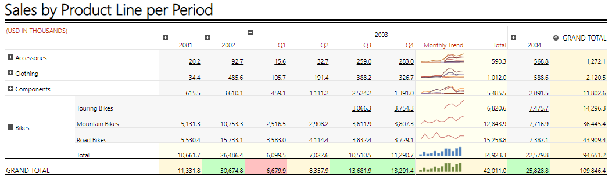

# Table Overview

The Table report item is a generalized layout report item that displays report data in cells that are organized into rows and columns.

The Table report item is an individual [data region]() which utilizes its own [`Telerik.Reporting.DataItem.DataSource`](/api/Telerik.Reporting.DataItem#Telerik_Reporting_DataItem_DataSource) to populate the fields with data. Thus, it defines its own [expression scope](). The dataset fields are displayed either as detailed or grouped data in a grid or in a free-form layout. Each table cell can contain any report item, such as a TextBox, PictureBox, Graph, or another Table template variation.

## Key Features

- [Basic concepts]()&mdash; Get to know the logic behind the implementation of the Table report item and learn more about the detail and group data, group hierarchies, table items, and static and dynamic table rows and columns.
- [Template items]()&mdash; The Table report item supports the Table, CrossTab, and List templates which are actually optimized variations of the same concept for a specific data layout.
- [Crosstab areas]()&mdash; The CrossTab comes with the corner, row group, column group, and body areas that contain table cells.
- [Table parts]()&mdash; The Table report item provides a number of settings for controlling the behavior of its cells, rows, and columns.
- [Context menu]()&mdash; Besides the available TextBox item attributes, the Table template variations provide a context menu with additional settings.
- [Group editor]()&mdash; You can use the Table context menu which allows you to modify the properties of the selected group data.

## Next Steps

- [Getting Started with the Crosstab Report Item]()
- [(Demo) Product Sales Report with a CrossTab Summary](https://demos.telerik.com/reporting/product-sales)
- [(Demo) List-Bound Report](https://demos.telerik.com/reporting/list-bound-report)
- [Table Class API Reference](/api/telerik.reporting.table)
- [Demo Page for Telerik Reporting](https://demos.telerik.com/reporting)
- [Knowledge Base Section](/knowledge-base)

## See Also

- [Telerik Reporting Homepage](https://www.telerik.com/products/reporting)
- [Reporting Forums](https://www.telerik.com/forums/reporting)
- [Reporting Blog](https://www.telerik.com/blogs/tag/reporting)
- [Reporting Videos](https://www.telerik.com/videos/reporting)
- [Reporting Roadmap](https://www.telerik.com/support/whats-new/reporting/roadmap)
- [Reporting Pricing](https://www.telerik.com/purchase/individual/reporting)
- [Reporting Training](https://learn.telerik.com/learn/course/external/view/elearning/19/reporting-report-server-training)
