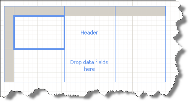
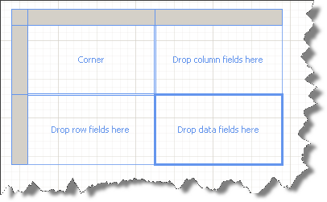
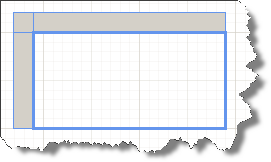

# Template Variations of the Table Report Item

The Table report item supports the Table, CrossTab, and List templates which you can add directly from the Toolbox.

## Table 

The Table template item is useful for displaying detail data and organizing it in row groups. The Table contains three columns with a table header row and a details row for the data. 

The following image shows the initial Table template when selected on the design surface: 

## CrossTab 

The CrossTab template item is useful for displaying aggregated data summaries that are grouped in rows and columns. The number of rows and columns for groups is determined by the number of unique values for each row and column groups. 

The following image shows the CrossTab template when selected on the design surface: 

## List 

The List template item is useful for creating a free-form data layout. While you are not limited to a grid layout, you can freely place fields inside the List. 

You can use a List to design a form for displaying many dataset fields or as a container to display multiple data regions for grouped data side by side. For example, you can define a group for a List, add a table, chart, or image, and display values in a table and graphic form for each group value.

The following image shows the List template when selected on the design surface: 

## General Considerations 

You are not limited to your initial template choice. As you add groups, totals, and labels, the Table report item allows you to modify its design. For example, you can start with a Table and then delete the details row and add column groups.

You can also continue to develop a Table, CrossTab, or List by adding any table feature. Table features include displaying detail data or aggregates for grouped data in rows and columns. You can create nested groups, independent adjacent groups, or recursive groups. You can filter and sort grouped data, and combine groups by including multiple group expressions in a group definition.

> [Data items]() cannot be used in page sections ([PageHeaderSection/PageFooterSection]()), because page sections are processed after the report data, at which moment the report data source is not available anymore. 

## See Also 

* [Table Cells, Rows, and Columns]()
* [CrossTab Areas]()
