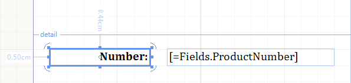
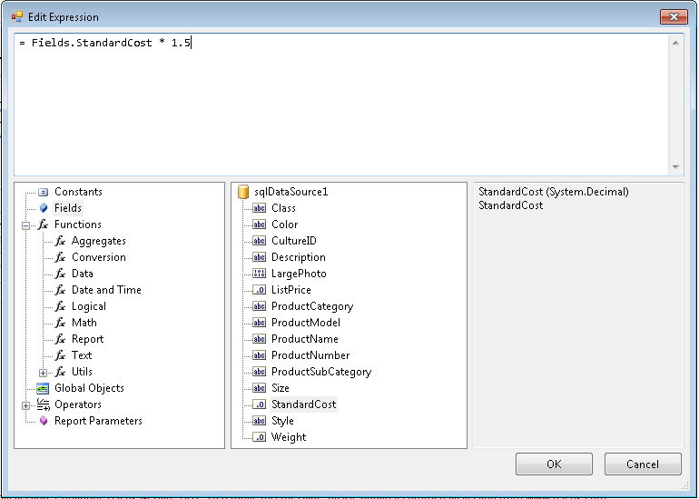

# TextBox Report Item Overview

The TextBox report item is used to display text on a report.

The TextBox can display literal text for titles, descriptions, and labels, or dynamic text based on expressions. Every cell in a Table or CrossTab also contains a TextBox, which can be formatted in the same way as the standalone TextBoxes in the report. The expressions in a TextBox can contain literal text, point to a database field, or calculate data.

To control the TextBox layout and its dependency on other report items, use a [Panel report item](/api/Telerik.Reporting.Panel).

To format separate chunks of text (different words) or insert HTML-formatted text into a report, use the [HtmlTextBox report item](/api/Telerik.Reporting.HtmlTextBox).

The following image shows two TextBox report items.



## Growing, Shrinking, and Wrapping

By default, the TextBox items have their size set.

* To allow a TextBox to expand vertically based on its content, set the [`CanGrow`](/api/Telerik.Reporting.TextItemBase#Telerik_Reporting_TextItemBase_CanGrow) property to `True`, which is the default value. 
* To allow a TextBox to shrink based on its content, set the [`CanShrink`](/api/Telerik.Reporting.TextItemBase#Telerik_Reporting_TextItemBase_CanShrink) property to `True`. By default, `CanShrink` is set to `False`. The TextBox will always grow to accommodate the first line of the text, even when `CanGrow` is `False`.
* Set [`TextWrap`](/api/telerik.reporting.textitembase#Telerik_Reporting_TextItemBase_TextWrap) property to `False` to ensure the content won't split and wrap to the next line when it cannot fit on a single line. In this case, the value of `CanGrow` doesn't influence the layout, as the content will be cut to fit within the available single-line area. When `CahShrink` is `True`, it will reduce the height of the TextBox to a single line.

## Text Orientation

To change the text orientation in a TextBox item, use the [`Angle`](/api/Telerik.Reporting.TextItemBase#Telerik_Reporting_TextItemBase_Angle) property. This approach enables you to create more readable reports, supports locale-specific text orientation, fits more columns on a printed report that has a fixed page size, and creates reports with a better graphical appeal.

The layout of the tilted text starts from the corner of the client item rectangle and fits the text until finished. This behavior produces short initial text lines, which can be avoided, if desired, by adding some empty lines at the beginning of the text or expression:

````CSharp
this.textBox1.Value = "= \"\r\n\r\n\" + Fields.MyDataColumn";
````
````VB.NET
Me.textBox1.Value = "= """ & vbCr & vbLf & vbCr & vbLf & """ + Fields.MyDataColumn"
````

The item grows vertically to accommodate a full tilted line from the left to the right edge, which may produce a significant growth of the item, especially for angles nearing 90 degrees. To avoid this behavior, set the [`CanGrow`](/api/Telerik.Reporting.TextItemBase#Telerik_Reporting_TextItemBase_CanGrow) property to `false`.

For angles in the 90-270 degree range, the item will grow until the whole text is fitted on a single line. To control this behavior, use the [`CanGrow`](/api/Telerik.Reporting.TextItemBase#Telerik_Reporting_TextItemBase_CanGrow) property.

For busy reports that will need to break the item into two pages, reconsider using tilted text as split tilted text is hardly readable.

## Using In-Place Editing

The in-place editor for the [TextBox]() report item allows you to quickly enter text directly into the designer.

To activate the in-place editor:

1. Double-click the __TextBox__ report item or select the report item and press `F2`. As a result, the in-place editor is activated.
1. To create a new line, press `CTRL`+`Enter`.
1. To accept all changes, press `Enter` or move the focus away from the TextBox.
1. To discard all changes, press `Esc`.

The following image shows a TextBox with an activated in-place editor.


## Using the Expression Editor

For more information about how to use the Expression editor, refer to the article on the [**Edit Expression** dialog](). Note that when pressing the `Enter` key inserts a new line in the expression. To insert a new line in the string resulting from the evaluated expression, enclose the new line within double quotes (`"..."`).



## Embedded Expressions

The TextBox report item supports [embedded expressions]() to provide a mail merge functionality. Embedded expressions enable you to get and insert data-driven information directly into the TextBox report item to produce customized reports and mail merging.

## Considerations and Known Issues

Before you apply a TextBox format, consider the following:

* By default, numbers are formatted to reflect the cultural settings on the client computer. To specify how numbers are displayed and provide consistent formatting regardless of where the person who is viewing the report is located, use formatting strings.
* The formats provided on the **Number** page are a subset of the .NET Framework standard numeric format strings. To format a number or a date by using a custom format that is not shown in the dialog box, use any number or date .NET Framework format strings. For more information about custom format strings, refer to the article [Formatting Types](https://learn.microsoft.com/en-us/dotnet/standard/base-types/formatting-types) topic.
* If you specify a custom format string, it will prevail over the culture-specific default settings. For example, if you set a custom format string of `#,###` to render 1234 as `1,234`, users in different parts of the world may interpret it in different ways. Before specifying a custom format, consider how the chosen format will affect users of different cultures viewing the report.
* If you specify an invalid format string, it will override the actual `Value`.

For more information, refer to the article about the [**Format Builder** dialog]().

## Next Steps 

* [Using Styles to Customize Reports]()
* [(API) TextBox](/api/Telerik.Reporting.TextBox)
* [(API) Angle](/api/Telerik.Reporting.TextItemBase#Telerik_Reporting_TextItemBase_Angle)
* [(API) Format](/api/Telerik.Reporting.TextItemBase#Telerik_Reporting_TextItemBase_Format)
* [(API) HtmlTextBox](/api/Telerik.Reporting.HtmlTextBox)
* [Demo Page for Telerik Reporting](https://demos.telerik.com/reporting)
* [Knowledge Base Section](/knowledge-base)

## See Also 

* [Telerik Reporting Homepage](https://www.telerik.com/products/reporting)
* [Reporting Forums](https://www.telerik.com/forums/reporting)
* [Reporting Blog](https://www.telerik.com/blogs/tag/reporting)
* [Reporting Videos](https://www.telerik.com/videos/reporting)
* [Reporting Roadmap](https://www.telerik.com/support/whats-new/reporting/roadmap)
* [Reporting Pricing](https://www.telerik.com/purchase/individual/reporting)
* [Reporting Training](https://learn.telerik.com/learn/course/external/view/elearning/19/reporting-report-server-training)
