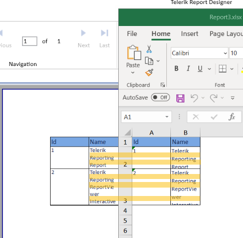

# Design Considerations for the Excel Rendering

__Telerik Reporting__ produces Excel files in:

* Microsoft Excel 2007 and above (OpenXML 2.0). This rendering extension requires [Third-Party Dependencies]().
* Microsoft Excel 97-2003 (BIFF, v.8)

Telerik Reporting does not rely on Microsoft Office being installed to export to both formats. __Microsoft Excel 97-2003__ files can be opened by Microsoft Excel 97 for Windows and later.

__Microsoft Excel 2007__ files can be opened by Microsoft Excel 2007 for Windows and later and has the following advantages over __Microsoft Excel 97-2003__ :

* Works in Medium Trust.
* Supports up to 16 million colors.
* Hyperlinks support.
* Graph items are rendered as Metafiles (EMF). This guarantees the best quality in any scale factor and when printing. The format must be considered if the Excel file will be post-processed by a third-party tool.

The Excel Rendering Extensions tries to reproduce as much of the original report as possible regarding layout and styling, but certain limitations are imposed by the physical and logical structure of an Excel Document.

## Report Item Layout

* The layout of the generated Excel document is controlled by the device info parameter [SplitWorksheetOnPageBreak](). By default, the entire report is rendered into a single Excel worksheet and the paging is not applied. If the _SplitWorksheetOnPageBreak_ is set to **true**, a new worksheet gets generated on each page break configured in the report definition.
* Overlapping items are not supported and will be moved down/right by the Excel renderer so that they do not overlap.
* When the TextBox grows vertically to accommodate larger content, Excel may render the text with larger space between the lines.

	The Reporting engine measures each line of text and sets the cell height to match the accumulated line heights. However, Excel text rendering engine might use a different line spacing and padding within the cell bounds, which might cause the text at the bottom not to fit into the visible part of the cell. This is easily noticeable on the image below, which shows the difference in line spacings between the Image rendering and Excel rendering.

	>caption PrintPreview in Designer vs Excel Rendering

	

* When you use the CanGrow and CanShrink properties, the Rendering Engine will utilize the AutoFit functionality of Excel. That means that cell content will resize according to Excel behavior which might not produce the expected result. Furthermore, AutoFit is applied by Excel only for horizontal text, so if you have rotated text (at an angle different than zero), the CanGrow and CanShrink properties might not behave as expected. Rotated text is realized via Excel's built-in cell rotation settings.
* Multi-column reports are not supported.

## Page Headers and Footers

The page header and footer render differently depending on the [Excel 2003 Device Information Settings](). The page header can be rendered in two ways: as a sequence of frozen rows at the top of the worksheet, or in the native Excel page header. The page footer can also be rendered in two ways: as a sequence of Excel cells at the bottom of the worksheet or in the native Excel page footer. The native Excel page sections are divided into three – left, middle, and right. Report items will enter the respective page footer section according to their original location in design time.

>note Because of Excel limitations, TextBoxes are the only type of report item that can be rendered in the native Excel header/footer section.

With default configuration (__UseNativePageHeader__ is False and __UseNativePageFooter__ is True), the page header is rendered as frozen rows at the top of the worksheet and the page footer is rendered in the native Excel page footer.

The native Excel page header/footer is not displayed on the Excel worksheet in Normal view - it is displayed only in Page Layout view and on the printed pages. For more information see [Headers and footers in a worksheet](https://support.office.com/en-us/article/Headers-and-footers-in-a-worksheet-cae2a88c-64a7-42ab-96a4-28d2fc16ad31).

>caution The __PageNumber__ and  __PageCount__ global objects' behavior depends on the __UseNativePageHeader__ and __UseNativePageFooter__ configuration. Since the report rendered to Excel is not in a page-oriented format and is contained in a single worksheet (regarded as a single page) __PageNumber__ and __PageCount__ will always return a value of 1. However, if you intend to print the Excel document and would like to let Excel handle the page numbering instead, you can do so by setting both  __UseNativePageHeader__ and __UseNativePageFooter__ to __True__. This configuration will force the Reporting engine to use the native Excel page number and page count tokens, instead of the default value of 1, so the page number and count are correct when the document is printed in Excel. When the native Excel page tokens are used, any arithmetic operations on the PageNumber/PageCount are not supported. Since the PageNumber() and PageCount() functions use arithmetic operations internally, they are also not supported in the native page header/page footer sections.

## ReportBook

Each report in a ReportBook will occupy a separate worksheet in the Excel workbook. Each worksheet of the Excel workbook will have the name of the respective report.

## Styling

Background images are not supported.

## Report Items

| Report Item | Rendering Notes |
| ------ | ------ |
|TextBox|TextBox values are converted to string or number cells in Excel depending on the actual value. If a supported .NET string format is supplied through the Format property of the TextBox, the resulting cell is accordingly formatted respecting the Culture of the TextBox. Item binding expressions are not converted to Excel formulas.|
|Graph|Graph report items are rendered as an Excel Picture object and not an Excel Chart object. In __Microsoft Excel 97-2003__ it is a Bitmap image; in __Microsoft Excel 2007 and above__ it is a Metafile(EMF).|
|Barcode|Barcode is rendered as an Excel Picture object with a Bitmap image. In __Microsoft Excel 97-2003__ it is a Bitmap image; in __Microsoft Excel 2007 and above__ it is a Metafile(EMF). Due to this if the barcode is small when exported to the __Microsoft Excel 97-2003 (XLS)__ format, the image will be rasterized and the barcode might become unreadable. Exporting to __Microsoft Excel 2007 and above(XLSX)__ is advised because then the image will be in a vector format (EMF) |
|Table|Table is rendered as a range of Excel cells.|
|HtmlTextBox|HtmlTextBox is rendered as plain text with no formatting.|
|Shape|Shape report items are rendered as Excel Picture objects with Bitmap images, not Microsoft Office Drawings.|
|CheckBox|CheckBox report items are rendered as Excel Picture objects with Bitmap images – including check marks and text.|
|PictureBox|PictureBox is rendered as an Excel Picture object. PictureBox report item's Sizing property should be set to AutoSize for best image quality or the PictureBox.Size should match the actual image size. In case you get a blurred image at run-time, change the Sizing mode or resize the PictureBox item to match the size of the produced image.|
|Panel|Panel is rendered as a range of Excel cells.|
|SubReport|SubReport is rendered as a range of Excel cells.|
|Cross-section item|Cross-section items are not supported|

## Merging Cells

The Excel renderer is mainly a layout renderer. Its purpose is to replicate the layout of the report being rendered as closely as possible in an Excel worksheet and consequently, cells might be merged in the worksheet to keep the WYSIWYG report layout. Merged cells are a possible source for problems since the sort functionality in Excel requires cells to be merged in a very specific way for sort to work properly e.g. Excel requires that the ranges of merged cells have the same size to be sorted. 

If sorting is important for your exported Excel reports, the guidelines below can help you reduce the number of merged cells in your Excel worksheets, which is the common cause of difficulties with Excel sort functionality: 

* The most common cause of merged cells is improper or missing left/right alignment of report items. Make sure the left and right edges of all report items line up with one another. The alignment and applying the same width to report items will usually solve the problem.
* Aligning items precisely might not be enough, and in some rare cases, columns might continue to be merged. This is likely caused by internal unit conversion and rounding when the Excel worksheet is rendered. In the report definition, you can specify location and size in different measurement units such as inches, pixels, centimeters, and points, but internally Excel uses points. So to minimize conversion and the potential inaccuracy of rounding when converting inches and centimeters to points, consider specifying all measurements in points (one inch is 72 points).
* The Page Header of the report interferes with the exported columns in Excel. A horizontal page break (see [Understanding Pagination]()) that splits a report item into two parts will result in an additional Excel column in the item. For that reason, you need to make sure that the report's physical page is wide enough to accommodate the entire report content so that there is no horizontal page break introduced. The report designers indicate when the report is wider than the physical page through a yellow warning triangle at the top left corner of the report. You may check the warning message by hovering over the triangle.

## Page Settings

The following standard paper kinds are supported:

* A3 (297mm x 420mm)
* A4 (210mm x 297mm)
* A5 (148mm x 210mm)
* B4 (250mm x 353mm)
* Quarto (215mm x 275mm)
* DLEnvelope (110mm x 220mm)
* C5Envelope (162mm x 229mm)
* PrcEnvelopeNumber10 (324mm x 458mm)
* PrcEnvelopeNumber9 (229mm x 324mm)
* C6Envelope (114mm x 162mm)
* C65Envelope (114mm x 229mm)
* B4Envelope (250mm x 353mm)
* B5 (176mm x 250mm)
* B6Envelope (176mm x 125mm)
* ItalyEnvelope (110mm x 230mm)
* Letter (8.5” x 11”)
* Tabloid (11” x 17”)
* Ledger (17” x 11”)
* Legal (8.5” x 14”)
* Statement (5.5” x 8.5”)
* Folio (8.5” x 13”)
* Standard10x14 (10” x 14”)
* Number9Envelope (3.875” x 8.875”)
* Number10Envelope (4.125” x 9.5”)
* Number11Envelope (4.5” x 10.375”)
* Number12Envelope (4.75” x 11”)
* Number14Envelope (5” x 11.5”)
* DSheet (22” x 34”)
* ESheet (34” x 44”)
* MonarchEnvelope (3.875” x 7.5”)
* PersonalEnvelope (3.625” x 6.5”)
* USStandardFanfold (14.875” x 11”)

If any other paper size is specified, the default printer settings will be used. In this manner you can use custom paper sizes.

>important The page layout in Excel depends on the selected printer and its DPI settings, so additional automatic page breaks may appear when printing the document. To ensure the uniform look of the printed document, please check the *Scaling* options in Excel's Page Setup dialog. You can read [Scale a worksheet](https://support.office.com/en-us/article/Scale-a-worksheet-34a91eb5-8b4e-4a8a-ab28-b6492012eaae) Microsoft article for more information. 

## Formatting Strings

Formatting Strings used in reports are applied to rendering the document in the selected format. To preserve the result from previewing the document, formats are saved as custom formatting strings in the Excel file. Otherwise, culture-specific settings can change the data meaning in the Excel file. 

>tip If an item's Value property is evaluated as a string, the Numeric/DateTime formatting string will not be applied.

##Standard Numeric Format Strings

A subset of the .NET string formats (set through the TextBox.Format property) is supported by the rendering extension. Those include:

* C or c (Currency)
* N or n (Number)
* G or g (General)
* P or p (Percent)
* and others ...

To preserve the result from previewing the rendered document, formats are saved as custom formatting strings in the Excel file. This behavior can be modified by setting __UseExtendedFormatting = False__ in the Excel device information settings.

##Standard DateTime Format Strings

* d (Short date pattern)
* D (Long date pattern)
* t (Short time pattern)
* T (Long time pattern)
* f (Full date/time pattern with short time)
* F (Full date/time pattern with long time)
* g (General date/time pattern with short time)
* G (General date/time pattern with long time)
* M or m (Month day pattern)
* R or r (RFC1123 pattern)
* s (Sortable date/time pattern; conforms to ISO 8601)
* u (Universal sortable date/time pattern)
* U (Universal sortable date/time pattern)
* Y or y (Year month pattern)

## Currency Format Strings

Currency format strings are always hard-coded with "Custom Format". This way the currency formatting from the report definition is preserved and does not depend on the client machine locale. This behavior can be modified by setting __UseExtendedFormatting = False__ in the Excel device information settings.

If a valid format string is detected by the rendering extension, the raw value will be stored in the cell as a Number and an Excel Number Format will be applied. Otherwise, the value will be stored in the cell, again as a Number, but without formatting. Even unformatted, it would be possible to use the resulting cell in Excel functions.

## Excel Limitations

### Common for both formats

Excel places limitations on exported reports due to the format capabilities. The most significant are the following:

* TextBoxes are rendered within one Excel cell. Font size, font face, decoration, font style, and text/vertical alignment are the only formatting that is supported on individual text within an Excel cell.
* Telerik Reporting expressions are not converted to Excel formulas. TextBox values that are expressions are evaluated during report processing and the result is exported as content of Excel cell.
* Excel does not support background images for individual cells, so Background images for report items (including Report) are ignored.
* Excel native page headers and footers support a maximum of 255 characters including [Formatting and VBA Codes for Headers and Footers](https://learn.microsoft.com/en-us/previous-versions/office/developer/office-2007/bb225426(v=office.12)). The rendering extension truncates the string at 255 characters.
* Excel does not support Watermarks.
* Underlining justified text will only underline the words and not the spaces between them.
* Table of contents is not supported.
* The maximum length of the Excel Worksheet name is 25 characters. Longer names would be trimmed. The limitation set by Microsoft Excel is 31 characters. Six (6) of them are preserved to secure the uniqueness of Worksheet names, for example when exporting a Report Book containing reports with the same Document Name.

### Excel 97-2003

* Supported only in the `.NET Framework`.
* Excel supports a palette of up to 56 colors. The first 56 unique colors used in the report are defined in a custom palette. If more than 56 colors are used in the report, the rendering extension matches the required color to one of the 56 colors already available in the palette. Excel’s color-matching algorithm is used to match colors to ones already existing in the palette.
* The maximum number of rows in a worksheet is limited to 65,536. If this is exceeded, the renderer displays an error message.
* The maximum number of columns in a worksheet is limited to 256. If this is exceeded, the renderer displays an error message.
* The maximum column width is limited to 255 characters or 1726.5 points. The renderer does not verify that the column width is less than the limit.
* The maximum row height is 409 points. If the contents of the row cause the row height to increase beyond 409 points, the contents are split and added to the next row instead.
* The maximum number of characters in a cell is limited to 32,767. If this is exceeded, the renderer displays an error message.
* In FIPS-enabled environments a report export in Excel 97-2003 format will fail.
* When the result of an expression is not a number (i.e. double.NaN) or infinite value (i.e. double.PositiveInfinity or double.NegativeInfinity) then double.MaxValue or double.Min value will be written to the Excel cell.

### Excel 2007 and above

* Excel 2007 supports up to 1 million rows.
* Excel 2007 supports up to 16 thousand columns per worksheet. Specifically, the Office Excel 2007 grid is 1,048,576 rows by 16,384 columns.
* Excel 2007 supports up to 16 million colors.
* When the result of an expression is not a number (i.e. double.NaN) or infinite value (i.e. double.PositiveInfinity or double.NegativeInfinity) then "#NUM!" error will be written to the Excel cell.

## Interactivity

__Microsoft Excel 2007 and above__ format supports Navigate to URL actions on report items, which are rendered as Excel hyperlinks in the cell in which the report item's text is rendered. When you click the hyperlink, the default Web browser opens and navigates to the specified URL.

__Microsoft Excel 97-2003__ format does not support any interactive features.

## See Also

 * [Export Formats]()
 * [Telerik Reporting Configuration Section]()
 * [Device Information Settings]()
