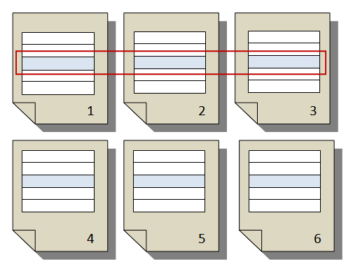

# Understanding Pagination

Pagination refers to the number of pages within a report and how report items are arranged on these pages. Pagination varies depending on the used renderer, page break and keep-together options you configure the report to use.

A successfully designed report that is optimized for the renderer that you plan to use to deliver your report, requires understanding of the rules used to control pagination.

This topic discusses the impact of the physical page size and the report layout on how page break renderers render the report.

## Page Setup

When you render a report you can specify page setup options at run-time or design-time. Some of these options can be changed by the user using the Page Setup dialog. Page setup options apply to all report output types.

### Page Settings

The PageSettings property of the Report object allows you to customize the following properties:

| __Property__ | __Description__ |
| ------ | ------ |
| __Landscape__ | __True__ to print in landscape orientation, __False__ to print in portrait orientation.|
| __Margins__ |A `Telerik.Reporting.Drawing.MarginsU` object, which lets you individually specify the margins at the four sides of the report.|
| __PaperKind__ |The type of paper to print the report on, such as `Letter`, `Legal`, `A3`, or `A4`. Setting this automatically sets the correct dimensions in the `PaperSize` property.|
| __PaperSize__ |If the Paper Kind is "Custom" you can specify a non-standard set of paper dimensions.|
| __ContinuousPaper__ | __True__ to print the report's content without adding vertical page-breaks.|
| __ColumnCount and ColumnSpacing__ |Related to Multi-column layout. The properties define the number of columns in which the report's content can be placed, and the space between.|
| __BackgroundColor, BackgroundImage__ |Define color or image that is applied on the whole physical page and repeats for each physical page.|
| __BorderStyle, BorderWidth, BorderColor__ |Define style, width and color for the border that can be drawn around the space available for content in the physical page. The space is defined by the `PaperKind`, `PaperSize`, `Landscape` and `Margins` properties.|
| __Watermarks__ |Typically used to designate a document's status e.g. draft or for internal distribution only. They are commingled with the report content, making them next to impossible to ignore|

### Physical Page

The physical page size is the paper size. The paper size that you specify for the report controls how the report is rendered. Reports rendered in physical page formats insert page breaks horizontally and vertically based on the physical page size to provide an optimized reading experience when printed or viewed in a physical page format. Reports rendered in logical page formats insert page breaks horizontally based on the physical size to provide an optimized reading experience when viewed in a Web browser.

You can change page size by changing the `PaperSize.Height` and `PaperSize.Width` properties in the Properties pane. The page size does not grow or shrink to accommodate the contents of the report. If you want the report to appear on a single page, the whole report content must fit on the physical page. If it does not fit and you use physical page format, the report will occupy additional pages. If the report grows past the right edge of the physical page, then a page break is inserted horizontally. If the report body grows past the bottom edge of the physical page, then a page break is inserted vertically.

The `PaperSize.Height` can be set to be undetermined through the `ContinuousPaper` property. As a result the page will use all PageSettings properties, excluding `PaperSize.Height` property. The height of the page will be determined by the height of the content.

By design, if the remaining part of the document is less than 1% of single-column width, this part will not be displayed. For example, if you add a textbox whose width is equal to the report's width and you set a border to it, the right border will not be displayed in Print Preview mode.

### Margins

Margins are specified by changing the `Top`, `Bottom`, `Left` and `Right` properties in the __Properties__ pane. The area of the physical page that remains after space is allocated for margins, column spacing (multi-column), and the page header and footer, is referred to as usable page area. Margins are only applied when you render and print reports in physical page formats.

### Multi-columns (Newsletter-Style Columns)

When a report is divided into multiple columns, physical pages are divided vertically into columns, each of which is considered a logical page. Suppose you have two columns on a physical page - the content of your report fills the first column and then the second column. If the report does not fit entirely within the first two columns, the report fills the first column and then the second column on the next page. Columns continue to be filled, from left to right, top to bottom until all report items are rendered. For more information, see [How to Create a Multi-Column Report]().

### Print on continuous (roll) paper

When you set the report's PageSettings.__ContinuousPaper__ property to __true__, PageSettings are respected excluding the PaperSize.Height property. The report's content will be measured and rendered into a page with height enough to gather the content in height, including the page margins. If the content cannot be gathered in width on the physical page, the report will be paged horizontally where each page will have the same height.

Page breaks are not expected when printing on a continuous paper. Setting a report section's PageBreak results in physical pages having the same height, such enough to gather the whole content in height.

In a ReportBook each report's PageSettings properties are respected on paging the document. Each individual report will be printed separatly on a continuous (roll) paper.

## Paging and Keep Together

Based on report content and page settings the report is divided into one or more pages. The actual report content is rendered on a page after margins are subtracted from the page size.

If the report body cannot fit in the available page width, a new page will be added in order to accommodate all content. At design-time, a vertical red line will appear to indicate the available width (snap grid needs to be turned on in the Designer). Make sure report sections and items do not cross this boundary if you do not want them to be split across different pages.

>caution If every other page in a report seems to be blank, the most probable reason is that a report item is stretching over the right page margin (appears over the vertical red line in report designer) and in case it has no background or border, you will not be able to detect it, but it is still there and is causing a new page to be created.

In the vertical direction, by default sections are not split across different pages. Soft page break is an instrument to cut the report content and continue on the next page. Here are the items with their respective properties that enable inserting a soft page break.

* If you want to force a page break before or after a section, use the section’s `PageBreak` property.

* Table/Crosstab items also support page breaks before and/or after each TableGroup instance. This is supported in both horizontal and vertical direction and is controlled using the [Telerik.Reporting.TableGroup.PageBreak](/api/Telerik.Reporting.TableGroup#Telerik_Reporting_TableGroup_PageBreak) property.

* Set the `KeepTogether` property of a Report item or section or `GroupKeepTogether` of a Report group to `false` to allow it to be split during the rendering.

In older Telerik Reporting versions, simple report items (i.e. non-container items) are always kept together on a page if possible. If not, they are rendered at the beginning of the next page. If they still cannot fit, because they are longer than a whole page, they are split. The (PictureBox(, (Shape( and (Chart( items are always kept together. __In recent Telerik Reporting versions all items can be split between pages, if they do not fit in__.

By default, groups are not kept together on a single page. You can instruct the rendering engine to try to keep the entire group or the group header with the first detail on a single page if possible by setting the GroupKeepTogether property of the Group component. If group is kept together using `GroupKeepTogether` property, the engine will ignore the PageBreak property set for the Detail section.

By default, Table item is kept together. To force nested table to break set `KeepTogether = False` for parent table's row/column that contains nested table.

>note If the Report group has `GroupKeepTogether = FirstDetail` and the `Detail` section has `KeepTogether = False`, if even only a part of the detail section without any report items(essentially _blank_ content) can be rendered on the page with the __group header__, that part of the detail section will be treated as the first detail and the group header section will be rendered on the page.

>note If the content that should be kept together is too large to fit on a single page, it is not moved and is left on the current page, forcing the rest of the content to move to next page, as if `KeepTogether` is `False`.
>
>_Example_: Report group has `GroupKeepTogether = FirstDetail`, this means that the summary height of the group header, height of all child group headers (if any) and height of the first detail should be able to fit on a single page in order for the KeepTogether algorithm to work and move the whole Group on a new page.

>One may change the Page sections' `Height` and `Visible` properties for particular pages applying 
[Bindings]().
This results in taller or shorter available space for the rest of the report content on the affected pages. 
The paging logic respects the changed space when it fits content on the current page.
However, it cannot predict if a change in the available space will occur on the next page.
For that reason, while applying the paging rules on the current page, the logic assumes that the available space on the next page will not be changed dynamically, i.e., it will stay as designed in the report definition. 
Consider this implication when applying such Bindings, as it may lead to unexpected pagination behavior.
>
>_Example_: If you have a _Panel_ with `KeepTogether = True`, the expectation is to have it entirely on a new page if it cannot fit on the current one but can fit on a new page. Lets assume that the _Panel_ `Height` is such that it fits on a physical page if it doesn't have a _PageHeader_ and cannot fit if it does. In this scenario, if your report has _PageHeader_, the _Panel_ will be split even if the _PageHeader_ `Visible` property is `False` or its `Height` is reduced with _Bindings_ to allow the _Panel_ to fit entirely on a new page. The reason is that the Reporting engine caclulates the expected available area for the next page based on the report definition property values for the Page sections' `Height`. The `Visible` property is not taken into account. If there is no _PageHeader_ section in the report, the _Panel_ `KeepTogether` will work as expected.

## Horizontal Paging

If the report spans over several pages in width then its sections are stretched from the left edge of the left-most page’s printable area to the right edge of the right-most page’s printable area, as displayed in the following diagram:

>caution If your report item (table) is too wide to fit on the page it will cause a horizontal overflow and will continue on the next page. However whenever this happens if there is additional content below the table a blank page for each additional page (needed by the table) will be generated. To understand this better consider the following example: 

|   |   |   |
| ------ | ------ | ------ |
|page 1 (first part of table)|page 2 (second part)|page 3 (third part)|
|page 4 (another content here)|page 5 (empty)|page 6 (empty)|

## Report sections

Report sections automatically grow and can shrink (controlled by property) to accommodate the report items contained within. They do not reflect the physical page size and can grow beyond the boundaries of the physical page size to span multiple report pages. Exception in this rule make the PageHeader and PageFooter sections, which can only grow horizontally, and cannot shrink in any dimension. Page sections can be only hidden, and in that case their space is taken up from the rest of the report content.

## See Also

* [Rendering and Paging]()
* [Understanding Rendering Behaviors]()
