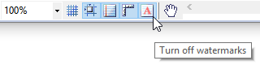

# Report Watermarks

__Watermarks__ are text or pictures that appear commingled with the report content. They often add interest or identify status, such as marking a generated report as a Draft. You can see watermarks in Print Preview Layout of the report viewers and when printing or exporting. You have the ability to set the __Opacity__ of the text or image, specify its __Position__ and whether it is displayed on first (__PrintOnFirstPage__ ) and last page (__PrintOnLastPage__ ).

Watermarks are [PageSettings](/api/Telerik.Reporting.Drawing.PageSettings) member, processed during the paging of the report. At this moment the report data source is not available anymore, and thus data fields used in expressions would not be evaluated.

## Add Text Watermark using Report Designer

To add Text Watermarks to the Report use the following steps:

1. Open a report in __Design__ view.
1. You can open the Watermarks collection editor in two ways:

	+ Click the Report selector button located in the upper left corner of the [Visual Studio Report Designer](). This makes the report active in the Properties window. Expand __PageSettings__ and click __Watermarks__ ellipsis in the property grid.
	+ Select the Watermarks item in the report's context menu, which appears when you right-click on the designer surface. Both actions will display the Watermarks collection editor, which is empty by default.

1. Click __Add__ button and select TextWatermark.
1. In __Text__ , type or click the ellipsis to enter text or an [Expressions]() that represents the Text Watermark.
1. Format the text by setting __Color__ and __Font__ attributes.
1. Set __Opacity__.
1. Set __Position__. Available options are __Behind__ and __Front__. Default is __Behind__.
1. Set __Orientation__. Available options are __Horizontal__ , __Vertical__ and __Diagonal__. Default is __Horizontal__.
1. Specify whether it will be displayed on first (__PrintOnFirstPage__ ) and last page (__PrintOnLastPage__ ).
1. Click __OK__.

## Add Text Watermark programmatically

{{source=CodeSnippets\CS\API\Telerik\Reporting\WatermarksSnippets.cs region=AddNewTextWatermarkSnippet}}
{{source=CodeSnippets\VB\API\Telerik\Reporting\WatermarksSnippets.vb region=AddNewTextWatermarkSnippet}}

## Add Picture Watermark using Report Designer

To add Picture Watermarks to the Report use the following steps:

1. Open a report in __Design__ view.
1. You can open the Watermarks collection editor in two ways:

	+ Click the Report selector button located in the upper left corner of the [Visual Studio Report Designer](). This makes the report active in the Properties window. Expand __PageSettings__ and click __Watermarks__ ellipsis in the property grid.
	+ Select the Watermarks item in the report's context menu, which appears when you right-click on the designer surface. Both actions will display the Watermarks collection editor, which is empty by default.

1. Click the small arrow on the right side of the __Add__ button and select PictureWatermark from the drop-down menu.
1. In __Image__ , browse for an image file on your hard drive, input an URI (local path or URL) or an [Expressions]() that evaluates to an image.The __Image__ field also accepts a string that represents a Base64-encoded image.
1. Set __Sizing__ mode. Available options are Center, Stretch, ScaleProportional and TopLeft. See [PictureBox]() article for more information on the modes.
1. Set __Opacity__.
1. Set __Position__. Available options are __Behind__ and __Front__. Default is __Behind__.
1. Specify whether it will be displayed on first (__PrintOnFirstPage__ ) and last page (__PrintOnLastPage__ ).
1. Click __OK__.

## Add Picture Watermark programmatically

{{source=CodeSnippets\CS\API\Telerik\Reporting\WatermarksSnippets.cs region=AddNewPictureWatermarkSnippet}}
{{source=CodeSnippets\VB\API\Telerik\Reporting\WatermarksSnippets.vb region=AddNewPictureWatermarkSnippet}}

## Add Background Overlay using Report Designer

Background Overlay is a special kind of Picture Watermark that is designed to facilitate the creation of form type reports. It is rendered behind the report contents and takes the whole page area without respecting the page margins.

To add Background Overlay to the Report use the following steps:

1. Open a report in __Design__ view.
1. You can open the Watermarks collection editor in two ways:

	+ Click the Report selector button located in the upper left corner of the [Visual Studio Report Designer](). This makes the report active in the Properties window. Expand __PageSettings__ and click __Watermarks__ ellipsis in the property grid.
	+ Select the Watermarks item in the report's context menu, which appears when you right-click on the designer surface. Both actions will display the Watermarks collection editor, which is empty by default.

1. Click the small arrow on the right side of the __Add__ button and select BackgroundOverlay from the drop-down menu.
1. In __Image__ , browse for an image file on your hard drive, input an URI (local path or URL) or an [Expressions]() that evaluates to an image. The __Image__ field also accepts a string that represents a Base64-encoded image.
1. Set __Sizing__ mode. Available options are Center, Stretch, ScaleProportional and TopLeft. The Background Overlay sets TopLeft as its default Sizing value, which means the image will be displayed without being resized, and positioned in the top left corner of the page area. See [PictureBox]() article for more information on the modes.
1. Set __Opacity__. By default the Opacity of the Background Overlay is set to 1.
1. Specify whether it will be rendered in the output report document. The default value is *false*  which means the Background Overlay will be visible only during design-time.
1. Specify whether it will be displayed on first (__PrintOnFirstPage__ ) and last page (__PrintOnLastPage__ ). These options are overridden by the __RenderInReportDocument__ option, i.e. if it is set to *false* , the __PrintOnFirstPage__ and __PrintOnLastPage__ options will not be respected.
1. Click __OK__. The design surface should display the selected Background Overlay image.

## Add Background Overlay programmatically

{{source=CodeSnippets\CS\API\Telerik\Reporting\WatermarksSnippets.cs region=AddNewBackgroundOverlaySnippet}}
{{source=CodeSnippets\VB\API\Telerik\Reporting\WatermarksSnippets.vb region=AddNewBackgroundOverlaySnippet}}

## Add Watermark conditionally

Add Watermarks to the Report on even pages only:

* For Text Watermark, in __Text__ property, use the following expression: __=IIF(PageNumber %2 = 0, "My Text Watermark", null)__
* For Picture Watermark, in __Image__ property, use the following expression: __=IIF(PageNumber %2 = 0, "C:\MyImageWatermark.png", null)__

Add Watermarks to the Report via defined page range:

* For Text Watermark, in __Text__ property, use the following expression: __=IIF(PageNumber > 2 and PageNumber < 10, "My Text Watermark", null)__
* For Picture Watermark, in __Image__ property, use the following expression: __=IIF(PageNumber > 2 and PageNumber < 10, "C:\MyImageWatermark.png", null)__

## Design-time support

For better design experience, the watermarks are shown in the designer by default. They can be switched on/off with the watermarks button, located on the toolstrip at the bottom left corner of the designer window.

The value of the text watermarks is not evaluated and it is shown 'as-is' in the designer. Note that the position of the watermark in design-time is calculated based on the report size in designer and might differ from the watermark you will see in the previewed report.

The value of the picture watermark is evaluated against the designer context and will be shown if possible.

>warning Some formats do not support Watermarks. For more information refer to the articles in the Design Considerations for Report Rendering section.
