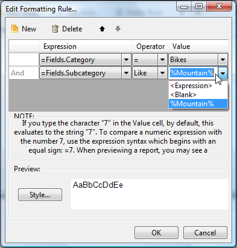
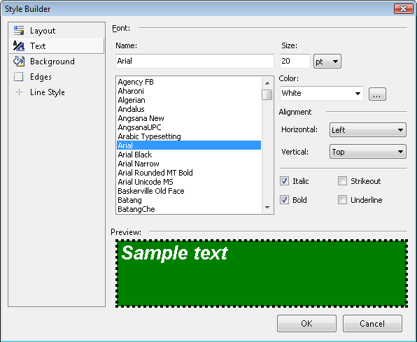

# Conditional Formatting Overview

Conditional formatting allows you to style report items dynamically based on certain rules that are defined in the [Conditional Formatting Rules Dialog](). All of this can be done without writing any code. Conditional formatting applies to any report item including sections and the report itself, all using the same [Conditional Formatting Rules Dialog]() user interface. See also the [Extending the Simple Report Design Quickstart]() Quickstart for a walkthrough demonstration of the conditional formatting feature.

## Usages

* Setting a specific color based on a value or other condition;
* Setting a specific text styling based on a value or other condition;
* Setting the visibility of an item based on a value or other condition and a lot more.

## Adding Conditional Formatting Rules

The __ConditionalFormatting__ property contains a collection of formatting rules that are evaluated in the order they are defined. Each rule has an associated style that lets you change styling characteristics when the rule is satisfied. You can choose to stop evaluating rules if a particular rule condition is met.

Each filter condition is made up of an __Expression__, __Operator__ and __Value__.

* __Expression__ can be a data field from the __Fields__ collection or defined using the [Edit Expression Dialog]().
* __Operator__ can be simple comparison operators but can also include __Like__ and additional operators to include the top and bottom number of records and the top and bottom percentage of records. See the table of operators below.
* __Value__ can be a literal value, `<blank>` or an expression defined in the [Edit Expression Dialog](). When all the filter conditions are met, the rule is fired and the style is applied.

You can change the Text, Background, Edges and Line Style for the given item using the [Style Builder dialog]().

## Samples with Conditional Formatting

* [Display Reports with alternating style rows]()
* [Change row color based on a value in the row]()
* [Display "No Data" message for Reports and Subreports]()
* [How to create waterfall chart with Graph item]()
