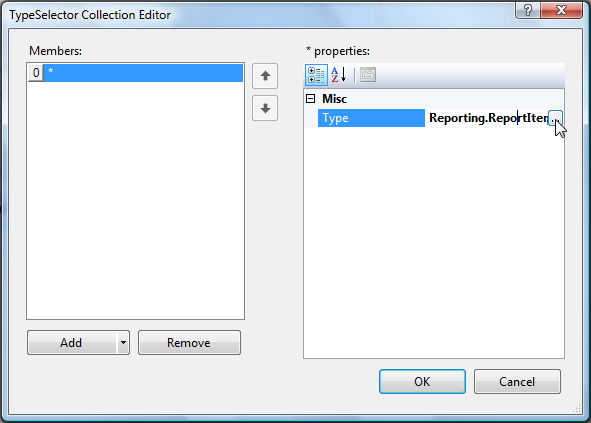
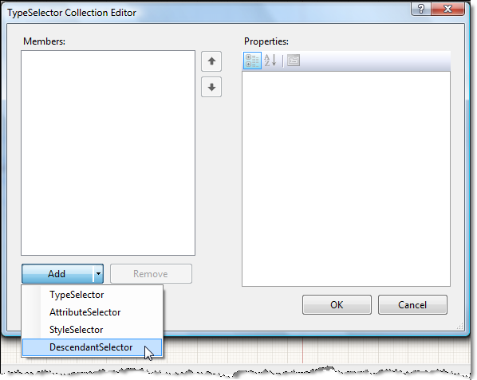

# Creating Style Rules

Style definitions can be stored in a Style Rule. Style Rules can be created in the designer or in code.

Style Rules are defined as one of the following four types:

* A __TypeSelector__ applies to all report items of a particular type.
* An __AttributeSelector__ applies to all report items with a particular attribute (such as Color=Red).
* A __StyleSelector__ applies to all report items with a particular style name.
* A __DescendantSelector__ applies to all report items descended from another report item, which in turn can be specified by any type of selector.

See [Understanding Style Selectors]() for more information about the types of Style Rules.

## Creating Rules Using the StyleRule Collection Editor

1. Open the report in design view.
1. Select the Report object.
1. Click in the __StyleSheet__ property, and then click the ellipsis button to open the StyleRule Collection Editor.

## Creating a TypeSelector StyleRule

### Using the StyleRule Collection Editor

1. In the StyleRule Collection Editor, click __Add__. A new rule will be added to the Members list and you will see the Selectors and Style properties for the rule.

	

1. Click the __Selectors__ property, then click the ellipsis button that appears to the right of __(Collection)__. This action will open TypeSelector Collection Editor.
1. Click the drop-down arrow on the __Add__ button to choose the type of Selector to create.
1. Click __TypeSelector__ from the list. Note: TypeSelector is the default type created when you click the __Add__ button.

	

1. Click the __Type__ property of the new TypeSelector, and then click the ellipsis button.

	

1. Select the __Telerik.Reporting.TextBox__ and click __OK__. The StyleRule will now apply to all __TextBox__ report items on the report.
1. Click the plus sign next to __Style__ to expand the __Style__ properties.
1. Modify any properties you wish to define formatting to be applied to the __TextBox__ report item.
1. Click __OK__ to save the rules and close the editor window.

	

### Creating a TypeSelector StyleRule in Code

The following code demonstrates the four steps required to create a __TypeSelector__ __StyleRule__ programmatically:

1. Create a new __StyleRule__ called __MyStyleRule__.
1. Add a __TypeSelector__ to the __StyleRule__ and define the type as __Telerik.Reporting.TextBox__.
1. Apply some formatting rules to the __StyleRule__.
1. Add the __StyleRule__ to the __Style Sheet__.

````CSharp
//Create a StyleRule
Telerik.Reporting.Drawing.StyleRule myStyleRule = new Telerik.Reporting.Drawing.StyleRule();
//Add a TypeSelector
myStyleRule.Selectors.AddRange(new Telerik.Reporting.Drawing.ISelector[] 
    {new Telerik.Reporting.Drawing.TypeSelector(typeof(Telerik.Reporting.TextBox))});
//Add formatting
myStyleRule.Style.BackgroundColor = System.Drawing.Color.Linen;
myStyleRule.Style.Color = System.Drawing.Color.DodgerBlue;
myStyleRule.Style.Font.Name = "Courier New";
//Add rule to Style Sheet
this.StyleSheet.AddRange(new Telerik.Reporting.Drawing.StyleRule[] {myStyleRule});
````
````VB.NET
'Create a StyleRule
Dim MyStyleRule As Telerik.Reporting.Drawing.StyleRule = New Telerik.Reporting.Drawing.StyleRule
'Add a TypeSelector
MyStyleRule.Selectors.AddRange(New Telerik.Reporting.Drawing.ISelector() _ 
{New Telerik.Reporting.Drawing.TypeSelector(GetType(Telerik.Reporting.TextBox))})
'Add formatting
MyStyleRule.Style.BackgroundColor = System.Drawing.Color.LinenMyStyleRule.Style.Color = System.Drawing.Color.DodgerBlue
MyStyleRule.Style.Font.Name = "Courier New"
'Add rule to Style Sheet
Me.StyleSheet.AddRange(New Telerik.Reporting.Drawing.StyleRule() {MyStyleRule})
````

## Creating a StyleSelector StyleRule

### Using the StyleRule Collection Editor

1. In the StyleRule Collection Editor, click __Add__. A new rule will be added to the Members list and you will see the __Selectors__ and __Style__ properties for the rule.
1. Click the __Selectors__ property, and then click the ellipsis button to open the TypeSelector Collection Editor window.
1. Click the drop-down arrow on the __Add__ button to choose the type of Selector to create.
1. Click __StyleSelector__ from the list.
1. Type a name for the Style into the __StyleName__ property.

	

1. Click __OK__ to return to the StyleRule Collection Editor.
1. Expand the __Style__ property and modify the formatting properties as desired.
1. When finished, click __OK__ to close the StyleRule Collection Editor.

### Creating a StyleSelector StyleRule in Code

The following code demonstrates the four steps required to create a __StyleSelector__ __StyleRule__ programmatically:

1. Create a new __StyleRule__ called __MyStyleRule__.
1. Add a __TypeSelector__ to the __StyleRule__ and give it a __StyleName__ , such as CaptionStyle.
1. Apply some formatting rules to the __StyleRule__.
1. Add the __StyleRule__ to the __Style Sheet__.

````CSharp
//Create a StyleRule
Telerik.Reporting.Drawing.StyleRule myStyleRule = new Telerik.Reporting.Drawing.StyleRule();     
//Add a StyleSelector
myStyleRule.Selectors.AddRange(new Telerik.Reporting.Drawing.ISelector[] {new Telerik.Reporting.Drawing.StyleSelector("CaptionStyle")});
//Add formatting
myStyleRule.Style.BackgroundColor = System.Drawing.Color.Linen;
myStyleRule.Style.Color = System.Drawing.Color.DodgerBlue;
myStyleRule.Style.Font.Name = "Courier New";
//Add rule to Style Sheet
this.StyleSheet.AddRange(new Telerik.Reporting.Drawing.StyleRule[] {myStyleRule});
````
````VB.NET
'Create a StyleRule
Dim MyStyleRule As Telerik.Reporting.Drawing.StyleRule = New Telerik.Reporting.Drawing.StyleRule 
'Add a StyleSelector
MyStyleRule.Selectors.AddRange(New Telerik.Reporting.Drawing.ISelector() _
{New Telerik.Reporting.Drawing.StyleSelector("CaptionStyle")})
'Add(formatting)
MyStyleRule.Style.BackgroundColor = System.Drawing.Color.Linen
MyStyleRule.Style.Color = System.Drawing.Color.DodgerBlue
MyStyleRule.Style.Font.Name = "Courier New"                   
'Add rule to Style Sheet
Me.StyleSheet.AddRange(New Telerik.Reporting.Drawing.StyleRule() {MyStyleRule})
````

### Applying StyleSelector StyleRules

Each report item has a __StyleName__ property.

Type the __StyleName__ of the desired __StyleRule__ into the report item's __StyleName__ property to apply the formatting of the __StyleRule__.
 


## Creating a DescendantSelector StyleRule

### Using the StyleRule Collection Editor

1. In the StyleRule Collection Editor, click __Add__. A new rule will be added to the Members list and you will see the __Selectors__ and __Style__ properties for the rule.
1. Click the __Selectors__ property, and then click the ellipsis button to open the TypeSelector Collection Editor window.
1. Click the drop-down arrow on the __Add__ button to choose the type of Selector to create.
1. Click __DescendantSelector__ from the list.

	

	The __DescendantSelector__ is made up of additional __Selectors__.

1. Click the __Selectors__ property, and then click the ellipsis button to open up a new TypeSelector Collection Editor window.

	

	In this new TypeSelector Collection Editor window, you will define the Selectors that make up the DescendantSelector.

1. Click __Add__ to add a new __TypeSelector__.
1. Click __Type__ , and then click the ellipsis button to open up the Select Type dialog.
1. Select the __Telerik.Reporting.DetailSection__ type.
1. Add another new __TypeSelector__ and set its type to __Telerik.Reporting.TextBox__. 

	

1. Click __OK__ to close the window and return to the TypeSelector Collection Editor window for the DescendantSelector.
1. Click __OK__ to close this window and return to the StyleRule Collection Editor window. 

	

1. Expand the __Style__ property to define the formatting for the __DetailSection TextBox StyleRule__.
1. Click __OK__ when complete.

### Creating a DescendantSelector StyleRule in Code

The following code demonstrates the four steps required to create a __DescendantSelector__ __StyleRule__ programmatically:

1. Create a new __StyleRule__ called __MyStyleRule__.
1. Create a new __DescendantSelector__.
1. Add __Selectors__ to the __DescendantSelectors__. If you are using __TypeSelectors__ , define the types too.
1. Add a __TypeSelector__ to the __StyleRule__ and give it a __StyleName__ , such as CaptionStyle.
1. Apply some formatting rules to the __StyleRule__.
1. Add the __StyleRule__ to the __Style Sheet__.

````CSharp
//Create StyleRule and DescendantSelector
Telerik.Reporting.Drawing.StyleRule myStyleRule = new Telerik.Reporting.Drawing.StyleRule();    
Telerik.Reporting.Drawing.DescendantSelector myDescendantSelector = new Telerik.Reporting.Drawing.DescendantSelector();
//Define the Selectors and Types of the DescendantSelector
myDescendantSelector.Selectors.AddRange(
	new Telerik.Reporting.Drawing.ISelector[] 
	{ new Telerik.Reporting.Drawing.TypeSelector(typeof(Telerik.Reporting.ReportHeaderSection)), 
		new Telerik.Reporting.Drawing.TypeSelector(typeof(Telerik.Reporting.TextBox))
	});
//Add the DescendantSelector to the StyleRule
myStyleRule.Selectors.AddRange(
	new Telerik.Reporting.Drawing.ISelector[] 
	{ 
	myDescendantSelector
	});
//Apply Formatting
myStyleRule.Style.BorderStyle.Default = Telerik.Reporting.Drawing.BorderType.Ridge;
myStyleRule.Style.Color = System.Drawing.Color.Navy;
myStyleRule.Style.Font.Name = "Arial";
//Add rule to Style Sheet
this.StyleSheet.AddRange(new Telerik.Reporting.Drawing.StyleRule[] {myStyleRule});
````
````VB.NET
'Create StyleRule and DescendantSelector
Dim MyStyleRule As Telerik.Reporting.Drawing.StyleRule = New Telerik.Reporting.Drawing.StyleRule
Dim MyDescendantSelector As Telerik.Reporting.Drawing.DescendantSelector = _ 
New Telerik.Reporting.Drawing.DescendantSelector
'Define the Selectors and Types of the DescendantSelector
MyDescendantSelector.Selectors.AddRange(New Telerik.Reporting.Drawing.ISelector() _ 
{New Telerik.Reporting.Drawing.TypeSelector(GetType(Telerik.Reporting.ReportHeaderSection)), _  
New Telerik.Reporting.Drawing.TypeSelector(GetType(Telerik.Reporting.TextBox))})
'Add the DescendantSelector to the StyleRule
MyStyleRule.Selectors.AddRange(New Telerik.Reporting.Drawing.ISelector() {DescendantSelector1})
'Apply formatting
MyStyleRule.Style.BorderStyle.Default = Telerik.Reporting.Drawing.BorderType.Ridge
MyStyleRule.Style.Color = System.Drawing.Color.Navy
MyStyleRule.Style.Font.Name = "Arial"
'Add the StyleRule to the Style Sheet
Me.StyleSheet.AddRange(New Telerik.Reporting.Drawing.StyleRule() {MyStyleRule})
````

