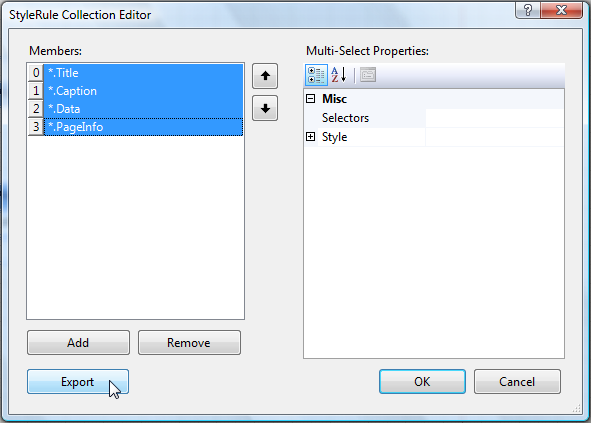

# Exporting and Reusing Style Sheets

Styles created in a report can be exported and then used in other reports. You can store one or more Styles in an exported file. The exported information is stored in an XML file.

## Export a Style Sheet

1. Open the report in design view.
1. Select the __Report__ object.
1. Click in the __StyleSheet__ property, and then click the ellipsis button to open the StyleRule Collection Editor.
1. Select one or more of the styles in the Members box on the left. Use Windows keyboard combinations to select more than one style.

	

1. Click the __Export__ button. This will open the __Save As__ dialog box.
1. Enter a name for the exported file and click __Save__ to complete the task.

## Use an Exported Style Sheet in Another Report

1. Open the report in design view.
1. Select the __Report__ object.
1. Click in the __ExternalStylesSheets__ property, and then click the ellipsis button to open the Collection Editor.
1. Click the __New__ icon in the upper left corner of the Collection Editor window. This will open a __File Open__ dialog. You will be located in the current project's root directory.
1. Browse to, and then select, the exported Style Sheet. Click __Open__. This action will return you to the Collection Editor window.
1. When you are finished adding Style Sheets, click __OK__.

Styles that are defined by __TypeSelectors__ or __AttributeSelectors__ will be automatically formatted. To use styles defined by __StyleSelectors__, change the __StyleName__ property of the desired report item to the appropriate style names that exist in the Style Sheets that you added.

## External Style Sheet Location Kinds

There are three ways in which an external style sheet can be located:

* __Absolute Path/URL__ such as *C:\Application1\StyleSheets\StyleSheet1.xml* or *https://www.mysite.com/Application1/StyleSheets/StyleSheet1.xml*
* __Relative Path/URL__ such as *.\StyleSheets\StyleSheet1.xml* or *~/StyleSheets/StyleSheet1.xml*
* __Resource Name__ such as *Application1.Resources.StyleSheet1.xml*

When you add a new external style sheet to the collection it will be recorded via Relative or Absolute path depending on the file's location. If the file that you chose is located __inside__ the current project root directory the style sheet will be recorded via relative path, otherwise it will be recorded via absolute path. Later you can change the way it is serialized by changing its location kind from the combo box next to its name.

## Absolute Path/URL

The external style sheet file does not have to be a part of the project since it is referenced absolutely.

## Relative Path/URL for trdp/trdx report definitions

When an external style sheet is referenced relatively, the path is relative to the __trdp/trdx report definition__.

When deploying the style sheet file should be added to the project and should have its __"Copy to Output Directory"="Copy Always"__.

## Relative Path/URL for type report definitions

When an external style sheet is referenced relatively the path is relative to the __hosting application root folder__. The project item representing the style sheet file should have its __"Copy to Output Directory"="Copy Always"__. When you use the Collection Editor, a project item for the style sheet file will be created automatically, if it does not exists, and it will be moved to a folder named __"StyleSheets"__ under the project root and its "Copy to Output Directory" property will be adjusted automatically as well.

>note For Windows Forms projects, the root folder is the location of the executable file (by default bin folder). In Web applications the root folder is the root of the application. In this case the stylesheets should be copied to the root of the Web application as well.

## Resource Name

You can reference an external style sheet as an embedded resource by its __name__. The name should be the [case-sensitive name of the manifest resource being requested](https://learn.microsoft.com/en-us/dotnet/api/system.reflection.assembly.getmanifestresourcestream?view=net-7.0#system-reflection-assembly-getmanifestresourcestream(system-string)). The project item representing the style sheet file should have its __"Build Action"="Embedded Resource"__. When you use the Collection Editor, a project item for the style sheet file will be created automatically, if it does not exists, it will be moved to a folder named __"Resources"__ under the project root and its "Build Action" property will be adjusted automatically as well. In the end the generated name will look something like *MyApplication1.Resources.StyleSheet1.xml* , where MyApplication1 is the default project namespace and the file is located in the folder Resources.

>note Specifying an URL for the external style sheet can be done only programmatically. It is not supported directly from the Collection Editor.
