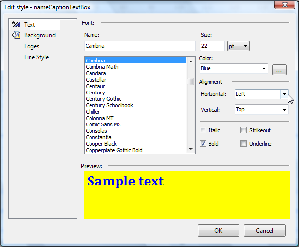
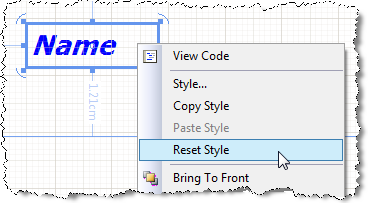

# Style Inheritance and Overriding

Telerik Reporting Styling is similar to CSS (Cascading Style Sheets), of which many web developers are familiar.

Styles can be defined globally using the [StyleRules](). They can be inherited from parent report items. They can also be explicitly defined in a report item's Style properties.

## General Inheritance Rules

Child report items placed within another report item always derive their styling based on the following precedence:

**Lowest Priority - Parent:** If the parent control has a **Style** applied, then the child will inherit the parent's styling. This will be over-ruled by the higher priorities.

**Second Priority - Global:** If any of the global styles apply to the child (eg. the child is a TextBox and there is a TypeSelector rule for TextBox report items) then the control will use this styling. Parent styling will be ignored in this case.

**Highest Priority - Inline:** If  the child control's **Style** properties have been changed from their defaults, then these properties will be honored with the  highest priority. In this case, the Global styling and the style of the parent will be ignored.

## Global Styles and Precedence

Styles defined with **Style Rules** will be applied globally in a report based on the definition of the Style Rule. A **Style Rule** can be defined by using one of the [Style Selectors]().

The **Style Sectors** have the following precedence:

- DescendantSelector
- TypeSelector
- AttributeSelector
- StyleSelector where the order is from bottom to top. This means that a **StyleSelector** has precedence over the other Selectors.

By default the order of the **Style Rules** in the collection determines how styles are applied and the order is from bottom (last) to top (first). Exception from this rule is the **TypeSelector** where the more specific the rule is, the higher precedence it has. For example, a Style Rule for a **TextBox** will have precedence over a style rule for a **ReportItemBase** despite their order in the style sheet.

If several rules match the same Selectors, the last Style Rule has precedence.

## Inheriting from Global Styles

Report items placed within a report item that is styled using one of the Global Styles will inherit the Font, Vertical Alignment, and Horizontal alignment of the parent.

## Overriding Global Styles

You can override a GlobalStyle by modifying the Style properties of an individual report item. Select the report item and either click the ellipsis of the **Style** property or right click and select the **Style...** option. These open the Edit Style dialog box, which allows you to edit the various properties that can be set through the style sheet. Any changes you make through the Edit Style dialog box override settings made through the report's **StyleSheet** property.

## Resetting Global Styles

If you have overridden a style using a report item's Style properties, it is possible to reset the report item to its Global Style.

1. Right-click the report item to open its context menu.
1. Click **Reset Style**.

