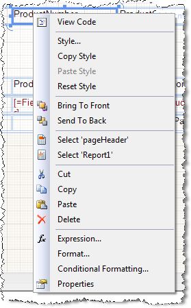
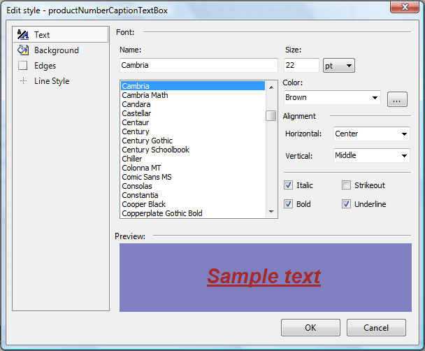

# Styling items using the Context Menu

The context menu for a report's report item allows you to modify styles easily.

Right-clicking on a report item opens the following context menu:

## Style...

The __Style...__ option will open the Edit style dialog so that you can make changes to the formatting of the report item.

## Copy Style

__Copy Style__ will get all the properties of the report item's inline style and make them available into the clipboard. Inline style includes all properties of the [Style](/reporting/api/Telerik.Reporting.Drawing.Style)  class. Any style inherited from parent report item, any global styling that was applied with __StyleSelectors__ or from external style sheets would not be copied.

## Paste Style

__Paste Style__ will apply the style that was copied using __Copy Style__. The style will be applied as an Inline style. This means that the report item's inline style properties will be modified to match the source item. Any global/external style/style name would not be pasted.

You can hold CTRL to select multiple report items and then use __Paste Style__ to apply the style on all selected items.

## Reset Style

If a report item's style properties were modified, clicking Reset Style will remove the inline styling. Any style inherited from parent report item, any global styling that was applied with __StyleSelectors__ or from external style sheets would not be reset.

## See Also

* [Style Inheritance and Overriding]()
* [Understanding Style Selectors]()
