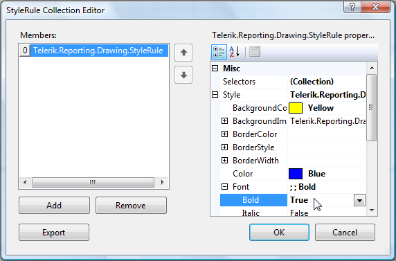
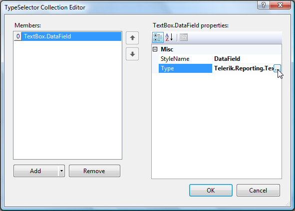

# Customizing Reports using Styles

Telerik Reporting uses a built-in styling model that is similar to CSS. The model provides for very fine-grained visual customization of all elements of a report directly in the Report designer. This CSS-like mechanism offers full control over such things as the background, colors, borders, and images for every item on your report. You can assign styles by using CSS selectors such as Type, Attribute, Style, and Descendent.

## Creating a Style Sheet for a Report

To create a style sheet for a report, follow these steps:

1. Open the report in design view.
1. Select the Report object.
1. Click in the __StyleSheet__ property, and click the ellipsis button to open the StyleRule Collection Editor.
1. Click __Add__ to add a new __StyleRule__.
1. Expand the __Style__ property and customize your new __StyleRule__. For example, the screenshot below shows a __StyleRule__ that specifies a yellow background, blue text, and bold Times New Roman font.

	

1. Click in the __Selectors__ property, and click the ellipsis button to open the TypeSelector Collection Editor.
1. Click the drop-down arrow on the __Add__ button and select the type of selector to add. See the type of selectors in [Understanding Style Selectors]()
1. Use the properties area of the TypeSelector Collection Editor to customize the new selector. For example, the screenshot below shows a __StyleSelector__ named __DataField__ which applies to __TextBox__ report items only.

	

1. Click __OK__ when you are done adding selectors for the current StyleRule.
1. Click __OK__ when you are done adding StyleRules for the report's StyleSheet.

## Assigning Styles to Report Items

Telerik Reporting will automatically apply styles that use __TypeSelectors__, __AttributeSelectors__, or __DescendantSelectors__ to the appropriate report items. For example, if you add a style to the report's __StyleSheet__ with a __TypeSelector__ of __Telerik.Reporting.TextBox__, that style will be inherited by all text box report items on the report.

To apply a style that uses a __StyleSelector__ to a report item, select the report item and set its __StyleName__ property to the __StyleName__ property of the __StyleSelector__.

## See Also

* [Understanding Style Selectors]()
* [Creating Style Rules]()
* [Exporting and Reusing Style Sheets]()
