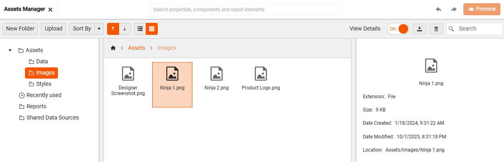
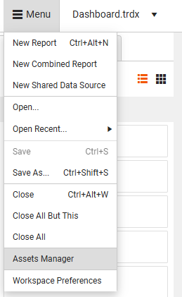
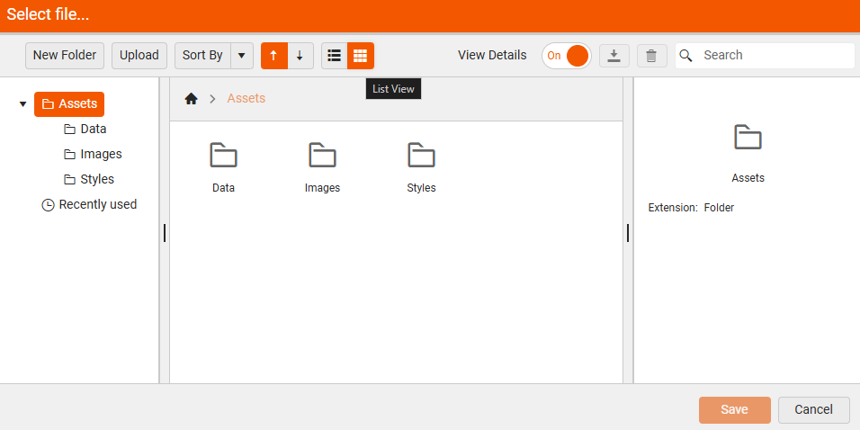
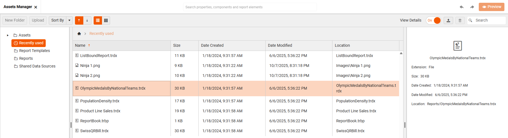

# Sharing Resources with Assets Manager

To share resources (like company logos, data files) when crafting reports in the [Web Report Designer](https://demos.telerik.com/reporting/designer), use the **Assets Manager**, which helps you manage shared resources used across multiple reports. It provides centralized resource management, allowing users to upload, organize, rename, and delete various types of assets directly on the server. Shared report resources ensure a unified, consistent look and feel across reports and enable teams to work together&mdash;data experts can manage sources, while designers focus on presentation.

You can share and reuse:  

* **Images** (for example, logos, backgrounds): Suitable for using a company logo across multiple reports when the logo is stored at one centralized place.

* **Data files** (for example, CSV, JSON, shapefiles): Share common data that can be reused across multiple users.

* **Stylesheets** (for consistent report styling): Styles created in a report can be exported and then used in other reports. 

* **Shared Data Sources** (predefined connections to data): Enable report designers to easily create and reuse a data source component across multiple reports. Read more in [Shared Data Source]()

* **Report Templates** (.trtx file): Offer initial report layout and styling, and allow creating reports with consistent look and feel. Read more in [Creating and Using Report Templates in Web Report Designer]().

Once uploaded, you can reuse the assets in multiple reports, ensuring consistency and reducing duplication. For example, updating a company logo in the Assets Manager updates it across all reports using that asset.

## Sharing a Resource

To share a resource (e.g. an image), you need to invoke the **Assets Manager** in the Telerik Web Report Designer:

1. Launch the Web Report Designer in your browser.

1. Click the **Main Menu** at the top left corner.

1. Select **Assets Manager** from the menu options:
 
    

You do not always need to go through the menu. When you are editing a report item like a PictureBox, just click the asset picker next to the `Value` field. This will instantly open the Assets Manager so you can select an image right away:

<iframe width="560" height="315" src="https://www.youtube.com/embed/urU2a-d6Saw?si=YJZziPWrtOxDYci3" title="YouTube video player" frameborder="0" allow="accelerometer; autoplay; clipboard-write; encrypted-media; gyroscope; picture-in-picture; web-share" referrerpolicy="strict-origin-when-cross-origin" allowfullscreen></iframe>

## Resource Folders

Several default folders that help organizing shared resources for usage across multiple reports are created automatically and cannot be renamed or deleted by end-users, though developers can configure them differently on the backend.

The main root folder contains three predefined subfolders: 

* **Data** (Stores data files like .csv, .json, and shapefiles used in Map items)

* **Images** (Contains image files used in PictureBox items, backgrounds, logos, etc.)

* **Styles** (Holds stylesheets (e.g., .trdx, .css) used for consistent styling across reports.

Users can create subfolders within these categories to better organize their assets. Developers can configure different predefined folders on the backend if needed.

### Reports

The `Reports` folder is a dedicated folder for storing report definitions which includes all available reports on the server. It is possible to organize them into subfolders, grouping the reports by category, department, or purpose. Shared reports that can be reused as SubReports in other designs.

### Shared Data Sources

The [Shared Data Sources]() folder within the Assets Manager contains reusable data source definitions (.sdsx files) that can be shared across multiple reports. Each .sdsx file encapsulates the configuration for a data source, including: Connection strings, Queries or endpoints, Parameters, Metadata (e.g., name, description).

## Enhanced UI Features

To help you manage your shared resources with ease and flexibility the Assets Manager is packed with a rich set of UI intuitive features:

* **Choose Your View: Grid or List**

    Prefer a visual layout or a compact list? You can switch between Grid View and List View depending on your workflow. Grid View even supports column resizing for better visibility.

    |Grid View|List View|
    |----|----|
    |||

* **Manage Files Effortlessly**: Upload, download, rename, move, or delete files and folders - all in one place. You can even drag and drop files directly into the manager for quick uploads.

* **View Asset Details Instantly**: Want to see more info about a file? Just select an asset and toggle the `View Details` button. A panel on the right will show metadata like file name, type, and size:
    
     

* **Quick Access to Recent Assets**: No need to search for files you just used - your recently accessed assets are tracked and easily accessible.

     

* **Organize Reports for Report Books**: If you are creating a Report Book, use the Assets Manager to select and organize individual reports into a cohesive, multi-report document.

## See Also

* [Web Report Designer]()
