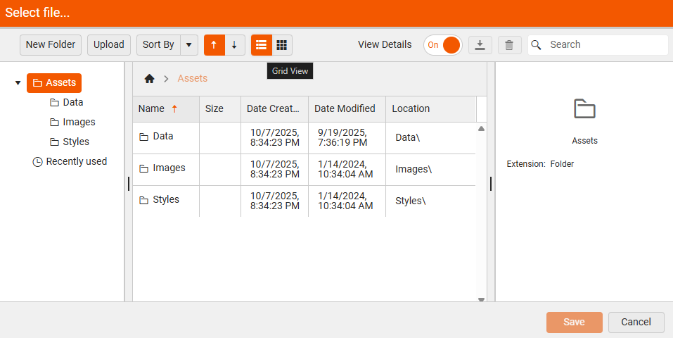
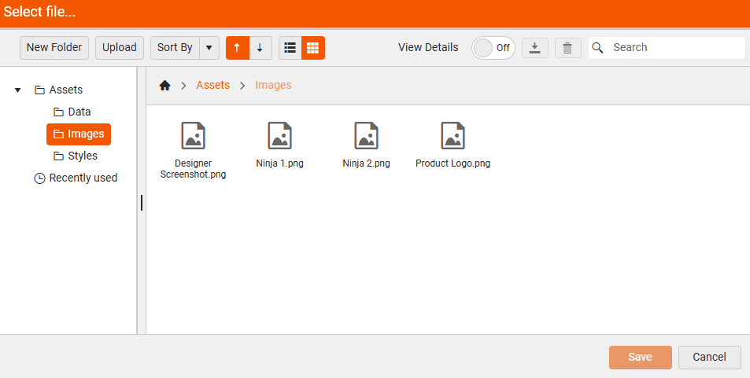

# Sharing Resources with Assets Manager

To share resources (like company logo, data files) when crafting reports in the [Web Report Designer](https://demos.telerik.com/reporting/designer), Telerik Reporting offers the **Assets Manager** tool. It is designed to help report authors manage shared resources used across multiple reports. It provides centralized resource management which allows uploading, organizing, renaming, and deleting various types of assets directly on the server. The **Assets Manager** reduces the time spent for managing resources individually for each report, ensures a unified consistent look and feel across reports and enables teams to work together - data experts can manage sources, while designers focus on presentation.
 
 

## What Resources Can Be Shared

You can share and reuse:

* **Images** (e.g., logos, backgrounds): Suitable for using a company logo accross multiple reports when the logo is stored at one centralized place.

* **Data files** (e.g., CSV, JSON, shapefiles): Share common data that can be reused accross multiple users.

* **Stylesheets** (for consistent report styling): Styles created in a report can be exported and then used in other reports. 

* **Shared Data Sources** (predefined connections to data): Enable report designers to easily create and reuse a data source component across multiple reports.

* **Report Templates** (.trtx file): Offer initial report layout and styling, and allow creating reports with consistent look and feel.

Once uploaded, assets can be reused in multiple reports, ensuring consistency and reducing duplication. For example, updating a company logo in the Assets Manager updates it across all reports using that asset.

## What Enhanced UI Features Can Be Used

The Assets Manager in the Telerik Web Report Designer offers a rich set of UI features designed to help users manage the shared resources easily.

* **Grid and List views**: Resources can be displayed in either grid or list layout. Grid view supports column resizing for better visibility.

    |Grid View|List View|
    |----|----|
    | | |

* **File Operations**: Upload, download, rename, move, and delete files and folders. Supports drag-and-drop for uploads.

* **Details panel**: Allows inspecting asset metadata: Once an asset is selected, its details are displayed in the panel on the right side if the `View Details` button is toggled.

     

* **Recent assets**: Tracking for quick access.

      

* **Report Book Integration**: Assets Manager also helps in selecting and organizing reports when creating a Report Book (a combined report made of multiple individual reports).

## Getting Started with Assets Manager

To invoke the Assets Manager in the Telerik Web Report Designer, follow these steps:

1. Launch the Web Report Designer in your browser.

1. Click the **Main Menu** at the top left corner.

1. Select "Assets Manager" from the menu options:

      

You can also invoke the Assets Manager contextually - for example, when setting the Value of a PictureBox, clicking the asset picker will open the Assets Manager directly to select an image:

<iframe width="560" height="315" src="https://www.youtube.com/embed/krtf6XxVKfE?si=vHgJ6gwSYen7Y1ML" title="YouTube video player" frameborder="0" allow="accelerometer; autoplay; clipboard-write; encrypted-media; gyroscope; picture-in-picture; web-share" referrerpolicy="strict-origin-when-cross-origin" allowfullscreen></iframe>

## Default Folders

Several default folders that help organize shared resources for use across multiple reports are created automatically and cannot be renamed or deleted by end-users, though developers can configure them differently on the backend.

The main root folder contains three predefined subfolders: 

* **Data** (Stores data files like .csv, .json, and shapefiles used in Map items)

* **Images** (Contains image files used in PictureBox items, backgrounds, logos, etc.)

* **Styles** (Holds stylesheets (e.g., .trdx, .css) used for consistent styling across reports.

Users can create subfolders within these categories to better organize their assets. Developers can configure different predefined folders on the backend if needed.

### Reports

The `Reports` folder is a dedicated folder for storing report definitions which includes all available reports on the server. It is possible to organize them into subfolders, grouping the reports by category, department, or purpose. Shared reports that can be reused as SubReports in other designs.

### Shared Data Sources

The [Shared Data Sources]() folder within the Assets Manager contains reusable data source definitions (.sdsx files) that can be shared across multiple reports. Each .sdsx file encapsulates the configuration for a data source, including: Connection strings, Queries or endpoints, Parameters, Metadata (e.g., name, description).

## See Also

* [Web Report Designer]()
