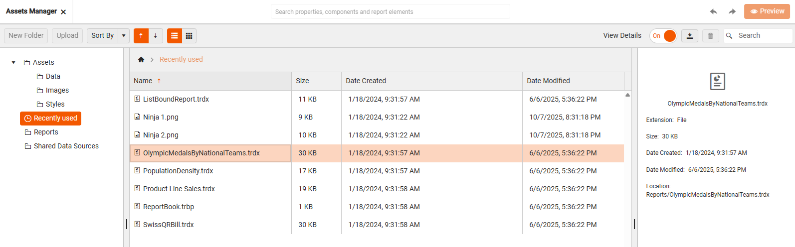

# Assets Manager

The **Assets Manager** in the [Web Report Designer](https://demos.telerik.com/reporting/designer) is a tool designed to help report authors manage shared resources used across multiple reports.
 
 

## Key Features

Here is a breakdown of its main functionalities:

* **Centralized Resource Management**: It allows uploading, organizing, renaming, and deleting various types of assets directly on the server. Assets are organized into predefined folders. These assets include:
    * **Images** (e.g., logos, backgrounds)
    * **Data files** (e.g., CSV, JSON, shapefiles)
    * **Stylesheets** (for consistent report styling)
    * **Shared Data Sources** (predefined connections to data)

* **Reusability Across Reports**: Once uploaded, assets can be reused in multiple reports, ensuring consistency and reducing duplication. For example, updating a company logo in the Assets Manager updates it across all reports using that asset.

* **Enhanced UI Features**:
    * Grid and List views for browsing assets. The arrows next to view buttons allow the end-users sort the available items.

    |Grid View|List View|
    |----|----|
    | | |

    * Details panel for inspecting asset metadata

     

    * Recent assets tracking for quick access

      

* **Report Book Integration**: Assets Manager also helps in selecting and organizing reports when creating a Report Book (a combined report made of multiple individual reports).

The **Assets Manager** offers the end-users:

* **Efficiency**: Reduces time spent managing resources individually for each report.
* **Consistency**: Ensures a unified look and feel across reports.
* **Collaboration**: Enables teams to work together - data experts can manage sources, while designers focus on presentation.
 

## Getting Started with Assets Manager

To invoke the Assets Manager in the Telerik Web Report Designer, follow these steps:

1. Launch the Web Report Designer in your browser.

1. Click the **Main Menu** at the top left corner.

1. Select "Assets Manager" from the menu options:

      

You can also invoke the Assets Manager contextually - for example, when setting the Value of a PictureBox, clicking the asset picker will open the Assets Manager directly to select an image:

<iframe width="560" height="315" src="https://www.youtube.com/embed/krtf6XxVKfE?si=vHgJ6gwSYen7Y1ML" title="YouTube video player" frameborder="0" allow="accelerometer; autoplay; clipboard-write; encrypted-media; gyroscope; picture-in-picture; web-share" referrerpolicy="strict-origin-when-cross-origin" allowfullscreen></iframe>

## Predefined Folders

### Assets

The main root folder of the Assets Manager is called `Assets` which is automatically created and managed by the Web Report Designer and contains three predefined subfolders: 

* **Data** (Stores data files like .csv, .json, and shapefiles used in Map items)

* **Images** (Contains image files used in PictureBox items, backgrounds, logos, etc.)

* **Styles** (Holds stylesheets (e.g., .trdx, .css) for consistent report styling. 

>tip These three folders are predefined and **cannot** be renamed or deleted by end users. Users can create subfolders within these categories to better organize their assets. Developers can configure different predefined folders on the backend if needed.

### Reports

The `Reports` folder includes all available reports on the server. It is possible to organize them into subfolders, grouping the reports by category, department, or purpose. Shared reports that can be reused as SubReports in other designs.

### Shared Data Sources

The `Shared Data Sources` folder within the Assets Manager contains reusable data source definitions (.sdsx files) that can be shared across multiple reports. Each .sdsx file encapsulates the configuration for a data source, including: Connection strings, Queries or endpoints, Parameters, Metadata (e.g., name, description).

## See Also

* [Web Report Designer]()
