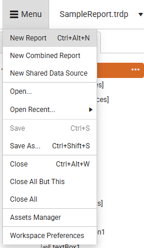
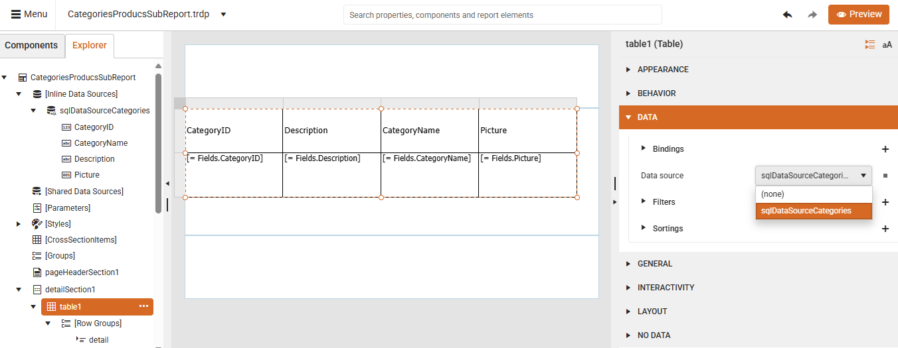
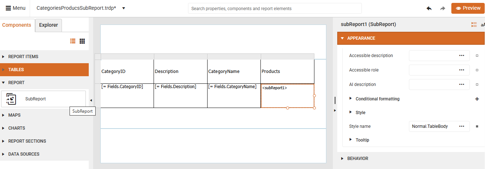
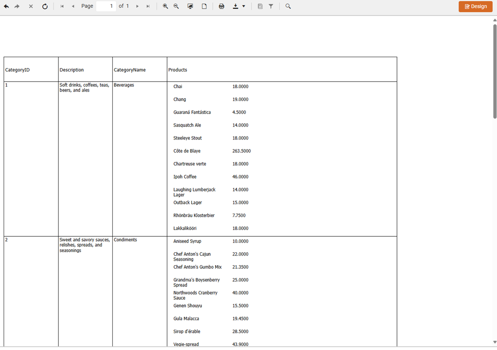

<style>
img[alt$="><"] {
  border: 1px solid lightgrey;
}

</style>

# Creating Master-Detail Reports with SubReports

Using SubReports in the Web Report Designer allows you to embed reports within other reports for creating master-detail hierarchies and reusable report components.

The next video demonstrates how to create master-detail reports by using SubReports in the Telerik Web Report Designer following the below steps:

<iframe width="560" height="315" src="https://www.youtube.com/embed/GnZi9PP9EK8?si=qaBfIZnbUu1fQzyK&rel=0" title="Adding a SubReport Item in the Telerik Web Report Designer" frameborder="0" allow="accelerometer; autoplay; clipboard-write; encrypted-media; gyroscope; picture-in-picture; web-share" referrerpolicy="strict-origin-when-cross-origin" allowfullscreen></iframe>

The following example demonstrates how to create a master-detail report using SubReports. The master report (*CategoriesProducts.trdp*) contains a table with Northwind **Categories** data. The SubReport (*ProductsReport.trdp*) displays Northwind **Products** records filtered by the respective `CategoryID`.

> To follow along with the steps below, you need access to an instance of the [Northwind](https://github.com/microsoft/sql-server-samples/tree/master/samples/databases/northwind-pubs) database for [Microsoft SQL Server](https://learn.microsoft.com/en-us/sql/database-engine/install-windows/install-sql-server?view=sql-server-ver17).

### Step 1: Building the Child Report

1. Start with a blank report (*ProductsReport.trdp*) that will serve as the child report. Select the header and footer sections and delete them.

    

1. Add a new [SQL Data Source]() populated with the `Northwind.Products` table:

    Here is the SQL query that selects the respective data:

    ```SQL
    SELECT
        [dbo].[Products].[ProductID], 
        [dbo].[Products].[ProductName], 
        [dbo].[Products].[Discontinued], 
        [dbo].[Products].[SupplierID], 
        [dbo].[Products].[CategoryID], 
        [dbo].[Products].[QuantityPerUnit], 
        [dbo].[Products].[UnitPrice], 
        [dbo].[Products].[UnitsInStock], 
        [dbo].[Products].[UnitsOnOrder], 
        [dbo].[Products].[ReorderLevel]
    FROM [dbo].[Products]
    ```

1. Set the **DataSource** of the report using the created SQLDataSource:

    

1. From the **Components** tab, drag two **TextBox** report items to the Detail section:

    4.1. Select each of the TextBoxes.

    4.2. Bind the the **Value** property of the TextBoxes to the `ProductName` and `UnitPrice` fields respectively.

    4.3. Use the **Expression** dialog to set the desired field.

    

1. Preview the report to verify that all Products are listed.

1. Add an integer report parameter called `ProductCategoryID` which you will use to filter by product:

    

1. Update the `SELECT` query of the added SQLDataSource and add a `WHERE` clause using an SQL parameter (which is mapped to the previously created report parameter):

    ```SQL
    SELECT
        [dbo].[Products].[ProductID], 
        [dbo].[Products].[ProductName], 
        [dbo].[Products].[Discontinued], 
        [dbo].[Products].[SupplierID], 
        [dbo].[Products].[CategoryID], 
        [dbo].[Products].[QuantityPerUnit], 
        [dbo].[Products].[UnitPrice], 
        [dbo].[Products].[UnitsInStock], 
        [dbo].[Products].[UnitsOnOrder], 
        [dbo].[Products].[ReorderLevel]
    FROM [dbo].[Products]
    WHERE [dbo].[Products].[CategoryID]=@sqlParamCategoryId
    ```

    

1. Save the report (*ProductsReport.trdp*). You will use it as a child report.

### Step 2: Building the Master Report

1. Create a new blank report (*CategoriesProducts.trdp*).

1. Add a new [SQL Data Source]() filled with the `Northwind.Categories` table:

    ```SQL
    SELECT
        [dbo].[Categories].[CategoryID], 
        [dbo].[Categories].[CategoryName], 
        [dbo].[Categories].[Description], 
        [dbo].[Categories].[Picture]
    FROM [dbo].[Categories]
    ```

1. Select the report's Detail section and use the [Table Wizard]() to add a table bound to the just added SQLDataSource:

    

1. Select the **Picture** header and change its text to **Products**.

1. Select the data cell bound to the `Picture` field (`[=Fields.Picture]`) and add a **SubReport** item by selecting it from the **Components** tab:

    

1. Specify the **Inner Report** for the **SubReport** item and select the Uri option that refers to the previously created `ProductsReport.trdp`:

    

1. Set up the relation between the parent and child reports:

    7.1. Adjust the parameters.

    7.2. Link the SubReport parameter (`ProductCategoryID`) with the master report's `CategoryID` field.

    

1. Save the changes and preview the master report. You will see all categories listed with the respective products for each category:

    

## Creating Nested Hierarchy with SubReports

The Web Report Designer provides an alternative approach to parameter binding for hierarchical data using the **DataSource** property of the **SubReport** item. This method is cleaner when your detail report is fully data-bound (not just a table inside it) and works well for hierarchical nested data scenarios.

Using DataSource on the SubReport item allows you to bind the child report directly to a filtered subset of the parent's data, making the hierarchy more intuitive and reducing parameter code.
The main benefits with this approach are:

* No need to define and pass parameters manually.
* Works naturally with hierarchical object models or JSON data.
* Cleaner and more maintainable for multi-level hierarchies.

The following example is purposed to show nested data relationships with proper grouping and organization.

Let's have JSON data representing a collection of Categories. Each category contains a nested list of its Products. This is a piece of the JSON content to better understand the Categories-Products hierarchical structure:

```JSON
    {
      "CategoryID": 1,
      "CategoryName": "Electronics",
      "Products": [
        {
          "ProductID": 100,
          "ProductName": "Electronics Item 100",
          "Price": 146.34,
        },
        {
          "ProductID": 101,
          "ProductName": "Electronics Item 101",
          "Price": 1470.37,
        },
        {
          "ProductID": 102,
          "ProductName": "Electronics Item 102",
          "Price": 934.91,
        },
        {
          "ProductID": 103,
          "ProductName": "Electronics Item 103",
          "Price": 334.59,
        }
      ]
    },
    {
      "CategoryID": 2,
      "CategoryName": "Home Appliances",
      "Products": [
        {
          "ProductID": 104,
          "ProductName": "Home Appliances Item 104",
          "Price": 1019.39,
        },
        {
          "ProductID": 105,
          "ProductName": "Home Appliances Item 105",
          "Price": 1374.47,
           },
        {
          "ProductID": 106,
          "ProductName": "Home Appliances Item 106",
          "Price": 1128.34,
        },
        {
          "ProductID": 107,
          "ProductName": "Home Appliances Item 107",
          "Price": 1009.11,
        },
        {
          "ProductID": 108,
          "ProductName": "Home Appliances Item 108",
          "Price": 1355.37,
          },
        {
          "ProductID": 109,
          "ProductName": "Home Appliances Item 109",
          "Price": 386.92,
        }
      ]
    }
```

1. Create a new report (e.g. CategoriesReport.trdp) which will be used as our main report for displaying Categories.

1. Create a [JSONDataSource](#json-data-source) item using the nested JSON collection for Categories and Products.

1. Use the [Table Wizard](#using-the-table-wizard) to create a table bound to the JSON source.

     

1. Select the generated TextBox for the Products field (e.g. the TextBox bound to Fields.Products)

1. Navigate to the Components tab and click SubReport. Thus, the TextBox item is replaced by a SubReport item.

1. Using the searchbox, navigate to the `Bindings` section and add a new binding for the **DataSource** field and setting the **Expression** to "=Fields.Products". Thus, the SubReport item will be mapped to the Products list of the respective category record.

     

1. Navigate to the `Inner Report` section and select the **UriReportSource** Type. Now, we will need a separate report that will be used as a container for the products for each category.

1. Create another report (e.g. ProductsReport.trdp) and add two TextBox items.
 
1. Using the searchbox, navigate to the **Value** field and bind to **=Fields.ProductName** and **=Fields.Price** respectively. Save the child report.

1. Go back to the CategoriesReport.trdp and set the newly created ProductsReport.trdp as **Uri** for the UriReportSource.

      

1. Click the Preview button and see the products for each category group:
    
       

A complete step-by-step video is available here:

<iframe width="560" height="315" src="https://www.youtube.com/embed/V3QxZimw19I?si=VdlqSxquqYvgEakX" title="YouTube video player" frameborder="0" allow="accelerometer; autoplay; clipboard-write; encrypted-media; gyroscope; picture-in-picture; web-share" referrerpolicy="strict-origin-when-cross-origin" allowfullscreen></iframe>

## See Also

* [Web Report Designer]()
* [Data Sources]()
