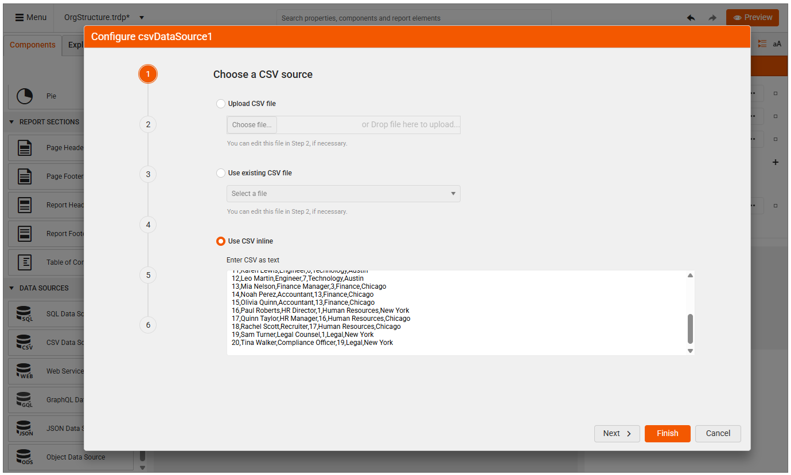
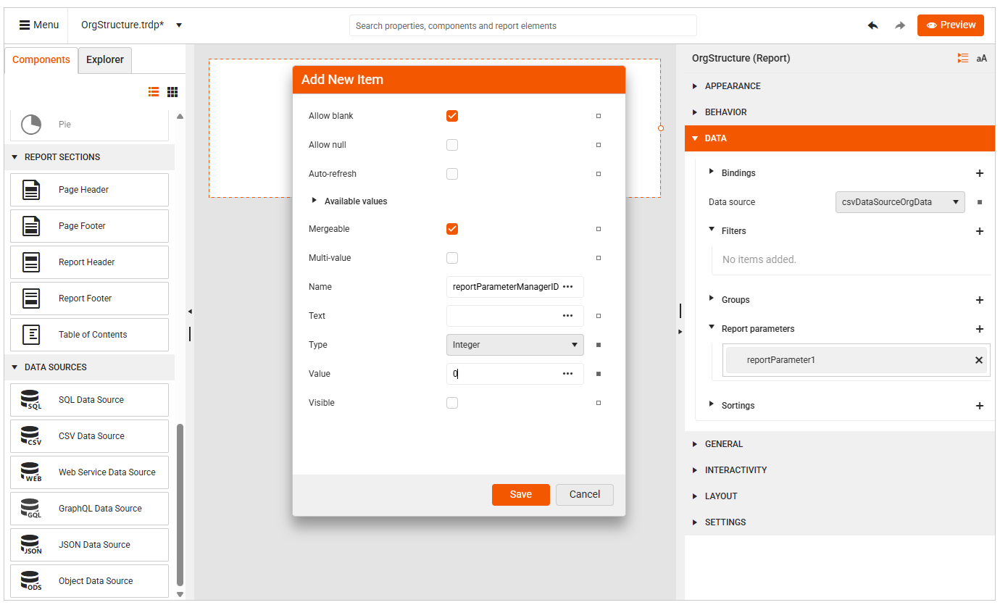
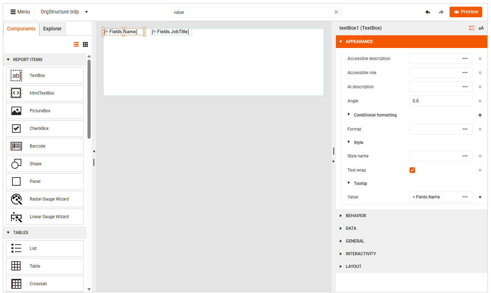
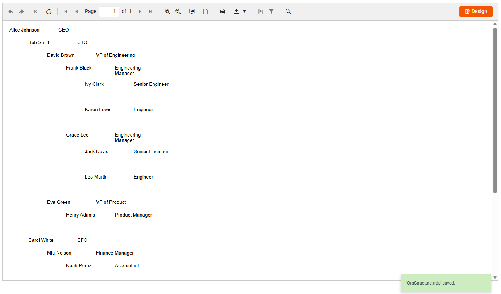

# Creating Organization Hierarchy with SubReports

An organizational hierarchy represents roles, responsibilities, and authority within an organization in a structured way. It represents both the chain of command (who reports to whom) and the mechanism by which decisions flow through the different organizational levels.

This article is a step-by-step tutorial on building a report representing an Org Hierarchy structure similar to the one below:

<pre>
CEO
 ├── CTO
 │    ├── VP of Engineering
 │    │    ├── Engineering Manager
 │    │    │    ├── Engineers
 ├── CFO
 │    ├── Finance Manager
 │    │    ├── Accountants
</pre>

The approach demonstrated here uses a recursive SubReport to construct an hierarchy from flat data. The main report references itself in a SubReport item, and each SubReport filters its data using a report parameter passed from its parent. This process continues recursively, building the hierarchy until no more child items remain:


<iframe width="560" height="315" src="https://www.youtube.com/embed/pzGIhgwfwZk?si=Cl3zj-v9Cuy4DJDb" title="YouTube video player" frameborder="0" allow="accelerometer; autoplay; clipboard-write; encrypted-media; gyroscope; picture-in-picture; web-share" referrerpolicy="strict-origin-when-cross-origin" allowfullscreen></iframe>

To create the Organizational Hierarchy, follow the steps:

1. Create a new report (`OrgStructure.trdp`), which you will use as a report to show the employees.

1. Delete the Header and Footer. Leave only the [Detail Section]().

1. Create a [CSV data source](#csv-data-source) item using the self-referencing flat data for the employees:

    ```CSV
    EmployeeID,Name,JobTitle,ManagerID,Department,Location
    1,Alice Johnson,CEO,0,Executive,New York
    2,Bob Smith,CTO,1,Technology,New York
    3,Carol White,CFO,1,Finance,New York
    4,David Brown,VP of Engineering,2,Technology,San Francisco
    5,Eva Green,VP of Product,2,Product,San Francisco
    6,Frank Black,Engineering Manager,4,Technology,Austin
    7,Grace Lee,Engineering Manager,4,Technology,Austin
    8,Henry Adams,Product Manager,5,Product,Seattle
    9,Ivy Clark,Senior Engineer,6,Technology,Austin
    10,Jack Davis,Senior Engineer,7,Technology,Austin
    11,Karen Lewis,Engineer,6,Technology,Austin
    12,Leo Martin,Engineer,7,Technology,Austin
    13,Mia Nelson,Finance Manager,3,Finance,Chicago
    14,Noah Perez,Accountant,13,Finance,Chicago
    15,Olivia Quinn,Accountant,13,Finance,Chicago
    16,Paul Roberts,HR Director,1,Human Resources,New York
    17,Quinn Taylor,HR Manager,16,Human Resources,Chicago
    18,Rachel Scott,Recruiter,17,Human Resources,Chicago
    19,Sam Turner,Legal Counsel,1,Legal,New York
    20,Tina Walker,Compliance Officer,19,Legal,New York

    ```
  
       

1. Toggle the option **This CSV has header row**.

1. For the `EmployeeID` and `ManagerID` columns, use the `Integer` type.

      

1. Set the Report's DataSource to the just created CSVDataSource.

1. Create an Integer report parameter (e.g. reportParameterManagerID) with Value=0.

      

1. Add two TextBox items and bind their values to the Name and JobTitle fields respectively:

      

1. Now, we need to filter the CSV data based on the ManagerID. Add a Filter based on the ManagerID field using the report parameter's value:

    ```
    = Fields.ManagerID = = Parameters.reportParameterManagerID.Value
    ```

1. Click the `Preview` button and you are expected to see only the CEO (Alice Johnson) because its ManagerID=0 and it meets the filter criterion. 

1. Add a **SubReport** item and specify the `Report source Type` to **UriReportSource** using the same OrgStructure.trdp as `Uri`:

      

1. Create a parameter (e.g. reportParameterManagerID) which value is bound to the EmloyeeID. Thus, the current EmployeeID will be passed as a value for the ManagerID for the SubReport.

       

1. `Preview` the report and you will see the Organization Hierarchy:

       

## See Also

* [Web Report Designer]()
* [Data Sources]()
