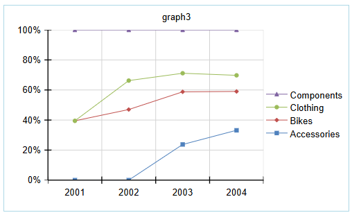

<style>
img[alt$="><"] {
  border: 1px solid lightgrey;
}
</style>

# Charts

The Chart components in the Web Report Designer allow users to visualize data records from different [Data Source]() storages. Charts transform numerical data into visual representations, making it easier to identify patterns, trends, and relationships in your data.

You can use Charts to represent:

* Trend Analysis—Show data changes over time using Line or Area charts.
* Comparison Analysis—Compare values across categories using Bar or Column charts.
* Part-to-Whole Analysis—Display proportional relationships using Pie or Doughnut charts.
* Performance Dashboards—Create visual scorecards and KPI displays.
* Financial Reporting—Present sales figures, revenue trends, and budget comparisons.
* Statistical Reports—Visualize survey results, demographic data, and analytical findings.


## Chart Types

The Web Report Designer provides the following chart types:

* [Bar Chart](#adding-a-bar-chart)—Displays data series as sets of horizontal bars, ideal for comparing amounts or values between different categories
* [Line Chart](#adding-a-line-chart)—Displays series as sets of points connected by lines, perfect for showing trends over continuous periods
* [Area Chart](#adding-an-area-chart)—Shows data as filled areas under lines, emphasizing volume and cumulative totals
* [Column Chart](#adding-a-column-chart)—Displays data series as sets of vertical bars that are grouped by category
* [Pie Chart](#adding-a-pie-chart)—Shows the contribution of fractional parts to a whole, commonly used for proportion comparisons
* [Doughnut Chart](#adding-a-pie-chart)—Similar to Pie Chart but with an open space in the center, allowing for additional information display

## Chart Categories

The Web Report Designer supports two main chart categories:

* **Cartesian Charts** (Bar, Line, Column, Area)—Use the Cartesian coordinate system to plot data points in chart series. The X and Y axes define how each point's coordinates in the plot area are calculated. Cartesian charts provide a mechanism for combining data points that reside in different series but have the same category. The combine mode can be:

  * **Cluster**—Data points in the same category are positioned close together
  * **Stack**—Data points are plotted on top of each other
  * **Stack100**—Values of one series are presented as a percentage of the other series

* **Pie Charts** (Pie, Doughnut)—Use the Radial coordinate system to plot each point as an arc segment where the arc's length represents the percentage this point's value is from the total sum

The following sections demonstrate how to add different chart types and illustrate how CSV data is presented in each chart.

>note The **Configuration** pane on the right-hand side is identical for all chart types, allowing users to specify the Data Source and configure the Categories, Series and Values groups.

## Adding a Chart to a Report

The next sections in this article demonstrate how to add each of the available [chart types](#chart-types) to your report. To follow along the steps below, make sure to add the proposed [data source](#adding-data-source) first.

### Adding Data Source

For this tutorial, use the following sample CSV data to create a CSV Data Source that will be used throughout this article:

```csv
Category, Year, Value
Accessories, 2003,230
Accessories,2004,340
Bikes, 2001, 150
Bikes, 2002, 195
Bikes, 2003, 340
Bikes, 2004, 265
Clothing, 2002, 80
Clothing, 2003, 120
Clothing, 2004, 110
Components, 2001, 230
Components, 2002, 140
Components, 2003, 280
Components, 2004, 310
```

<iframe width="560" height="315" src="https://www.youtube.com/embed/d34jlpfD94Q?si=jCgcgEMH9y2AQGOU" title="YouTube video player" frameborder="0" allow="accelerometer; autoplay; clipboard-write; encrypted-media; gyroscope; picture-in-picture; web-share" referrerpolicy="strict-origin-when-cross-origin" allowfullscreen></iframe>

After adding the data source to you report, continue by adding the desired chart type.

### Adding a Bar Chart

To create a Bar Chart, follow the steps below. See the video after the steps for a detailed walk-through.

1. Click the **Bar** item from the **Components** tab and configure the chart using the Configuration pane on the right-hand side of the Web Report Designer.

1. Set the [data source](#adding-data-source) for the Chart.

1. Design the Chart by configuring the **Categories**, **Series**, and **Values** groups based on the data you need to display.

1. Optionally, change the Chart type.

>caption Adding a Bar Chart and populating it with data

<iframe width="560" height="315" src="https://www.youtube.com/embed/-bCYlj5Qtwg?si=VgbqrDrNDA3zDvA_" title="YouTube video player" frameborder="0" allow="accelerometer; autoplay; clipboard-write; encrypted-media; gyroscope; picture-in-picture; web-share" referrerpolicy="strict-origin-when-cross-origin" allowfullscreen></iframe>

Based on the Bar Chart type that you select during the configuration, one of the following charts will be displayed:

|Clustered Bar|Stacked Bar|100% Stacked Bar|
|----|----|----|
||| |

### Adding a Column Chart

To create a Column Chart, follow the steps below. See the video after the steps for a detailed walk-through.

1. Click the **Column** item from the **Components** tab and configure the chart using the Configuration pane on the right-hand side of the Web Report Designer.

1. Set the [data source](#adding-data-source) for the Chart.

1. Design the Chart by configuring the **Categories**, **Series**, and **Values** groups based on the data you need to display.

1. Optionally, change the Chart type.

>caption Adding a Column Chart and populating it with data

<iframe width="560" height="315" src="https://www.youtube.com/embed/RGJa5FLZ5A8?si=vxsKE8GwK2jFFnIv" title="YouTube video player" frameborder="0" allow="accelerometer; autoplay; clipboard-write; encrypted-media; gyroscope; picture-in-picture; web-share" referrerpolicy="strict-origin-when-cross-origin" allowfullscreen></iframe>

Based on the Column Chart type that you select during the configuration, one of the following charts will be displayed:

|Clustered Column|Stacked Column|100% Stacked Column|
|----|----|----|
|||   |

### Adding an Area Chart

To create an Area Chart, follow the steps below. See the video after the steps for a detailed walk-through.

1. Click the **Area** item from the **Components** tab and configure the chart using the Configuration pane on the right-hand side of the Web Report Designer.

1. Set the [data source](#adding-data-source) for the Chart.

1. Design the Chart by configuring the **Categories**, **Series**, and **Values** groups based on the data you need to display.

1. Optionally, change the Chart type.

>caption Adding an Area Chart and populating it with data

<iframe width="560" height="315" src="https://www.youtube.com/embed/Eygyvp6y1zk?si=ObaAThjMoEajmB6H" title="YouTube video player" frameborder="0" allow="accelerometer; autoplay; clipboard-write; encrypted-media; gyroscope; picture-in-picture; web-share" referrerpolicy="strict-origin-when-cross-origin" allowfullscreen></iframe>

Based on the Column Chart type that you select during the configuration, one of the following charts will be displayed:

|Area|Stacked Area|100% Stacked Area|
|----|----|----|
||||

### Adding a Line Chart

To create a Line Chart, follow the steps below. See the video after the steps for a detailed walk-through.

1. Click the **Line** item from the **Components** tab and configure the chart using the Configuration pane on the right-hand side of the Web Report Designer.

1. Set the [data source](#adding-data-source) for the Chart.

1. Design the Chart by configuring the **Categories**, **Series**, and **Values** groups based on the data you need to display.

1. Optionally, change the Chart type.

>caption Adding a Line Chart and populating it with data

<iframe width="560" height="315" src="https://www.youtube.com/embed/jEP0YrFUG68?si=N5VuLs9tUHQ0I4CW" title="YouTube video player" frameborder="0" allow="accelerometer; autoplay; clipboard-write; encrypted-media; gyroscope; picture-in-picture; web-share" referrerpolicy="strict-origin-when-cross-origin" allowfullscreen></iframe>

Based on the Line Chart type that you select during the configuration, one of the following charts will be displayed:

|Line|Stacked Line|100% Stacked Line|
|----|----|----|
||||

|Line with Markers|Stacked Line with Markers|100% Stacked Line with Markers|
|----|----|----|
||||

### Adding a Pie Chart

To create a Pie Chart, follow the steps below. See the video after the steps for a detailed walk-through.

1. Click the **Pie** item from the **Components** tab and configure the chart using the Configuration pane on the right-hand side of the Web Report Designer.

1. Set the [data source](#adding-data-source) for the Chart.

1. Design the Chart by configuring the **Categories**, **Series**, and **Values** groups based on the data you need to display.

1. Optionally, change the Chart type.

>caption Adding a Pie Chart and populating it with data

<iframe width="560" height="315" src="https://www.youtube.com/embed/SPLPy_jAsJM?si=iYhK6Tm_W0DujcwD" title="YouTube video player" frameborder="0" allow="accelerometer; autoplay; clipboard-write; encrypted-media; gyroscope; picture-in-picture; web-share" referrerpolicy="strict-origin-when-cross-origin" allowfullscreen></iframe>

Based on the Pie Chart type that you select during the configuration, one of the following charts will be displayed:

|Pie Chart|Doughnut Chart|
|----|----|
|||

## See Also

* [Web Report Designer]()
* [Overview of the Graph Report Item]()
* [Data Sources]()
