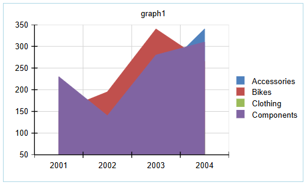

List
<style>
img[alt$="><"] {
  border: 1px solid lightgrey;
}
</style>

# Charts 
 
The **Web Report Designer** offers a **Charts** section inside the **Components** tray allowing the end-user to visualize the data records from different [Data Source]() storages: 

 

The available Chart types are:
* [Bar Chart](#adding-a-bar-chart) - Displays data series as sets of horizontal bars, graphically summarizes and renders data categories, and enables users to easily compare amounts or values between different categories. 
* [Line Chart](#adding-a-line-chart) - Displays series as sets of points connected by a single line and represents large amounts of data that occur over a continuous period of time. 
* [Area Chart](#adding-a-column-chart) - Displays a series as a set of points connected by a line with the whole area filled in under the line. 
* [Column Chart](#adding-an-area-chart) - Displays data series as sets of vertical bars that are grouped by category.</td>
* [Pie Chart](#adding-a-pie-chart) - Displays the contribution of fractional parts to a whole and is most commonly used to make comparisons between groups. 
* [Doughnut Chart](#pie-charts) - Similar to the Pie Chart which has an open space in the center. 
Before adding a Chart report item, first, you need to select the **Details** section of the report. Then, you can select the desired chart type from the **Components** tray and configure it with the desired data source.

## Adding DataSource

Let's have the following sample **CSV** data and create a CSVDataSource that will be used in this article:

```
Category, Year, Value
Accessories, 2003,230
Accessories,2004,340
Bikes, 2001, 150
Bikes, 2002, 195
Bikes, 2003, 340
Bikes, 2004, 265
Clothing, 2002, 80
Clothing, 2003, 120
Clothing, 2004, 110
Components, 2001, 230
Components, 2002, 140
Components, 2003, 280
Components, 2004, 310
```

<iframe width="560" height="315" src="https://www.youtube.com/embed/ypQHSpXnJkw?si=_pjCxfXAIfKoWBa_" title="YouTube video player" frameborder="0" allow="accelerometer; autoplay; clipboard-write; encrypted-media; gyroscope; picture-in-picture; web-share" referrerpolicy="strict-origin-when-cross-origin" allowfullscreen></iframe>

## Adding Charts

 The Web Report Designer support two main chart groups:

* **Cartesian Charts** (Bar, Line, Column, Area) - use the Cartesian coordinate system to plot the data points in its chart series. The X and Y axes define how each point's coordinates in the plot area are calculated. Cartesian charts provides a mechanism for combining data points that reside in different series but have the same category. The combine mode can be:

  * **Cluster**: The data points will be in the same category huddled close together.
  * **Stack**: Plots the points on top of each other.
  * **Stack100**: Presents the values of one series as a percentage of the other series.

* **Pie Charts** (Pie, Doughnut) - use the Radial coordinate system to plot each point as an arc segment where the arc's length is actually the percentage this point's value is from the total sum.

The next few sections demonstrate how to add the different chart types and illustrate how the CSV data is presented in the respective chart. 

>note The *Configuration pane* on the right-hand side is identical for all chart types, allowing the end-user to specify the Data Source and configure the Categories, Series and Values groups.

### Adding a Bar Chart

This section shows how to create a Bar Chart that uses the **Year** column for the *Categories*, the **Category** column for the *Series* and the **Value** column for the *Values*. 

1. Click the `Bar` item from the **Components** tray (step 1.), and configure the chart with the Configuration pane on the right-hand side of the **Web Report Designer** (step 2.):   

2. Build the desired chart and use an already defined [Data Source](). According to the data that should be displayed, it is possible to configure **Categories**, **Series** and **Values** groups. The following short video shows how to feed the chart with data from the already existing SQL Data Source that displays the total **Freight** for each **Country**:

>caption Populating Bar Chart with Orders' Freight by ShipCountry

<iframe width="560" height="315" src="https://www.youtube.com/embed/PD8RnyexfvQ?si=-sUhyCqDy0FC54O0" title="YouTube video player" frameborder="0" allow="accelerometer; autoplay; clipboard-write; encrypted-media; gyroscope; picture-in-picture; web-share" referrerpolicy="strict-origin-when-cross-origin" allowfullscreen></iframe>

According to the selected Bar Chart Type, the following charts will be displayed:

|**Clustered Bar**|**Stacked Bar**|**100% Stacked Bar**|
|----|----|----|
||| |

### Adding a Column Chart

By clicking the `Column` item from the **Components** tray, a similar tab (like the one shown in the *Configuration Settings* above) will appear on the right-hand side of the **Web Report Designer**. The **Column** chart type is very similar to the **Bar** chart (which displays series as sets of horizontal bars) and to the **Range** Column chart (which displays series as sets of vertical bars with varying beginning and end points).

We will use the same *CSV Data Source* and configure the **Year** column for the *Categories*, the **Category** column for the *Series* and the **Value** column for the *Values*:

>caption Populating Column Chart

<iframe width="560" height="315" src="https://www.youtube.com/embed/ePCehcujGnU?si=iQ5SDFrLaJeatsgl" title="YouTube video player" frameborder="0" allow="accelerometer; autoplay; clipboard-write; encrypted-media; gyroscope; picture-in-picture; web-share" referrerpolicy="strict-origin-when-cross-origin" allowfullscreen></iframe>

According to the selected Column Chart Type, the following charts will be displayed: 

|**Clustered Column**|**Stacked Column**|**100% Stacked Column**|
|----|----|----|
|||   |

### Adding an Area Chart

By clicking the `Area` item from the **Components** tray, the *Configuration Settings* pane will appear on the right-hand side of the **Web Report Designer**. We will use the same *CSV Data Source* and configure the **Year** column for the *Categories*, the **Category** column for the *Series* and the **Value** column for the *Values*:

>caption Populating Area Chart

<iframe width="560" height="315" src="https://www.youtube.com/embed/1F4df2B3TTw?si=SskFAdk4lDTmijfr" title="YouTube video player" frameborder="0" allow="accelerometer; autoplay; clipboard-write; encrypted-media; gyroscope; picture-in-picture; web-share" referrerpolicy="strict-origin-when-cross-origin" allowfullscreen></iframe>

According to the selected **Area Chart Type**, the following charts will be displayed: 

 

|**Area**|**Stacked Area**|**100% Stacked Area**|
|----|----|----|
||| | 

### Adding a Line Chart 

By clicking the `Line` item from the **Components** tray, the *Configuration Settings* pane will appear on the right-hand side of the **Web Report Designer**. We will use the same *CSV Data Source* and configure the **Year** column for the *Categories*, the **Category** column for the *Series* and the **Value** column for the *Values*:

>caption Populating Line Chart

<iframe width="560" height="315" src="https://www.youtube.com/embed/FVBqHGrqYvQ?si=MBSYV08JWm7KEhUJ" title="YouTube video player" frameborder="0" allow="accelerometer; autoplay; clipboard-write; encrypted-media; gyroscope; picture-in-picture; web-share" referrerpolicy="strict-origin-when-cross-origin" allowfullscreen></iframe>
  
According to the selected **Line Chart Type**, the following charts will be displayed: 

  

The table illustrates how each of the chart types is expected to look:

|**Line**|**Stacked Line**|**100% Stacked Line**|
|----|----|----|
|| ||

|**Line with Markers**|**Stacked Line with Markers**|**100% Stacked Line with Markers**|
|----|----|----|
||||

### Adding a Pie Chart

By clicking the `Pie` item from the **Components** tray, the *Configuration Settings* pane will appear on the right-hand side of the **Web Report Designer**. We will use the same *CSV Data Source* and configure the **Year** column for the *Categories*, the **Category** column for the *Series* and the **Value** column for the *Values*:

>caption Populating Pie Chart

<iframe width="560" height="315" src="https://www.youtube.com/embed/U9HMcfjAofc?si=3OCMV8NEyz8VwmaZ" title="YouTube video player" frameborder="0" allow="accelerometer; autoplay; clipboard-write; encrypted-media; gyroscope; picture-in-picture; web-share" referrerpolicy="strict-origin-when-cross-origin" allowfullscreen></iframe>

According to the selected **Pie Chart Type**, the following charts will be displayed: 

 

|Pie Chart|Doughnut Chart|
|----|----|
|| | 

## See Also

* [Web Report Designer]()
* [Overview of the Graph Report Item]()


