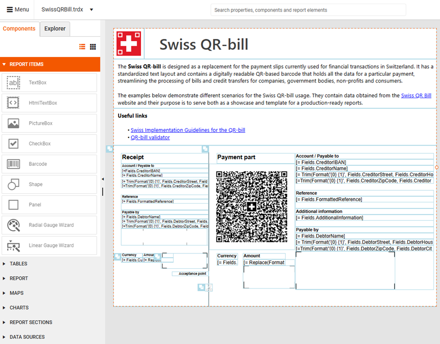

# Components Overview

Each report is constructed from [report items](). All report items that you can add to your report are organized in different groups (categories) in the **Components** tab.

The **Components** tab lists the available report components that you can add to your report design. The items are organized in groups based on their type and functionality. The tab supports two layout modes&mdash;grid and list. The list view is the default mode.

## How to Use Components

You can add components to your report in two ways:

* Drag and drop&mdash;Click the report's design surface and drag a component from the Components tab onto the report.
* Click to add&mdash;Click the desired location in your report, then click the component in the Components tab.

 
|Group (Category)|Report Items|
|----|----|
|[Report Items]() - The main building blocks used in the report depending on the data that will be displayed, e.g. a TextBox item for static or data-bound text, a PictureBox for displaying images, a Barcode for showing a barcode in a label report, etc.|<ul><li>TextBox</li><li>HtmlTextBox</li><li>PictureBox</li><li>CheckBox</li><li>Barcode</li><li>Shape</li><li>Panel</li><li>Radial Gauge Wizard</li><li>Linear Gauge Wizard</li></ul>|
|[Tables]() - The Table report item is a generalized layout report item that displays report data in cells that are organized into rows and columns.|<ul><li>List</li><li>Table</li><li>Crosstab</li><li>Table Wizard</li><li>Crosstab Wizard</li></ul>|
|Reports - The [SubReport]() item enables you to display reports within reports and serves as a container, similar to the report sections, growing in size depending on its children.|<ul><li>SubReport</li></ul>|
|[Maps]() - The Map report item is a native Telerik Reporting item which enables you to visualize aggregate business data in a geographical manner.|<ul><li>Map types: Point, Pie, Column</li><li>Choropleth</li></ul>|
|[Charts]() - The Graph report item is a native Telerik Reporting item that allows you to generate different Chart types (objects) and visually present large volumes of aggregated information.|<ul><li>Bar Chart</li><li>Line Chart</li><li>Area Chart</li><li>Column Chart</li><li>Pie Chart</li><li>Doughnut Chart</li></ul>|
|[Report Sections]() - A Telerik report consists of different sections that may contain report items. Each report section represents a specific area on the report page and defines the rendering of its report items.|<ul><li>Page Header</li><li>Page Footer</li><li>Report Header</li><li>Report Footer</li><li>Table of Contents</li></ul>|
|[Data Sources]() - Data Source components are used to connect data items to different types of data without writing any code.|<ul><li>SQL Data Source</li><li>CSV Data Source</li><li>Web Service Data Source</li><li>GraphQL Data Source</li><li>JSON Data Source</li><li>Object Data Source</li></ul>|

## Next Steps

* [Learn about Report Items]()
* [Configure Data Sources]()
* [Explore Report Sections]()
* [Create Your First Report]()

## See Also

* [Report Structure]()
* [Working with Tables]()
