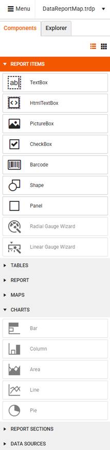

# Components

Each report is constructed by [report items]() organized in different groups in the **Components** tab based on their purpose. The available items are:

|Group|Report Items|
|----|----|
|**Report Items**|<ul><li>TextBox</li><li>HtmlTextBox</li><li>PictureBox</li><li>CheckBox</li><li>Barcode</li><li>Shape</li><li>Panel</li><li>Radial Gauge Wizard</li><li>Linear Gauge Wizard</li></ul>|
|**Tables**|<ul><li></li><li></li><li></li><li></li><li></li><li></li></ul>|
|**Report**|<ul><li></li><li></li><li></li><li></li><li></li><li></li></ul>|
|**Maps**|<ul><li></li><li></li><li></li><li></li><li></li><li></li></ul>|
|**Charts**|<ul><li></li><li></li><li></li><li></li><li></li><li></li></ul>|
|**Report Sections**|<ul><li></li><li></li><li></li><li></li><li></li><li></li></ul>|
|**DataSources**|<ul><li></li><li></li><li></li><li></li><li></li><li></li></ul>|

    

## See Also

* [Web Report Designer]()

