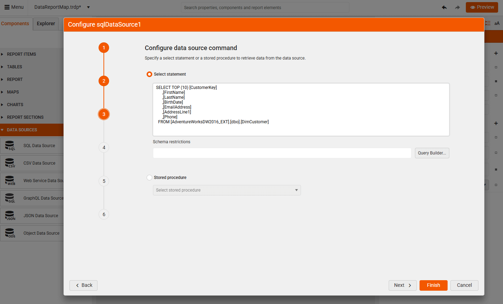
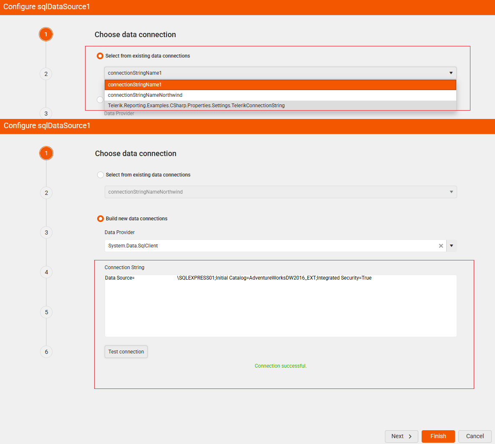
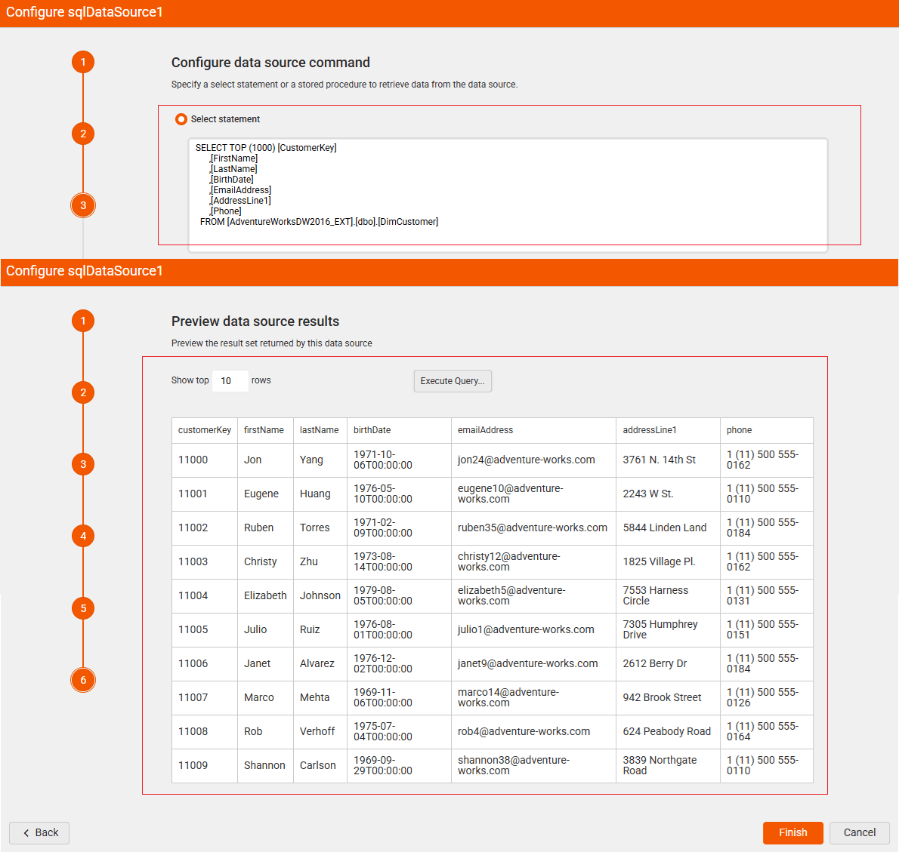
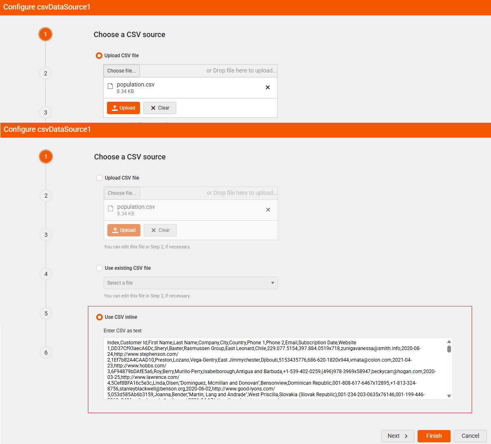
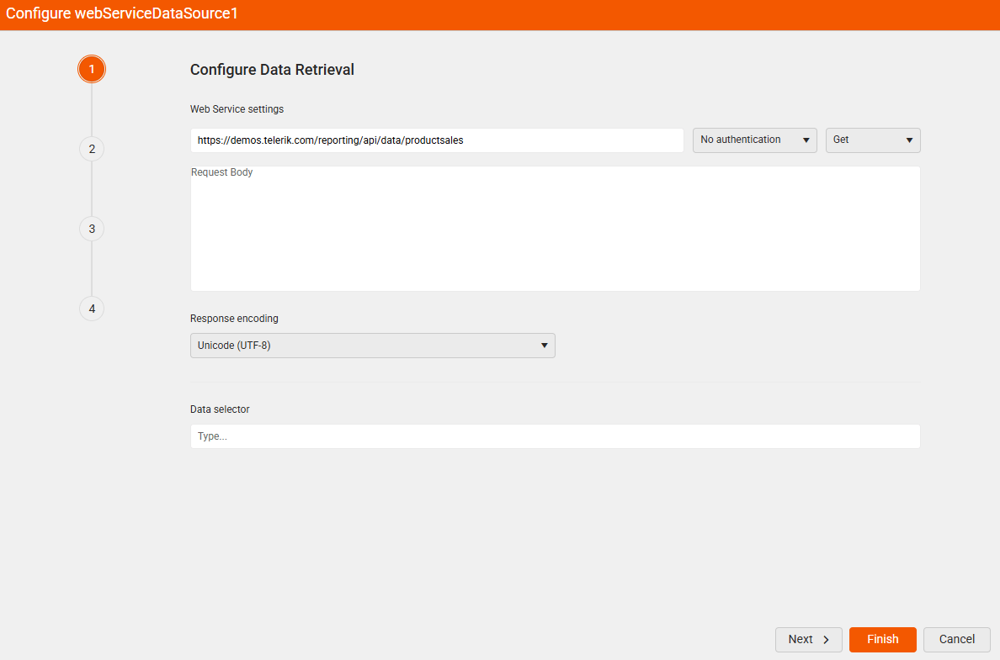
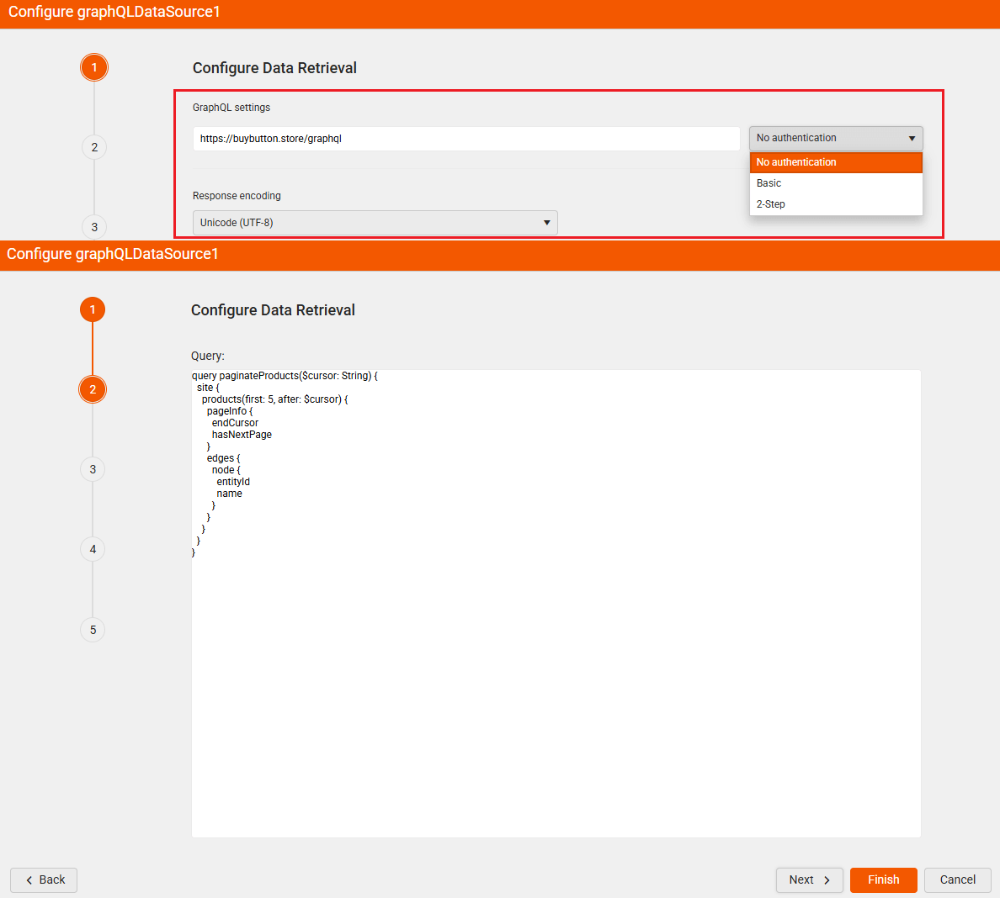
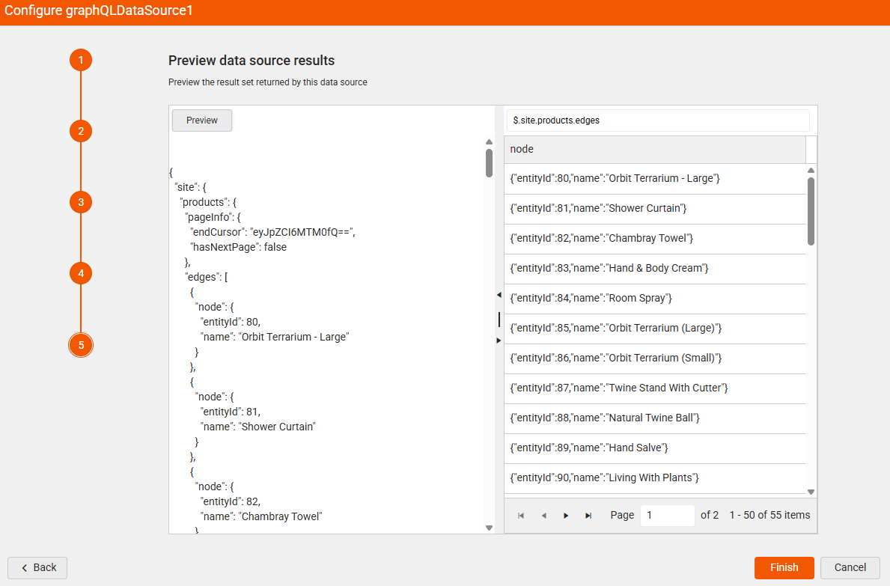
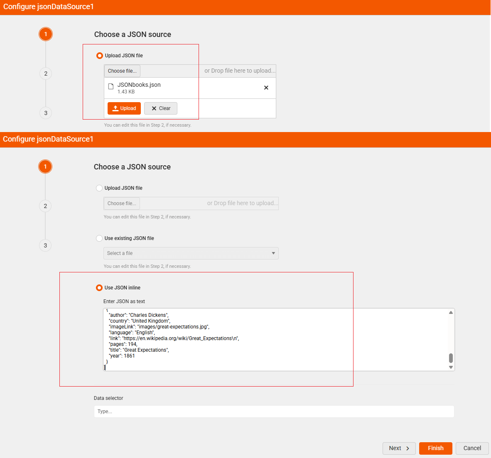
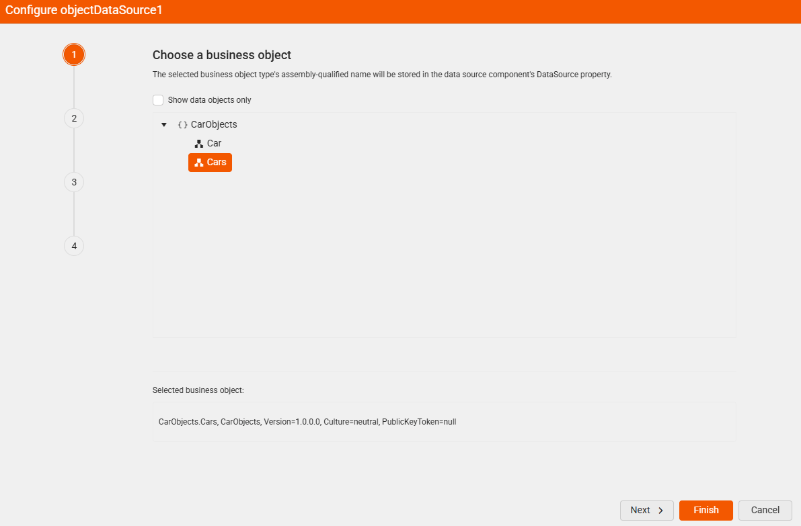
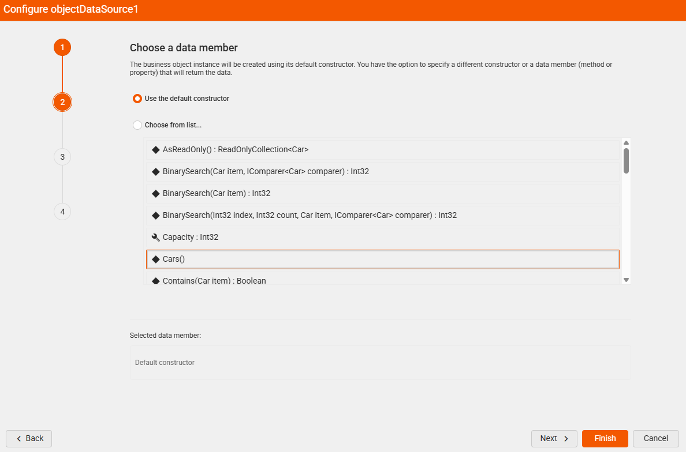

<style>
img[alt$="><"] {
  border: 1px solid lightgrey;
}

/* table, th, td {
	border: 1px solid;
} */
/* table th:first-of-type {
	width: 20%;
}
table th:nth-of-type(2) {
	width: 80%;
}  */
 

</style>

# Data Sources

The Data Source components allow users to connect to and retrieve data from various storage and database systems. Data Sources serve as the foundation for all report components, providing the data that powers your tables, charts, maps, and other report elements.

Data Sources are essential for:

* Database Reporting—Connect to SQL Server, Oracle, MySQL, and other relational databases.
* File-Based Data—Import data from CSV files, JSON documents, and structured text files.
* Web Services Integration—Retrieve data from REST APIs, GraphQL services, and web endpoints.
* Business Object Binding—Connect to .NET business objects and custom data providers.
* Real-Time Data—Access live data from web services and APIs.


 
## Data Source Types

The Web Report Designer provides the following data source types:

* [SQL Data Source](#sql-data-source)—Connects to relational databases including Microsoft SQL Server, Oracle, MySQL, and other databases through OLE DB and ODBC connections.
* [CSV Data Source](#csv-data-source)—Imports data from CSV documents, including files (*.csv, *.tsv, *.txt), inline strings, or data streams.
* [Web Service Data Source](#web-service-data-source)—Retrieves JSON data from REST APIs and web services.
* [GraphQL Data Source](#graphql-data-source)—Connects to GraphQL services to retrieve structured JSON data.
* [JSON Data Source](#json-data-source)—Processes JSON data from local files or embedded content within reports.
* [Object Data Source](#object-data-source)—Binds report items to .NET business objects and custom data providers.

## SQL Data Source

To add a new SQL Data Source:

1. Click the **SQL Data Source** item in the **Components** tab.

1. The SQL Data Source configuration wizard appears allowing you to use either an existing connection or build a new one by providing a `connection string` to connect to the database and define the SQL statement or the stored procedure to retrieve the data:

>caption Existing vs New SQL Connection



If you want to skip any further fine-tuning, click the **Finish** button to confirm the configured connection and close the wizard. Otherwise, you can continue applying the desired settings. The wizard may skip some of the wizard steps depending on your selection.

The following table lists all the steps that the wizard offers:

|Wizard Step|Description|
|----|----|
|1. Choose data connection|Select an existing or build a new data connection.|
|2. Data connection options|Specify whether to use the connection as shared or embed it in the report.|
|3. Configure data source command|Specify a *select statement* or a *stored procedure* to retrieve data from the data source. The [Query Builder]() helps you create queries to retrieve data from a relational database for a SqlDataSource component.|
|4. Configure data source parameters|This step occurs if you select *Stored procedure* in step 3. Specify a database type and a default value or an expression to evaluate for each data source parameter.|
|5. Configure design time parameters|Specify an appropriate design time value for each data source parameter.|
|6. Preview data source results|Preview the result set returned by this data source.|

>caption Select and Preview SQL Data



## CSV Data Source

To add a new CSV Data Source:

1. Click the **CSV Data Source** item in the **Components** tab.

1. The CSV Data Source configuration wizard appears allowing you to use either an existing or a new CSV file, or use inline CSV text with the data:

>caption Upload a CSV Source vs Inline



If you want to skip any further fine-tuning, click the **Finish** button to confirm the configured connection and close the wizard. Otherwise, you can continue applying the desired settings.

The following table lists all the steps that the wizard offers:

|Wizard step|Description|
|----|----|
|1. Choose a CSV source|Select an existing or select a new CSV file or use inline CSV data.|
|2. Modify your CSV file|If you upload a CSV file, you can make the selected file inline and modify its content.|
|3. Configure CSV Data Source - Separators|Specify the column/row separators and whether the data include headers or not.|
|4. Configure CSV Data Source - Escape Format|Specifies the [escape format]().|
|5. Map Columns to Type|Specify the columns types as by default they come in string type.|
|6. Preview data source results|Preview the result set returned by this data source.|

>caption Map Column Types and Preview CSV Data


## Web Service Data Source

To add a Web Service Data Source:

1. Click the **Web Service Data Source** item in the **Components** tab.

1. The Web Service Data Source configuration wizard appears allowing you to create new or edit an existing WebServiceDataSource component.

>caption Setup Web Service Data Source



If you want to skip the further settings steps, click the **Finish** button to confirm the configured connection and close the wizard. Otherwise, you can continue applying the desired settings. The wizard may skip some of the wizard steps depending on your selection.

The following table lists all the steps that the wizard offers:

|Wizard step|Description|
|----|----|
|1. Configure Data Retrieval|Set up the properties of the HTTP request which will retrieve data from the web service.|
|2. Configure request parameters|Specify name, type, default value or expression, and design time value for data source parameters.|
|3. Configure Basic Authentication|Specify *Username* & *password* (relevant for *Basic authentication*).|
|4. Configure 2-step authentication|Specify the 2-step (Bearer) authentication settings.|
|5. Configure authentication parameters|Specify name, type, default value or expression, and design time value for data source parameters (relevant for *2-Step authentication*).|
|6. Choose design-time data|Specify whether to: Use real data while designing the report, Upload JSON file, or Use JSON inline as hard-coded data while designing the report.|
|7. Preview data source results|Preview the result set returned by this data source.|

>caption Preview Data from the Web Service Data Source


## GraphQL Data Source

To add a GraphQL Data Source:

1. Click the **GraphQL Data Source** item in the **Components** tab.

1. The GraphQL Data Source configuration wizard appears allowing you to create new or edit an existing GraphQLDataSource component.

The wizard allows you to set up one of the following options:

* Set up the properties of the HTTP request which will retrieve data from the GraphQL service.
* Reference an external data file.
* Use inline data string containing the data (required if Service URL or external data file is not set).

The following configuration steps are available:

1. Set up the **GraphQL Service URL** (e.g. `https://buybutton.store/graphql`)

1. Provide the **Query** for data retrieval:

        ````SQL
        query paginateProducts($cursor: String) {
          site {
          products(first: 5, after: $cursor) {
              pageInfo {
                endCursor
                hasNextPage
              }
              edges {
                node {
                  entityId
                  name
                }
              }
            }
          }
        }
       ````

    >caption Set up GraphQL Service URL and Configure the Query

    

1. Specify the parameter name, type, value and design time value for each data source parameter. The value can be a default value or an expression to evaluate. The design-time value should be a constant value. This is necessary for retrieving the data source schema correctly at design time:

    

1. Configure Authentication settings (occurs only if an authentication method is selected in the first step): Transmits credentials as username/password pairs, encoded using base64.

1. As a final step, you can **Preview** the result:

    

## JSON Data Source

By clicking the **JSON Data Source** item in the **Components** tab, the JSON Data Source configuration wizard appears, allowing you to use a new or an existing JSON file, or directly enter inline JSON content:

>caption Upload a new JSON file vs Inline JSON data



>note The **Data selector** (e.g. `$.store.book[?(@.price<10)]`) is a [JSONPath](https://goessner.net/articles/JsonPath/) string which will be used to query the data.

|Wizard step|Description|
|----|----|
|1. Choose a JSON source|Specify the JSON source that should be retrieved.|
|2. Modify your JSON file|You can make the selected file inline and modify its content (relevant when using a JSON file in step 1).|
|3. Preview data source results|Preview the result set returned by this data source.|

## Object Data Source

To add an `Object Data Source`:

1. Click the **Object Data Source** item in the **Components** tab.

1. The Object Data Source configuration wizard appears allowing you to use a business object or any other class (that was already defined) for data retrieval in the report:

* Select Business object

    

* Specify the Data member

    

The following table lists all the steps that the wizard offers:

|Wizard step|Description|
|----|----|
|1. Choose a business object|The selected business object type's assembly-qualified name will be stored in the data source component's DataSource property.|
|2. Choose a data member|The business object instance will be created using its default constructor. You have the option to specify a different constructor or a data member (method or property) that will return the data.|
|3. Configure data source parameters|Specify default value or expression and design-time value for data source parameters.|
|4. Preview data source results|Preview the result set returned by this data source.|

>caption Preview Data


## Modifying Already Configured Data Sources

Once a Data Source component is configured, it can be modified later by selecting it in the **Explorer** tab. On the right-hand side the **General** settings (dependent on the specific Data Source item) are loaded and users can further modify them:


## See Also

* [Web Report Designer]()
* [Data Source Components Overview]()
