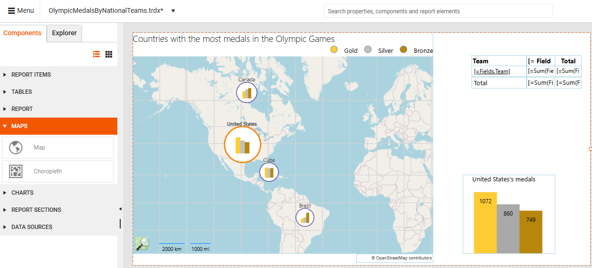
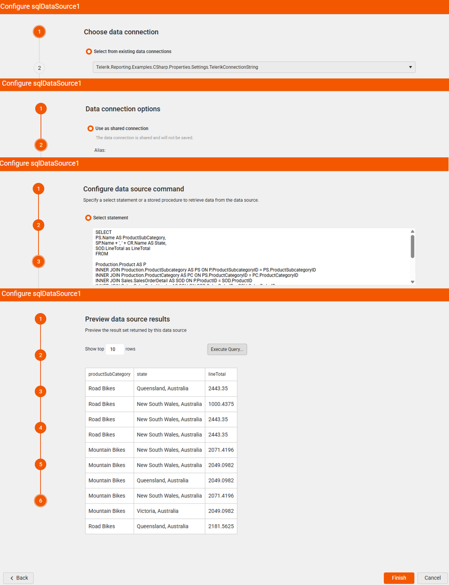
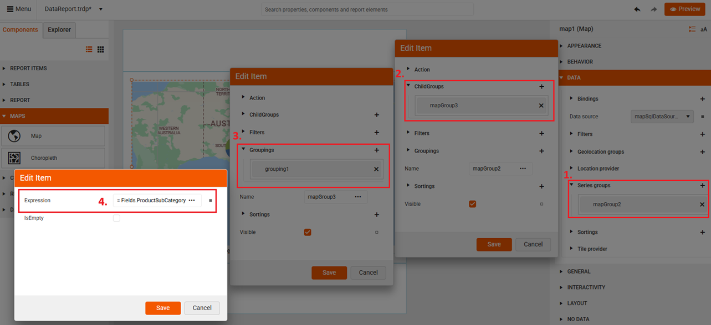
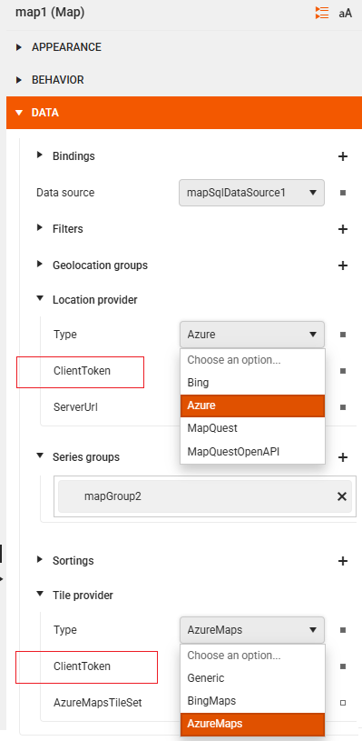
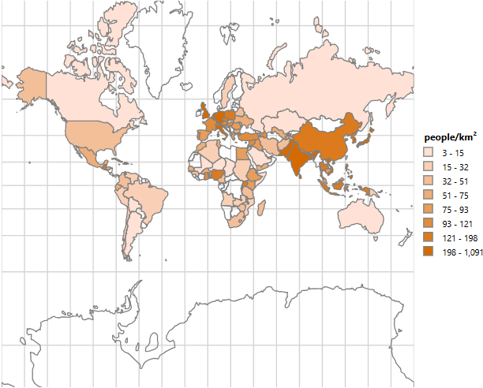

<style>
img[alt$="><"] {
  border: 1px solid lightgrey;
}

/* table th:first-of-type {
	width: 20%;
}
table th:nth-of-type(2) {
	width: 80%;
} */
</style>

# Maps

The Maps in the Web Report Designer are report items that enable you to visualize aggregated business data in a geographical manner. Maps transform raw data into intuitive visual representations overlaid on geographical regions, which lets you identify patterns, trends, and regional insights.

The Maps are suitable for a variety of use cases:

* Regional sales analysis&mdash;Visualize sales performance across different states, countries, or territories.
* Demographic data visualization&mdash;Display population density, income levels, or survey results by geographic area.
* Location-based reporting&mdash;Show data points related to specific addresses, cities, or coordinates.
* Performance comparison&mdash;Compare metrics across geographical regions using different chart types.
* Distribution analysis&mdash;Understand how products, services, or resources are distributed geographically.



## Map Types

The Web Report Designer provides two main types of map components:

* [Map](#map)&mdash;Displays data in various formats determined by the chosen Map Type: Point, Pie, or Column charts positioned on geographical locations.
* [Choropleth](#choropleth)&mdash;A [thematic map](https://en.wikipedia.org/wiki/Choropleth_map) that uses graded color differences to display a measure over predefined regions or areas, making it one of the most popular ways to visualize how a measure varies across a geographic area.

>important Currently, the Web Report Designer allows only **displaying an already created** report (for example, using the Standalone Report Designer) that contains a Choropleth report item and simple fine-tuning. It is not possible to build a Choropleth from scratch in the Web Report Designer.

## Required Data Sources

Because of its architecture, the Map component requires two types of data sources. When adding a Map component to your report, both data sources must be available:

* Visual map data&mdash;Geographical information provided by **Location** and **Tile** providers that render the actual map imagery.
* Business data&mdash;Your analytical data stored in a separate data source, with values that correspond to specific locations (displayed as charts on the map).

## Prerequisites

Before adding a Map report item:

* Obtain a valid **Location Provider** key (for example, Azure key) to authenticate the requests to the location and tile provider. You must enter this key in the **ClientToken** property.
* Alternaively, if using a location and tile provider is not an option, provide the geographical coordinates of your points manually, and set up the MapSeries accordingly.

### Location and Tile Providers

The **Location Provider** matches the addresses or locations with geographical coordinates. The Map Report item provides support for the following location providers:

|Location Provider|Description|
|----|----|
|Azure| The AzureLocationProvider uses the [Azure Maps Get Geocoding Request](https://learn.microsoft.com/en-us/rest/api/maps/search/get-geocoding) to get location information about the requested address. This provider was introduced in Q2 2025 as part of the transition from Bing Maps to Azure Maps.|
|Bing (Deprecated)|The BingLocationProvider uses the [Bing Maps Locations API](https://learn.microsoft.com/en-us/bingmaps/rest-services/locations/) to get location information about the requested address.|
|MapQuestOpenAPI (Obsolete)|The MapQuestOpenAPILocationProvider uses the MapQuest Geocoding Open API geocoding service to provide a single-line address and receive potential geographical coordinates of the geocoded location.|
|MapQuest |The MapQuestLocationProvider uses the [MapQuest Geocoding API](https://developer.mapquest.com/documentation/api/geocoding/) geocoding service to provide a single-line address and receive potential geographical coordinates of the geocoded location.|

>caution Microsoft has announced the deprecation of Bing Maps for Enterprise:
> * `Free (Basic)` accounts can use Bing Maps services until June 30, 2025.
> * `Enterprise` accounts can continue until June 30, 2028.
>
> The official Microsoft recommendation is for users to migrate to [Azure Maps](https://learn.microsoft.com/en-us/azure/azure-maps/) prior to these periods to avoid service disruptions.
> Telerik Reporting introduced support for Azure Maps through dedicated providers in Q2 2025 to address the deprecation of Bing Maps for Enterprise.

The **Tile Provider** requests and downloads the imagery data for the specified map extent. The Map Report item supports the following tile providers:

|TileProvider|Description|
|----|----|
|AzureMapsTileProvider|Supports a variety of tile sets that let you customize the appearance and data shown on your map.|
|BingMapsTileProvider (Deprecated)|Uses the [Bing Maps REST Services](https://learn.microsoft.com/en-us/bingmaps/rest-services/) to request metadata information that is needed to resolve the tile requests URLs, zoom levels, tile sizes and attribution information such as the text or logo that will be displayed on the map.|
|MapQuestTileProvider (Obsolete)|Uses the [`MapQuest`](https://www.mapquest.com/) tile servers that provides the tiles in the **OpenStreetMap Tiles** and the **MapQuest Open Aerial Tiles** imagery sets.|

## Creating a Report with the Map Component

The following tutorial demonstrates how to create a Map that presents sales distribution by products across several states.

> To follow along with the steps below, you need access to an instance of the [Adventure Works](https://github.com/microsoft/sql-server-samples/tree/master/samples/databases/adventure-works) database for [Microsoft SQL Server](https://learn.microsoft.com/en-us/sql/database-engine/install-windows/install-sql-server?view=sql-server-ver17).

<iframe width="560" height="315" src="https://www.youtube.com/embed/u-9dplAXbZk?si=RWeHmLWZRkse8TOL" title="YouTube video player" frameborder="0" allow="accelerometer; autoplay; clipboard-write; encrypted-media; gyroscope; picture-in-picture; web-share" referrerpolicy="strict-origin-when-cross-origin" allowfullscreen></iframe>

Since this tutorial uses the **AzureLocationProvider**, an Azure Maps subscription key is required. You can obtain a key by [creating an Azure Maps account through the Azure Portal](https://learn.microsoft.com/en-us/azure/azure-maps/quick-demo-map-app#create-an-azure-maps-account). For more information on how to access the key, refer to [Get the subscription key for your account](https://learn.microsoft.com/en-us/azure/azure-maps/quick-demo-map-app#get-the-subscription-key-for-your-account).

### Step 1: Adding the Data Source

Add a new [SQL Data Source]() item with a connection to the AdventureWorks database. This data will be used to create the Pie Charts that are positioned on the map. Paste the following query in the `SELECT` statement box:

```SQL
SELECT
PS.Name AS ProductSubCategory,
SP.Name + ', ' + CR.Name AS State,
SOD.LineTotal as LineTotal
FROM

Production.Product AS P
INNER JOIN Production.ProductSubcategory AS PS ON P.ProductSubcategoryID = PS.ProductSubcategoryID
INNER JOIN Production.ProductCategory AS PC ON PS.ProductCategoryID = PC.ProductCategoryID
INNER JOIN Sales.SalesOrderDetail AS SOD ON P.ProductID = SOD.ProductID
INNER JOIN Sales.SalesOrderHeader AS SOH ON SOD.SalesOrderID = SOH.SalesOrderID
INNER JOIN Person.Address AS ADDR ON ADDR.AddressID = SOH.ShipToAddressID
INNER JOIN Person.StateProvince AS SP ON SP.StateProvinceID = ADDR.StateProvinceID
INNER JOIN Person.CountryRegion AS CR ON CR.CountryRegionCode = SP.CountryRegionCode

WHERE
CR.Name IN ('Australia')
AND DATEPART(YEAR, SOH.OrderDate) IN (2003, 2004)
AND PC.Name = 'Bikes'
```



### Step 2: Building the Map Charts

1. Select the **Detail** section of the report and from the **Components** tab add a **Map** component. Set the SQL data source you have already created as the **Data source** property. This data source provides the data required to build the Charts.

1. Set up GeoLocationMapGroup. The Gelocation grouping you create defines the Chart locations&mdash;where the Charts appear on the Map. Using the `State` field in the data source will place the Chart on the corresponding federal state on the map. 

    2.1 Create a new GeoLocationMapGroup.

    2.2 Add a new Grouping item. This lets you specify which data source field to use for generating the Chart's categories.

    2.3 Set the Expression to the `State` field.

    

1. Set up the Series Group using the `ProductSubCategory` field:

    3.1 Create a new SeriesGroup.

    3.2 Add a new **ChildGroup** item. You use the **ChildGroup** type, as you define how to **subdivide** the data within each Pie Chart on the map.

    3.3 Add a new Grouping. In the **Groupings**, you specify the data source field for generating the Chart's series (the slices in the Pie).

    3.4 Set the Expression to the `ProductSubCategory` field.

    

   Now that you've defined the data for the Pie Chart, you can continue by configuring the presentation of the data in the next step.

1. Set up the **Series** type under the **PRESENTATION** section. The **Series** item will generate the pie slices.

    4.1 Add a new **PieMapSeries**.

    4.2 Specify the LegendItem's Value.

    4.3 Specify the series' **Size** and all other properties that the dialog offers. The **Size** property lets you adjust the dimensions of the generated Pie Charts.

    

### Step 3: Defining the Location and Tile Providers

1. Select the **Location provider** (for example, Azure) that will be used to geocode the `State` field. The location provider will allow the report to place the Pie Chart on the correct geographical location.

1. Add your **ClientToken** by pasting it in the **ClientToken** box. This token authenticates your requests to Azure.

1. Repeat the previous two steps for the **Tile provider**.



## Choropleth

A **Choropleth** map is a thematic map where areas are shaded or colored in proportion to a statistical variable (like population density, income levels, or voting results). This specialized map component colors geographical areas according to the data values they represent.

The Choropleth below shows the 100 most populated countries:



<!-- If you need to create a report with a Choropleth, download the [`PopulationData.zip`](https://github.com/telerik/reporting-docs/raw/master/knowledge-base/resources/PopulationDensity.zip) file, save it locally, and extract its contents in a folder. You can use it as a starting point for your own report.  -->

<!-- The essential steps for setting up a Choropleth:

1. Set up the data binding:

   * Bind your map to a data source containing values for each region, for example, [CSV Data Source](). Use the sample [PopulationData.csv](https://github.com/telerik/reporting-docs/raw/master/knowledge-base/resources/PopulationDensity.zip) file, save it locally, and extract its content to a folder.

   * Configure a color scale based on your data values.

1. Configure the Map:

   * Go to **PRESENTATION** > **Series** and use a CSV Data Source for the analytical data and an [ESRI Shapefile](https://en.wikipedia.org/wiki/Shapefile) for the spatial data. Use a Shapefile bundle which consists of the `world.shp` and `world.dbf` files. The files are located in the `\Resources` subfolder of the directory where the `PopulationDensity.zip` file is extracted.


 -->


## See Also

* [Web Report Designer]()
* [Map Overview]()
* [Data Sources]()
* [Adding Choropleth Maps to the Report]()
* [Population Density Demo Report with Choropleth](https://demos.telerik.com/reporting/population-density)
