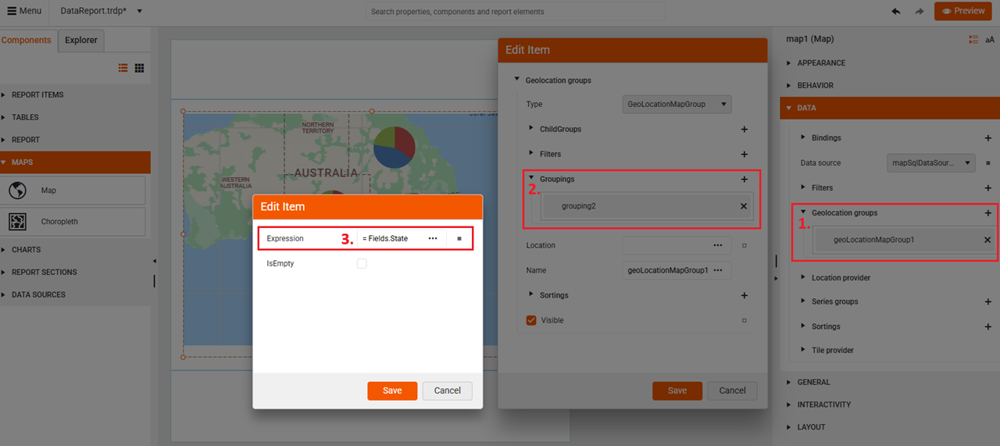
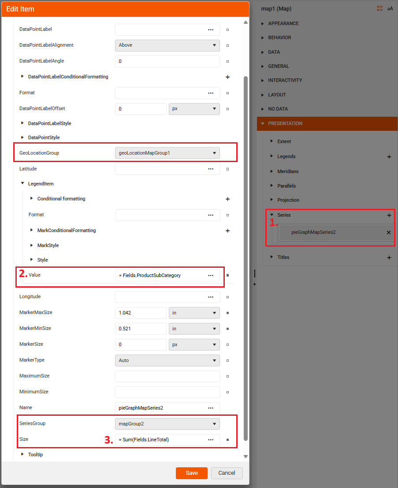
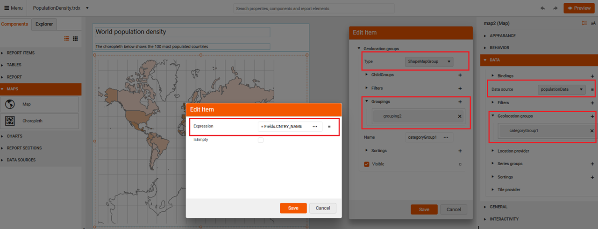
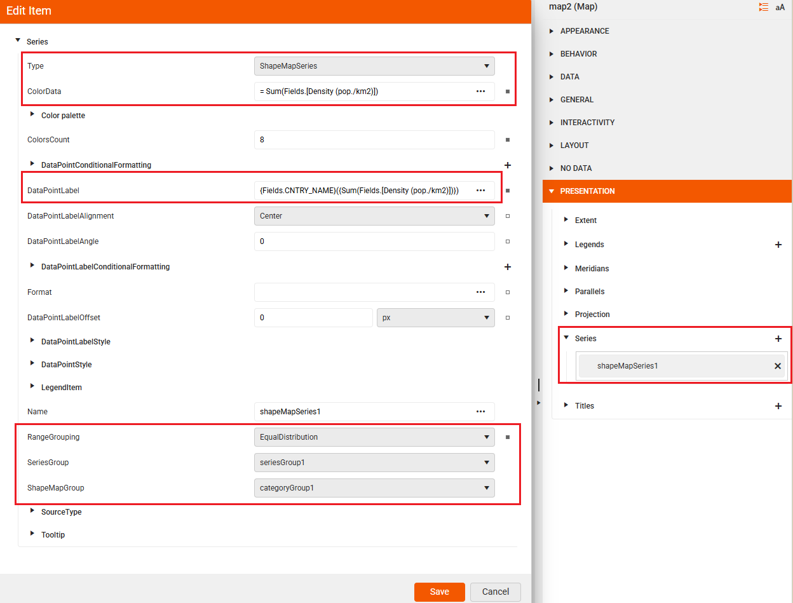

<style>
img[alt$="><"] {
  border: 1px solid lightgrey;
}

/* table th:first-of-type {
	width: 20%;
}
table th:nth-of-type(2) {
	width: 80%;
} */
</style>
 
# Maps 

The **Web Report Designer** offers a **Maps** section inside the **Components** tray allowing the end-user to visualize aggregated business data in a geographical manner.


|Map Type|Description|
|----|----|
|[Map](#map)|The data may be presented in different formats that is determined by the chosen Map Type: Point, Pie, Column. |
|[Choropleth](#choropleth)|The [Choropleth map](https://en.wikipedia.org/wiki/Choropleth_map) type is a thematic map that uses graded color differences to display a measure over predefined regions or areas, and is one of the most popular ways to visualize how a measure varies across a geographic area.|
 

The **Map Report item** requires one source collection for loading the visual (e.g. geographical) map data (provided by a Location and Tile providers) and one separate Data Source for the data itself storing the values that correspond to the respective location (displayed as small charts on the map).

### Prerequisites

Before creating the Map Report item, it is necessary to obtain a valid **Location Provider** key (e.g. Azure key) to authenticate the requests, so the user has to fill it in in the **ClientToken** property. Alternaively, provide the geographical coordinates of your points yourself and set up the MapSeries accordingly.

### Location and Tile Providers

The **Location Provider** matches the addresses or locations with geographical coordinates. The Map Report item provides support for the following location providers:

|Location Provider|Description|
|----|----|
|Azure| The AzureLocationProvider uses the [Azure Maps Get Geocoding Request](https://learn.microsoft.com/en-us/rest/api/maps/search/get-geocoding) to get location information about the requested address. This provider was introduced in Q2 2025 as part of the transition from Bing Maps to Azure Maps.|
|Bing *(Deprecated)*|The BingLocationProvider uses the [Bing Maps Locations API](https://learn.microsoft.com/en-us/bingmaps/rest-services/locations/) to get location information about the requested address.|
|MapQuestOpenAPI (Obsolete)|The MapQuestOpenAPILocationProvider uses the [MapQuest Geocoding Open API]() geocoding service to provide a single-line address and receive potential geographical coordinates of the geocoded location.|
|MapQuest  (Obsolete) |The MapQuestLocationProvider uses the [MapQuest Geocoding API](https://developer.mapquest.com/documentation/api/geocoding/) geocoding service to provide a single-line address and receive potential geographical coordinates of the geocoded location.|

>caution Microsoft has announced the deprecation of **Bing Maps for Enterprise**:
> * `Free (Basic)` accounts can use Bing Maps services until June 30, 2025.
> * `Enterprise` accounts can continue until June 30, 2028.
> The official Microsoft recommendation is for users to migrate to [Azure Maps](https://learn.microsoft.com/en-us/azure/azure-maps/) prior to these periods to avoid service distruptions.
> Telerik Reporting introduced support for Azure Maps through dedicated providers in Q2 2025 to address the deprecation of Bing Maps for Enterprise.

The **Tile Provider** requests and downloads the imagery data for the specified map extent. The Map Report item provides support for the following tile providers:

|TileProvider|Description|
|----|----|
|AzureMapsTileProvider|Supports a variety of tile sets that let you customize the appearance and data shown on your map.|
|BingMapsTileProvider *(Deprecated)*|Uses the [Bing Maps REST Services](https://learn.microsoft.com/en-us/bingmaps/rest-services/) to request metadata information that is needed to resolve the tile requests URLs, zoom levels, tile sizes and attribution information such as the text or logo that will be displayed on the map.|
|MapQuestTileProvider *(Obsolete)*|Uses the [`MapQuest`](https://www.mapquest.com/) tile servers that provides the tiles in the **OpenStreetMap Tiles** and the **MapQuest Open Aerial Tiles** imagery sets.|

## Creating a Report with the Map Report Item

The following tutorial aims to list all the necessary steps for creating a Map which will present the sales distribution by products among several states using the Adventure Works sample database. 

<iframe width="560" height="315" src="https://www.youtube.com/embed/VGeM_g7Ieqg?si=6mGUiz4yEIV3Opnu" title="YouTube video player" frameborder="0" allow="accelerometer; autoplay; clipboard-write; encrypted-media; gyroscope; picture-in-picture; web-share" referrerpolicy="strict-origin-when-cross-origin" allowfullscreen></iframe>

Since it uses the **AzureLocationProvider**, an Azure Maps subscription key is **required**. You can obtain a key by [creating an Azure Maps account through the Azure Portal](https://learn.microsoft.com/en-us/azure/azure-maps/quick-demo-map-app#create-an-azure-maps-account). For more information on how to access the key, refer to [Get the subscription key for your account](https://learn.microsoft.com/en-us/azure/azure-maps/quick-demo-map-app#get-the-subscription-key-for-your-account).

### Adding the Data Source 

Add a new [SQL Data Source]() item with a connection to the AdventureWorks database and Paste the following query in the Select Statement box:

```SQL: 
SELECT
PS.Name AS ProductSubCategory,
SP.Name + ', ' + CR.Name AS State,
SOD.LineTotal as LineTotal
FROM

Production.Product AS P
INNER JOIN Production.ProductSubcategory AS PS ON P.ProductSubcategoryID = PS.ProductSubcategoryID
INNER JOIN Production.ProductCategory AS PC ON PS.ProductCategoryID = PC.ProductCategoryID
INNER JOIN Sales.SalesOrderDetail AS SOD ON P.ProductID = SOD.ProductID
INNER JOIN Sales.SalesOrderHeader AS SOH ON SOD.SalesOrderID = SOH.SalesOrderID
INNER JOIN Person.Address AS ADDR ON ADDR.AddressID = SOH.ShipToAddressID
INNER JOIN Person.StateProvince AS SP ON SP.StateProvinceID = ADDR.StateProvinceID
INNER JOIN Person.CountryRegion AS CR ON CR.CountryRegionCode = SP.CountryRegionCode

WHERE
CR.Name IN ('Australia')
AND DATEPART(YEAR, SOH.OrderDate) IN (2003, 2004)
AND PC.Name = 'Bikes'
```


### Building the Map Charts 

1. Select the Details section of the report and from the **Components area** add a **Map report item**. Set the SqlDataSource you have already created the **DataSource** property. 

2. Setup GeoLocationMapGroup for the **State** field:

   2.1 Create a new GeoLocationMapGroup

   2.2 Add a new Grouping item

   2.3 Set the Expression to the **State** field

  

3. Setup the Series Group using the **ProductSubCategory** field:

   3.1 Create a new SeriesGroup

    3.2 Add a new Child Group item

    3.3 Add a new Grouping

    3.4 Set the Expression to the **ProductSubCategory** field

    

4. Setup the Series Type under the **Presentation** section:

   4.1 Add a new **PieMapSeries**</br>

   4.2 Specify the LegendItem's Value</br>

   4.3 Specify the series' Size and all other properties that the dialog offers</br>

    

### Defining the Location and Tile Providers 

Select the location provider (e.g. Azure) that will be used to geocode the **State** field. Once you obtain the key, paste it in the **ClientToken** box:

   

## Choropleth

A choropleth map is a thematic map where areas are shaded or colored in proportion to a statistical variable (like population density, income levels, or voting results). This is a specific map item coloring the respective area according to the value it stores.

The choropleth below shows the 100 most populated countries: 

>caption World population density

  

The video demonstrates how to create and set up a Choropleth map that will show the world population for each country and coloring its area depending on the population density value.

Download the [`PopulationData.zip`](https://github.com/telerik/reporting-docs/raw/master/knowledge-base/resources/PopulationDensity.zip) file, save it locally, and extract its contents in a folder. 

The essential steps in the setup are:

**Setting up Data Binding**:

* Bind your map to a data source containing values for each region - e.g. [CSV Data Source](). Use the sample [CSV data population](https://github.com/telerik/reporting-docs/raw/master/knowledge-base/resources/PopulationDensity.zip) file, save it locally, and extract its content to a folder.

* Configure a color scale based on your data values 

**Configuring the Map**:

* Presentation >> Series >> We will use a CSV Data Source for the analytical data and an [ESRI Shapefile](https://en.wikipedia.org/wiki/Shapefile) for the spatial data: use a Shapefile bundle which consists of the **world.shp** and **world.dbf** files. The files are located in the `\Resources` subfolder of the directory where the `PopulationDensity.zip` file is extracted.

  


  

//TODO 

Source Type [bug](https://github.com/telerik/reporting/issues/5129)


## See Also

* [Web Report Designer]() 
* [Map Overview]()
* [DataSources]()


