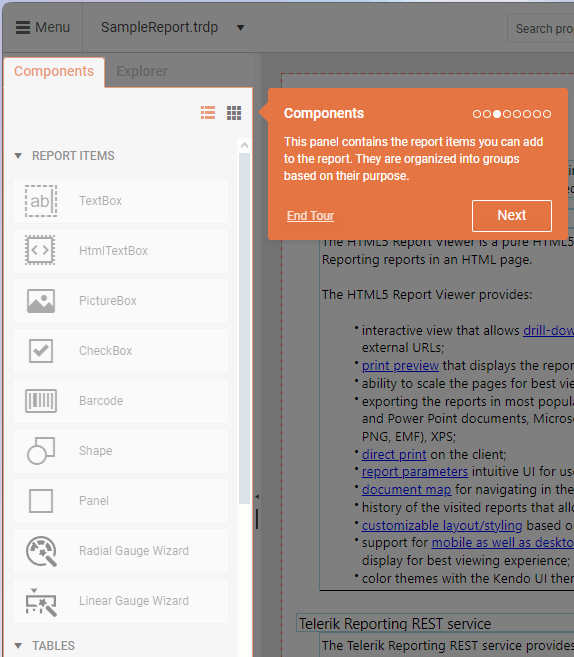
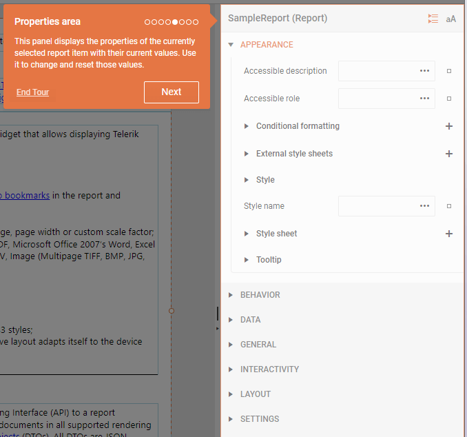

# Report Items

The Report Items are visual elements used to display and organize content within a report.

Like the other [report components]() in the Web Report Designer, they are building blocks that make up the structure and layout of a report, with each item serving a specific purpose depending on the type of data being displayed.

Report items can reside inside report sections or other report components such as Panels, Tables, Lists, and so on. The arrangement of these items creates the overall layout and visual presentation of your report.

## Report Item Types

Telerik Web Report Designer provides various report items, each designed for specific data visualization needs:

* [TextBox](#textbox)—Displays static or data-bound text with various formatting options.
* [HtmlTextBox](#htmltextbox)—Inserts HTML-formatted text with styling and formatting.
* [PictureBox](#picturebox)—Shows images from various sources (binary, URIs, Base64, SVG).
* [CheckBox](#checkbox)—Shows both text and a check mark for boolean data.
* [Barcode](#barcode)—Renders various barcode types for labeling and identification.
* [Shape](#shape)—Displays predefined shapes like lines, arrows, and geometric figures.
* [Panel](#panel)—Acts as a container to group or separate multiple report items.
* [Gauge](#gauge)—Visualizes key performance indicators (KPIs) in radial or linear formats.

## Adding Report Items

You can add Report Items to a report by dragging them from the **Components** panel onto the design surface of the report. Alternatively, you can also add items by consecutively clicking the report section where you want to place the item and then the report item in the **Components** panel.

## Customizing the Report Items

Each report item has specific properties and features that allow for extensive customization to meet your reporting requirements. To change the properties of an item, navigate to the **Properties** panel of the Web Report Designer.

Once you add the desired Report Items, the **Properties** panel allows you to:

* Arrange items within sections or containers
* Resize and position items as needed
* Set properties to control appearance and behavior
* Bind items to data sources
* Apply styling and conditional formatting
* Configure interactivity options

## TextBox

The TextBox is used for titles, labels, and within tables. It can display both static and dynamic text, including expressions and database fields. The TextBox's flexible properties allow you to control its size and text orientation.

<iframe width="560" height="315" src="https://www.youtube.com/embed/v0XprGTvnDk?si=k5ShFO8XfMbPGxCn" title="Adding a TextBox Item in the Telerik Web Report Designer" frameborder="0" allow="accelerometer; autoplay; clipboard-write; encrypted-media; gyroscope; picture-in-picture; web-share" referrerpolicy="strict-origin-when-cross-origin" allowfullscreen></iframe>

To learn more about working with the TextBox item, see the [TextBox article in the main Telerik Reporting documentation]().

## HtmlTextBox

The HtmlTextBox allows you to insert and display HTML-formatted text within a report. It is ideal for scenarios where you need rich text formatting, dynamic content, or templated text in your reports. You can set its content at design time using a WYSIWYG editor, an expression editor, or dynamically from a data source.

<iframe width="560" height="315" src="https://www.youtube.com/embed/7O-zB9QjkyU?si=HoHpwrcJ6ZDMwCxx" title="Adding an HtmlTextBox Item in the Telerik Web Report Designer" frameborder="0" allow="accelerometer; autoplay; clipboard-write; encrypted-media; gyroscope; picture-in-picture; web-share" referrerpolicy="strict-origin-when-cross-origin" allowfullscreen></iframe>

To learn more about working with the HtmlTextBox item, see the [HtmlTextBox article in the main Telerik Reporting documentation]().

## PictureBox

The PictureBox displays images within a report. It is ideal for product images, logos, barcodes, or any visual content in reports. The PictureBox supports various image formats, including Base64-encoded images, SVG, and common raster formats like BMP, GIF, JPEG, PNG, EXIF, and TIFF. It provides flexible data binding and layout options to fit various reporting needs. You can also reference images directly from the Assets Manager.

<iframe width="560" height="315" src="https://www.youtube.com/embed/_HXkVfOO66g?si=9aCvjaz43jLqvMas" title="Adding a PictureBox in the Telerik Web Report Designer" frameborder="0" allow="accelerometer; autoplay; clipboard-write; encrypted-media; gyroscope; picture-in-picture; web-share" referrerpolicy="strict-origin-when-cross-origin" allowfullscreen></iframe>

To learn more about working with the PictureBox item, see the [PictureBox article in the main Telerik Reporting documentation]().

## CheckBox

The Checkbox displays a check mark alongside text in a report. It visually represents boolean or multi-state data (such as approved/disapproved) and can be customized to match various data field values. Its main uses include displaying status indicators, approval states, or any scenario where a visual check mark is needed in a report. The item supports both static and data-driven content.

<iframe width="560" height="315" src="https://www.youtube.com/embed/ab9VzzOq6YE?si=z1IxeMd7z_wC-WnB" title="Adding a Table with Checkboxes in the Telerik Web Report Designer" frameborder="0" allow="accelerometer; autoplay; clipboard-write; encrypted-media; gyroscope; picture-in-picture; web-share" referrerpolicy="strict-origin-when-cross-origin" allowfullscreen></iframe>

To learn more about working with the CheckBox item, see the [CheckBox article in the main Telerik Reporting documentation]().

## Barcode

The Barcode item allows you to automatically generate barcodes from numeric or character data within a report. It supports both 1D and 2D barcodes. The Barcode Report Item is ideal for adding machine-readable codes to reports, such as product labels, inventory sheets, tickets, or any scenario where barcodes are needed for scanning and automation.

<iframe width="560" height="315" src="https://www.youtube.com/embed/3XjY_m84OHE?si=SBOnX-IzdxKgiL66" title="Adding a Barcode Item in the Telerik Web Report Designer" frameborder="0" allow="accelerometer; autoplay; clipboard-write; encrypted-media; gyroscope; picture-in-picture; web-share" referrerpolicy="strict-origin-when-cross-origin" allowfullscreen></iframe>

To learn more about working with the Barcode item, see the [Barcode article in the main Telerik Reporting documentation]().

## Shape

The Shape item displays a single, predefined geometric shape (such as lines, arrows, stars, or polygons) within a report. It also allows you to create custom shapes. The Shape item is ideal for adding visual elements, separators, highlights, or decorative graphics to reports, which lets you enhance readability and visual appeal. It can also be used to represent flow, direction, or status using arrows and other shapes.

<iframe width="560" height="315" src="https://www.youtube.com/embed/lfhB-kZDfY8?si=Y8fqI0Iwfy7A8iix" title="Adding a Shape Item in the Telerik Web Report Designer" frameborder="0" allow="accelerometer; autoplay; clipboard-write; encrypted-media; gyroscope; picture-in-picture; web-share" referrerpolicy="strict-origin-when-cross-origin" allowfullscreen></iframe>

To learn more about working with the Shape item, see the [Shape article in the main Telerik Reporting documentation]().

## Panel

The Panel is a container used to group or separate multiple report items for layout and organizational purposes. It is not bound to data and does not affect the data context of its contents. The Panel is perfect for structuring complex report layouts, grouping related items, and applying shared properties or visibility rules to multiple items at once.

<iframe width="560" height="315" src="https://www.youtube.com/embed/5e1NoMNfX6Y?si=yMNsbyJ_O7gQ9rK3" title="Adding a Panel Item in the Telerik Web Report Designer" frameborder="0" allow="accelerometer; autoplay; clipboard-write; encrypted-media; gyroscope; picture-in-picture; web-share" referrerpolicy="strict-origin-when-cross-origin" allowfullscreen></iframe>

To learn more about working with the Panel item, see the [Panel article in the main Telerik Reporting documentation]().

## Gauge

The Gauge visualizes a single value on a scale. It supports both radial (circular, like speedometers) and linear (horizontal or vertical bars) gauges. You can incorporate the Gauge in dashboards and reports where you need to visualize KPIs, progress, or performance metrics at a glance, such as sales targets, speed, or completion percentages.

### Radial Gauge

A radial gauge is a circular visual element that looks similar to a speedometer in a car. It shows values along a curved scale, usually in the shape of a full or partial circle. The pointer on the gauge is often a needle, but it can also be a marker or a bar. This pointer moves to show the current value. 

Radial gauges are especially useful when you want to show data that feels like speed or progress, such as how fast something is going or how much of a goal has been reached.

<iframe width="560" height="315" src="https://www.youtube.com/embed/QrUAtdgFsM0?si=AJrUJEfiMAGbEbw9" title="Adding a Radial Gauge Item in the Telerik Web Report Designer" frameborder="0" allow="accelerometer; autoplay; clipboard-write; encrypted-media; gyroscope; picture-in-picture; web-share" referrerpolicy="strict-origin-when-cross-origin" allowfullscreen></iframe>

### Linear Gauge

The Linear Gauge is represented by a horizontal or vertical scale and displays its value as a percentage of the total scale's length. To add a Linear Gauge, click the **Linear Gauge Wizard** in the **Components** tab, and then use the **Configure Linear Gauge** pane to adjust the settings.

Depending on the gauge's orientation and range, you can create horizontal, vertical, single-range, and multi-range linear gauges.

<iframe width="560" height="315" src="https://www.youtube.com/embed/9Aw-w0yn4Pw?si=M_8bMIEVOFEv12Z1" title="Adding a Linear Gauge Item in the Telerik Web Report Designer" frameborder="0" allow="accelerometer; autoplay; clipboard-write; encrypted-media; gyroscope; picture-in-picture; web-share" referrerpolicy="strict-origin-when-cross-origin" allowfullscreen></iframe>

To learn more about working with the Gauge item, see the [Gauge article in the main Telerik Reporting documentation]().
