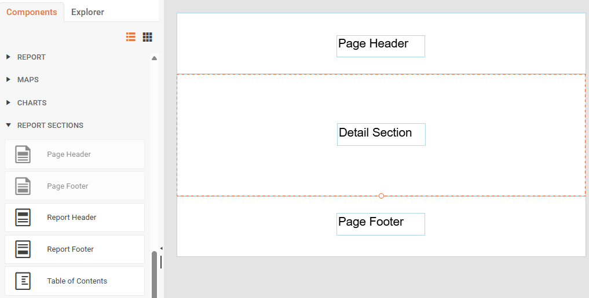

# Report Sections

Report sections divide the report vertically and define specific areas on the report page where content is rendered. Each section represents a distinct area with its own rendering behavior and determines how the report items within it are processed and displayed. The Web Report Designer provides five key sections that control the structure and layout of your reports.

## Adding Report Sections

The Web Report Designer automatically creates Page Header, Detail, and Page Footer sections when you create a new report. To add a Report Header, Report Footer, and a Table of Contents, select the **Components** tab, go to **REPORT SECTIONS** and click the desired section.

<iframe width="560" height="315" src="https://www.youtube.com/embed/9xOgNOHyZa0?si=QccKBDQKWfnY7c5N&rel=0" title="Adding Report Sections" frameborder="0" allow="accelerometer; autoplay; clipboard-write; encrypted-media; gyroscope; picture-in-picture; web-share" referrerpolicy="strict-origin-when-cross-origin" allowfullscreen></iframe>

## Page Header Section

The Page Header section appears at the top of every page in your report. You can use this section to display report titles, logos, or other information that will be repeated on each page. The Page Header section supports page-specific functions and expressions that let you display page information and navigation elements.

## Page Footer Section

The Page Footer section appears at the bottom of every page in your report. This section is commonly used to display page numbers, footer text, or per-page summary information. Like the Page Header, the Page Footer section is processed after the report data has been evaluated, allowing you to use page-specific functions and expressions.

## Report Header Section

The Report Header section appears only once for every report. If the report has a Page Header, the Report Header will appear after the Page Header by default. This section is perfect for displaying cover page information such as report titles, company logos, dates, or introductory content. All data fields in the Report Header must use aggregate functions since they are calculated for the entire report dataset.

## Report Footer Section

The Report Footer section appears only once at the very end of the report. If the report has a Page Footer, the Report Footer will appear after the Page Footer by default. Use this section to display report totals, summary information, or closing content for the entire report. Similar to the Report Header, all data-bound items in the Report Footer must use aggregate functions to calculate values across the complete report data.

## Table of Contents Section

The Table of Contents (TOC) section provides navigational links to report items and displays the page numbers where they can be found. Users can click on TOC entries to navigate directly to the corresponding report page. The TOC section can be positioned before or after the Report Header or Report Footer sections based on your preferences.

For a sample report with a TOC, see the [Product Catalog Report Demo](https://demos.telerik.com/reporting/product-catalog).
