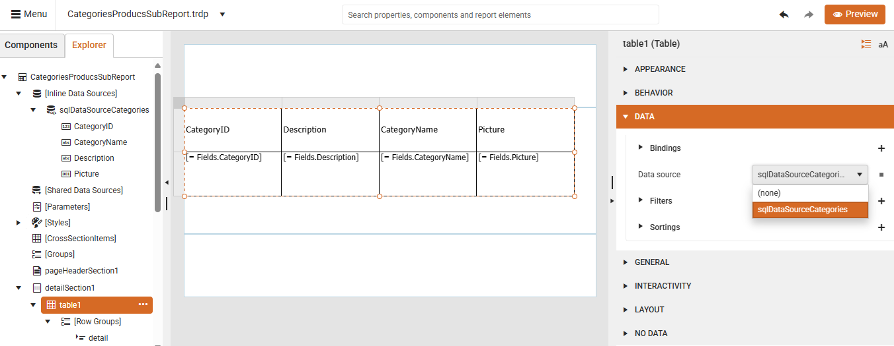
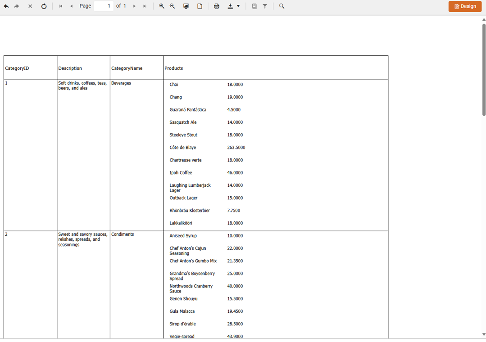

<style>
img[alt$="><"] {
  border: 1px solid lightgrey;
}

</style>

# SubReport

A SubReport is a report component that allows you to embed one report inside another report. This lets you create complex report layouts, display hierarchical data relationships, and build reusable report components that can be shared across multiple reports.

SubReports act as containers that automatically adjust their size based on the content of the embedded report. You can use SubReports to create:

* Master-detail relationships&mdash;Display related data in a parent-child format (for example, customers and their orders).
* Reusable components&mdash;Create shared headers, footers, or report sections that can be used across multiple reports.
* Complex layouts&mdash;Combine different data sources and report structures within a single report.
* Hierarchical data&mdash;Show nested data relationships with proper grouping and organization.

The next video demonstrates how to [create master-detail](#creating-master-detail-reports-with-subreports) reports by using SubReports in the Telerik Web Report Designer:

<iframe width="560" height="315" src="https://www.youtube.com/embed/AH2XdSDDiEs?si=ys2b1ROAXh5qs3Aw" title="YouTube video player" frameborder="0" allow="accelerometer; autoplay; clipboard-write; encrypted-media; gyroscope; picture-in-picture; web-share" referrerpolicy="strict-origin-when-cross-origin" allowfullscreen></iframe>

## Prerequisites

Before working with SubReports, ensure you have:

* Created and configured [data sources]() for both master and child reports.
* Planned your data relationships and report hierarchy.

## Creating Master-Detail Reports with SubReports

The following example demonstrates how to create a master-detail report using SubReports. The master report (*CategoriesProducts.trdp*) contains a table with Northwind **Categories** data. The SubReport (*ProductsReport.trdp*) displays Northwind **Products** records filtered by the respective `CategoryID`.

> To follow along with the steps below, you need access to an instance of the [Northwind](https://github.com/microsoft/sql-server-samples/tree/master/samples/databases/northwind-pubs) database for [Microsoft SQL Server](https://learn.microsoft.com/en-us/sql/database-engine/install-windows/install-sql-server?view=sql-server-ver17).

### Step 1: Building the Child Report

1. Start with a blank report (*ProductsReport.trdp*) that will serve as the child report. Select the header and footer sections and delete them.

    

1. Add a new [SQL Data Source]() populated with the `Northwind.Products` table:

    Here is the SQL query that selects the respective data:

    ```SQL
    SELECT
        [dbo].[Products].[ProductID], 
        [dbo].[Products].[ProductName], 
        [dbo].[Products].[Discontinued], 
        [dbo].[Products].[SupplierID], 
        [dbo].[Products].[CategoryID], 
        [dbo].[Products].[QuantityPerUnit], 
        [dbo].[Products].[UnitPrice], 
        [dbo].[Products].[UnitsInStock], 
        [dbo].[Products].[UnitsOnOrder], 
        [dbo].[Products].[ReorderLevel]
    FROM [dbo].[Products]
    ```

1. Set the **DataSource** of the report using the created SQLDataSource:

    

1. From the **Components** tab, drag two **TextBox** report items to the Detail section:

    4.1. Select each of the TextBoxes.

    4.2. Bind the the **Value** property of the TextBoxes to the `ProductName` and `UnitPrice` fields respectively.

    4.3. Use the **Expression** dialog to set the desired field.

    

1. Preview the report to verify that all Products are listed.

1. Add an integer report parameter called `ProductCategoryID` which you will use to filter by product:

    

1. Update the `SELECT` query of the added SQLDataSource and add a `WHERE` clause using an SQL parameter (which is mapped to the previously created report parameter):

    ```SQL
    SELECT
        [dbo].[Products].[ProductID], 
        [dbo].[Products].[ProductName], 
        [dbo].[Products].[Discontinued], 
        [dbo].[Products].[SupplierID], 
        [dbo].[Products].[CategoryID], 
        [dbo].[Products].[QuantityPerUnit], 
        [dbo].[Products].[UnitPrice], 
        [dbo].[Products].[UnitsInStock], 
        [dbo].[Products].[UnitsOnOrder], 
        [dbo].[Products].[ReorderLevel]
    FROM [dbo].[Products]
    WHERE [dbo].[Products].[CategoryID]=@sqlParamCategoryId
    ```

    

1. Save the report (*ProductsReport.trdp*). You will use it as a child report.

### Step 2: Building the Master Report

1. Create a new blank report (*CategoriesProducts.trdp*).

1. Add a new [SQL Data Source]() filled with the `Northwind.Categories` table:

    ```SQL
    SELECT
        [dbo].[Categories].[CategoryID], 
        [dbo].[Categories].[CategoryName], 
        [dbo].[Categories].[Description], 
        [dbo].[Categories].[Picture]
    FROM [dbo].[Categories]
    ```

1. Select the report's Detail section and use the [Table Wizard]() to add a table bound to the just added SQLDataSource:

    

1. Select the **Picture** header and change its text to **Products**.

1. Select the data cell bound to the `Picture` field (`[=Fields.Picture]`) and add a **SubReport** item by selecting it from the **Components** tab:

    

1. Specify the **Inner Report** for the **SubReport** item and select the Uri option that refers to the previously created `ProductsReport.trdp`:

    

1. Set up the relation between the parent and child reports:

    7.1. Adjust the parameters.

    7.2. Link the SubReport parameter (`ProductCategoryID`) with the master report's `CategoryID` field.

    

1. Save the changes and preview the master report. You will see all categories listed with the respective products for each category:

    

## See Also

* [Web Report Designer]()
* [Data Sources]()
