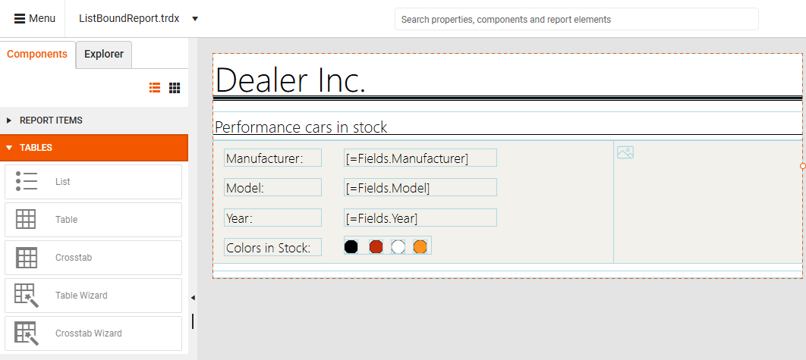
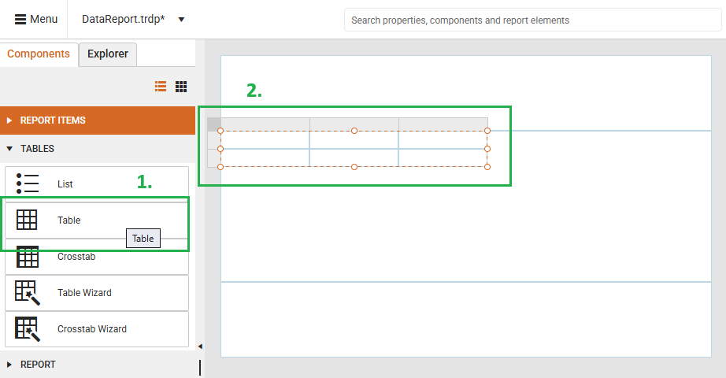
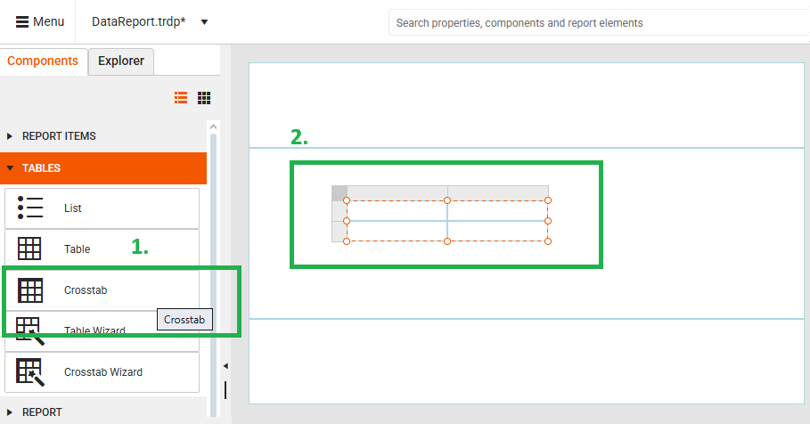

# Tables
 
The **Web Report Designer** offers a **Tables** section inside the **Components** tray allowing the end-user to visualize the data records from different [Data Source]() storages: 

* [List](#adding-a-list) - Displays data from a set of Business Objects creating a free-form data layout (e.g. composed of multiple simpler items per list data item). You are not limited to a grid layout, you can freely place fields inside the List. 
* [Table](#adding-a-table) - Displays report data in cells that are organized into rows and columns.</td>|
* [Crosstab](#adding-a-crosstab) - Displays aggregated data summaries that are grouped in rows and columns in a similar way to a pivot grid. The number of rows and columns for groups is determined by the number of unique values for each row and column groups.
* [Table Wizard](#using-the-table-wizard) - The Table wizard guides you through the process of adding a Table item to a report.
* [Crosstab Wizard](#using-the-crosstab-wizard)|The Crosstab wizard guides you through the process of adding a Crosstab item to a report.

Before adding a Table report item, first, you need to select the Details section of the report. Then, you can select the desired table item type from the Components tray and configure it with the desired data source. The following sections illustrate what are the available table item types:

## Adding a List

1. Drag the `List` item from the **Components** tray and drop it onto the **Details** section of the report.
2. Build the desired layout with report items like TextBoxes and use the already defined [Data Sources]().

The following short video illustrates how to add a List, bind it to an already existing [SQL Data Source]() item and adding a TextBox report item for displaying the FirstName of the data records:     

<iframe width="560" height="315" src="https://www.youtube.com/embed/2P50WiOqq7M?si=QhoQr_gPoX2oR_PF" title="YouTube video player" frameborder="0" allow="accelerometer; autoplay; clipboard-write; encrypted-media; gyroscope; picture-in-picture; web-share" referrerpolicy="strict-origin-when-cross-origin" allowfullscreen></iframe>

## Adding a Table 

By dragging the `Table` item from the **Components** tray and dropping it onto the **Details** section of the report, you are ready to build the desired layout with report items like TextBoxes and use the already defined [Data Sources]().

When added from a report designer, the Table contains three columns with a table header row and a details row for the data:

1. Drag a Table report item 

2. Drop it onto the Details section

      

The following short video illustrates how to add an empty Table report item, bind it to an already existing [CSV Data Source](), add the necessary TextBox report items for the column headers and for the data records displaying the First/Last Names:

<iframe width="560" height="315" src="https://www.youtube.com/embed/fBmSktuKgHA?si=-PjTxgYIAQVbphyf" title="YouTube video player" frameborder="0" allow="accelerometer; autoplay; clipboard-write; encrypted-media; gyroscope; picture-in-picture; web-share" referrerpolicy="strict-origin-when-cross-origin" allowfullscreen></iframe>

## Adding a Crosstab  

By dragging the `Crosstab` item from the **Components** tray and dropping it onto the **Details** section of the report, you are ready to build the desired layout with the generated empty column/row groups and body parts. 

When added from a report designer, the [Crosstab]() contains a column group, a row group and a body for crosstab data:

1. Drag a Crosstab report item 

2. Drop it onto the Details section

     

The following short video illustrates how to add an empty Crosstab report item, bind it to an already existing [SQL Data Source](), bind the generated empty Column/Row groups and map the necessary TextBox report items for the column/row group and for the data records displaying the total sum of Freight for the respective OrderID:

<iframe width="560" height="315" src="https://www.youtube.com/embed/Ntf3DDlczmg?si=shL9Z4HNJSevq_Gx" title="YouTube video player" frameborder="0" allow="accelerometer; autoplay; clipboard-write; encrypted-media; gyroscope; picture-in-picture; web-share" referrerpolicy="strict-origin-when-cross-origin" allowfullscreen></iframe>

## Using the Table Wizard

By clicking the [Table Wizard]() item from the **Components** tray, a new tab will appear on the right-hand side of the **Web Report Designer**:

1. Click the Table Wizard from the Components tray

2. Show the **Configure Table** pane on the right side

      

The following short video illustrates how to add a Table report item with the wizard, bind it to an already existing [Web Service Data Source]() item and arrange the desired fields for displaying the name and localized name of the data records:

<iframe width="560" height="315" src="https://www.youtube.com/embed/YYdyeCW2XSg?si=Dksa5GK_ZkfszicP" title="YouTube video player" frameborder="0" allow="accelerometer; autoplay; clipboard-write; encrypted-media; gyroscope; picture-in-picture; web-share" referrerpolicy="strict-origin-when-cross-origin" allowfullscreen></iframe>

## Using the Crosstab Wizard
 
By clicking the [Crosstab Wizard]() item from the **Components** tray, a new tab will appear on the right-hand side of the **Web Report Designer**:

1. Click the Crosstab Wizard from the Components tray

2. Show the **Configure Crosstab** pane on the right side

  

The following short video illustrates how to add a [Crosstab]() report item with the wizard, bind it to an already existing [SQL Data Source]() item populated with Northwind.Orders table and arrange the desired fields for displaying the OrderID as rows and total sum of Freight of the data records:

<iframe width="560" height="315" src="https://www.youtube.com/embed/E6O9eiyBJcQ?si=uC4PyMfkC3E5V3Uh" title="YouTube video player" frameborder="0" allow="accelerometer; autoplay; clipboard-write; encrypted-media; gyroscope; picture-in-picture; web-share" referrerpolicy="strict-origin-when-cross-origin" allowfullscreen></iframe>

## See Also

* [Web Report Designer]()
* [Getting Started with the Crosstab]()
* [DataSources]()
* [Template Variations of the Table Report Item]()

