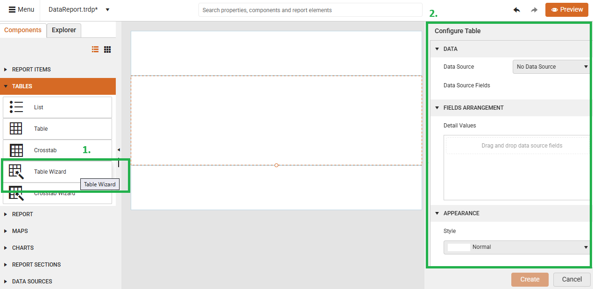

# Tables

Tables are data-bound components that organize and display information from your data sources in structured layouts. The Web Report Designer provides several table types to meet different data presentation needs, from simple lists to complex cross-tabulated summaries.

## Table Types

The **Components** tab offers a **Tables** section that allows users to visualize data records from different [data sources]():

* [List](#adding-a-list)&mdash;Displays data records in a free-form layout where you can arrange fields anywhere within each list item. Ideal for creating custom layouts like address cards or product catalogs.
* [Table](#adding-a-table)&mdash;Displays report data in a traditional grid format with rows and columns. Best for tabular data like invoices, reports, or data lists.
* [Crosstab](#adding-a-crosstab)&mdash;Displays aggregated data summaries grouped in rows and columns, similar to a pivot table. Perfect for cross-referencing data like sales by region and product.
* [Table Wizard](#using-the-table-wizard)&mdash;Guides you through creating a Table with an easy step-by-step wizard.
* [Crosstab Wizard](#using-the-crosstab-wizard)&mdash;Guides you through creating a Crosstab with an easy step-by-step wizard.

Using the wizards and following manual tuning as needed is the recommended approach to configure tables and crosstabs. It also offers a smoother user experience.

## Prerequisites

Before adding any table component, ensure you have:

* Selected the **Detail section** of your report (required for table placement).
* Created and configured a [data source]() for your report.
* Planned your data layout and identified the fields you want to display.

## Adding a List

The List component provides the most flexibility for custom data layouts. Use Lists when you need complete control over how data appears or want to create non-tabular presentations.

1. Drag the **List** item from the **Components** tab and drop it onto the **Detail** section of the report.
1. Bind the List to your [data source]().
1. Build your custom layout by adding report items like TextBoxes inside the List.
1. Configure the individual report items to display specific data fields.

This video demonstrates creating a List, binding it to an SQL data source, and adding a TextBox to display customer names:

<iframe width="560" height="315" src="https://www.youtube.com/embed/__7ELxOjqm0?si=IYqKnn0jLf3x00Y4" title="YouTube video player" frameborder="0" allow="accelerometer; autoplay; clipboard-write; encrypted-media; gyroscope; picture-in-picture; web-share" referrerpolicy="strict-origin-when-cross-origin" allowfullscreen></iframe>

## Adding a Table

Tables organize data in a traditional row-and-column format that you can use for structured data like invoices, reports, or any tabular information.

1. Drag the **Table** item from the **Components** tab and drop it onto the **Detail** section of the report.
1. Bind the Table to your [data source]().
1. Configure the table structure by adding or removing columns and rows as needed.
1. Add TextBox report items to cells and bind their value to the relevant fields in your [data source](). Note that the empty-appearing table already consists of text boxes according to the applied data source and the available fields (just their value is empty). You can add new items if you want to have other item types instead, e.g., HtmlTextBox, Barcode, etc.

When you add a new Table, it starts with three columns, a header row, and a data row:

This video shows how to add a Table report item, bind it to an already existing [CSV Data Source](), and add the necessary TextBox report items for the column headers and the data records.

<iframe width="560" height="315" src="https://www.youtube.com/embed/fGJ_76wbZPI?si=isspSoVFKM1iC6cX" title="YouTube video player" frameborder="0" allow="accelerometer; autoplay; clipboard-write; encrypted-media; gyroscope; picture-in-picture; web-share" referrerpolicy="strict-origin-when-cross-origin" allowfullscreen></iframe>

## Adding a Crosstab

Crosstabs let you display aggregated data summaries with row and column groupings, similar to pivot tables. Use Crosstabs when you need to analyze data across multiple dimensions.

1. Drag the **Crosstab** item from the **Components** tab and drop it onto the **Detail** section of the report.
1. Bind the Crosstab to your [data source]().
1. Configure the row groups and column groups.
1. Bind the value of the data cells to the relevant fields in your [data source]().
1. Set up aggregation functions (e.g., Sum(), Count()) in the designated data cells.

When you add a Crosstab, it includes a column group area, row group area, and data body:

This video demonstrates creating a Crosstab, binding it to SQL data, and configuring row/column groups with aggregated data:

<iframe width="560" height="315" src="https://www.youtube.com/embed/zurckEvEy_M?si=KRaJRxXpKg4-Y5vW" title="YouTube video player" frameborder="0" allow="accelerometer; autoplay; clipboard-write; encrypted-media; gyroscope; picture-in-picture; web-share" referrerpolicy="strict-origin-when-cross-origin" allowfullscreen></iframe>

## Using the Table Wizard

The Table Wizard provides a faster way to create tables by guiding you through the setup process step-by-step. Use the wizard when you want to quickly create a table with minimal manual configuration.

1. Click the **Table Wizard** from the **Components** tab.
1. The **Configure Table** pane appears on the right side of the Web Report Designer.
1. Follow the wizard steps to select your data source, choose fields, and configure the table layout.

This video shows how to use the Table Wizard to create a table with a Web Service data source and configure field selection:

<iframe width="560" height="315" src="https://www.youtube.com/embed/RegNPfOvUTY?si=WoveEgyxM1dV2akA" title="YouTube video player" frameborder="0" allow="accelerometer; autoplay; clipboard-write; encrypted-media; gyroscope; picture-in-picture; web-share" referrerpolicy="strict-origin-when-cross-origin" allowfullscreen></iframe>

## Using the Crosstab Wizard

The Crosstab Wizard simplifies creating complex cross-tabulated reports by walking you through the grouping and aggregation setup.

1. Click the **Crosstab Wizard** from the **Components** tab.
1. The **Configure Crosstab** pane appears on the right side of the Web Report Designer.
1. Follow the wizard steps to define row groups, column groups, and data aggregation.

This video demonstrates using the Crosstab Wizard with SQL data to create a cross-tabulated report showing OrderID and Freight totals:

<iframe width="560" height="315" src="https://www.youtube.com/embed/RGaz3iQ9S-g?si=E5Zy8_io9h4p0GsS" title="YouTube video player" frameborder="0" allow="accelerometer; autoplay; clipboard-write; encrypted-media; gyroscope; picture-in-picture; web-share" referrerpolicy="strict-origin-when-cross-origin" allowfullscreen></iframe>

## Next Steps

* Add [report sections]() to organize your report layout.
* Explore other [report components]() to enhance your reports.

## See Also

* [Web Report Designer]()
* [Getting Started with the Crosstab]()
* [DataSources]()
* [Template Variations of the Table Report Item]()
